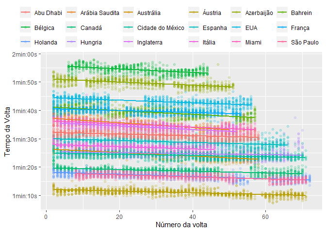
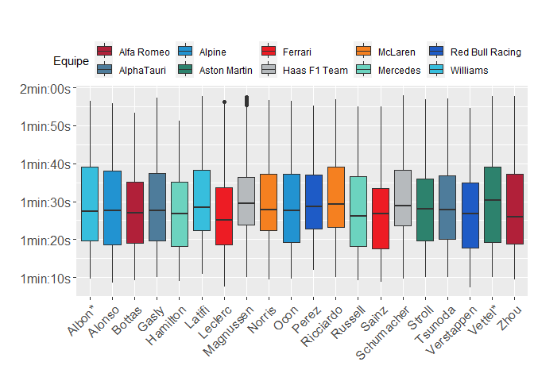

Data Prep

Loading libraries


```r
library(ggplot2)
library(gridExtra)
library(ggpmisc)
library(readxl)
library(dplyr)
```

Loading data


```r
df = read_excel("./files/Races_cleaned.xlsx")
df = df %>% rename('Local' = "PlaceBrazilianPortuguese")
```

Formating millisecond to friendlier format.


```r
timeHMS_formatter <- function(x) {
  x[is.na(x)] <- 0
#  h <- trunc(x / 24 / 60 / 1000)
  m <- trunc(x / 60 / 1000)
  s <- (x / 1000) %% 60
  s <- round(s, 2)
  lab <- sprintf('%02dmin:%02ds', m, s) # Format the strings as HH:MM:SS
  lab <- gsub('^00h:', '', lab)              # Remove leading 00: if present
  lab <- gsub('^0', '', lab)                # Remove leading 0 if present
}
```

Including Plots

Density plot


```r
ggplot(df, aes(x=msLapTime)) + 
 geom_histogram(aes(y= after_stat(density)), colour="black", fill="white", bins = 12)+
 geom_density(alpha=.2, fill="#FF6666") +
 xlab("Tempo da volta") + ylab("Densidade")
```


Scatter Plot


```r
plot <- ggplot(df, aes (x = LapNumber, y = msLapTime))+
  geom_point(alpha = 0.2) + 
  geom_smooth(method = lm,se = F)+ 
  scale_y_continuous(label=timeHMS_formatter, breaks = c(70000,80000,90000,100000,110000,120000)) +
  xlab("Número da volta") + ylab("Tempo da Volta")

plot
```


Scatter Plot grouped by Circuit as color


```r
plotCircuit <- ggplot(df, aes(x = LapNumber, y = msLapTime, color = Local))+
  geom_point(alpha = 0.2)+
  geom_smooth(method = lm,se = F) + 
  scale_y_continuous(label=timeHMS_formatter, breaks = c(70000,80000,90000,100000,110000,120000)) + 
  xlab("Número da volta") + ylab("Tempo da Volta") +
  scale_color_discrete(name=NULL) +
  guides(color=guide_legend(ncol=6,byrow = TRUE)) +
  ggtitle("\n\n\n\n") +
  theme(legend.position=c(0,1.01), legend.justification=c(0.08,0),legend.box = "horizontal")
plotCircuit
```



Scatter Plot of each circuit separately


```r
plotWrapEventos <- ggplot(df, aes (x = LapNumber, y = msLapTime))+
  geom_point(alpha = 0.2) + 
  geom_smooth(method = lm,se = F)+ 
  scale_y_continuous(label=timeHMS_formatter) +
  facet_wrap(~ Local, ncol = 6, labeller = labeller(groupwrap = label_wrap_gen())) +
  xlab("Número da volta") + ylab("Tempo da Volta")  + 
  theme(strip.text.x = element_text(size = 8))

plotWrapEventos
```


Behavior for each lap

Filtering Dutch Grand Prix for exemplification purposed.


```r
df_dutch = df[df[,"Local"] == "Holanda",]
```

Creating auxiliary data grouped by Driver (LastName) to plot stints separately.


```r
dataLine1 <- df_dutch %>%
  group_by(LastName) %>%
  summarize(line1 = mean(Stint_1))

dataLine2 <- df_dutch %>%
  group_by(LastName) %>%
  summarize(line2 = mean(Stint_2))

dataLine3 <- df_dutch %>%
  group_by(LastName) %>%
  summarize(line3 = mean(Stint_3))

dataLine4 <- df_dutch %>%
  group_by(LastName) %>%
  summarize(line4 = mean(Stint_4))

dataLine5 <- df_dutch %>%
  group_by(LastName) %>%
  summarize(line5 = mean(Stint_5))

dataLine6 <- df_dutch %>%
  group_by(LastName) %>%
  summarize(line6 = mean(Stint_6))

dataLine7 <- df_dutch %>%
  group_by(LastName) %>%
  summarize(line7 = max(LapNumber))
```

Plotting Dutch GP LapTimes for each driver, specifying Tyre and Stints.


```r
plotHolanda <- ggplot(df_dutch, aes (x = LapNumber, y = msLapTime, col = TyreType, linecolor = "red",group = 1))+
  geom_point(alpha = 0.2) + 
  geom_line() +
  geom_vline(data = dataLine1, aes(xintercept = line1), linetype="dashed", color = "red") +
  geom_vline(data = dataLine2, aes(xintercept = line2), linetype="dashed", color = "red") +
  geom_vline(data = dataLine3, aes(xintercept = line3), linetype="dashed", color = "red") +
  geom_vline(data = dataLine4, aes(xintercept = line4), linetype="dashed", color = "red") +
  geom_vline(data = dataLine5, aes(xintercept = line5), linetype="dashed", color = "red") +
  geom_vline(data = dataLine6, aes(xintercept = line6), linetype="dashed", color = "red") +
  geom_vline(data = dataLine7, aes(xintercept = line7), linetype="dashed", color = "red") +
  labs(color = "Tipo de pneu", linetype = "Tipo") +
  theme(legend.position="top") +
  scale_y_continuous(label=timeHMS_formatter) +
  xlab("Número da volta") + ylab("Tempo da Volta") + 
  facet_wrap(~ LastName, ncol = 5)

plotHolanda
```


Explain behaviour.

Boxplot: Laptimes for each circuit


```r
boxplotCircuits <- ggplot(df,aes(x = Local, y = msLapTime)) +
  scale_y_continuous(label=timeHMS_formatter, breaks = c(70000,80000,90000,100000,110000,120000)) +
  geom_boxplot() + 
  xlab("") + ylab("")+ 
    theme(axis.text=element_text(size=12))+
  guides(x =  guide_axis(angle = 45))
boxplotCircuits
```


Boxplot: Laptimes for each driver


```r
df_color = df[c("Team","TeamColor")]
df_color = unique(df_color)
df_color = df_color[order(df_color$Team),]
```


```r
boxplotDriver <- ggplot(df,aes(x = LastName, y = msLapTime,fill = Team)) +
  scale_y_continuous(label=timeHMS_formatter, breaks = c(70000,80000,90000,100000,110000,120000)) +
  geom_boxplot() + 
  scale_fill_manual(name = "Equipe", values = as.character(df_color$TeamColor)) +
  xlab("") + ylab("")+ 
  theme(legend.position = "top",
        legend.background = element_rect(fill = "transparent"),
        axis.text=element_text(size=12))+
  guides(x =  guide_axis(angle = 45), fill = guide_legend(direction = "horizontal")) + 
  ggtitle("\n\n\n\n") +
  theme(legend.position=c(0,1.01), legend.justification=c(0.06,0),legend.box = "horizontal")

boxplotDriver
```


Fastest lap for each race


```r
fastest_laps = data.frame()
for (event in unique(df$EventName)){
  x = df[df$EventName == event,] %>%
  filter(msLapTime == min(msLapTime)) %>% 
  select(EventName, DriverNumber, LastName, LapNumber, msLapTime)
fastest_laps = rbind(fastest_laps,x)
}
fastest_laps
```

```
## # A tibble: 18 × 5
##    EventName                DriverNumber LastName   LapNumber msLapTime
##    <chr>                           <dbl> <chr>          <dbl>     <dbl>
##  1 Bahrain Grand Prix                 16 Leclerc           52     95027
##  2 Saudi Arabian Grand Prix           16 Leclerc           48     91634
##  3 Australian Grand Prix              16 Leclerc           58     80260
##  4 Miami Grand Prix                    1 Verstappen        54     91361
##  5 Spanish Grand Prix                 11 Perez             55     84108
##  6 Azerbaijan Grand Prix              11 Perez             36    106046
##  7 Canadian Grand Prix                55 Sainz             63     75749
##  8 British Grand Prix                 44 Hamilton          52     90510
##  9 Austrian Grand Prix                 1 Verstappen        62     67275
## 10 French Grand Prix                  55 Sainz             51     95781
## 11 Hungarian Grand Prix               44 Hamilton          57     81386
## 12 Belgian Grand Prix                  1 Verstappen        32    109354
## 13 Dutch Grand Prix                    1 Verstappen        62     73652
## 14 Italian Grand Prix                 11 Perez             46     84030
## 15 United States Grand Prix           63 Russell           56     98788
## 16 Mexico City Grand Prix             63 Russell           71     80153
## 17 São Paulo Grand Prix               63 Russell           61     73785
## 18 Abu Dhabi Grand Prix                4 Norris            44     88391
```
## Auxiliary plots for mixed effects model explanation


```r
x1 <- c(1,2,3,4,5,6,1,2,3,4,5)
y1 <- c(5,4,2,2,1,0,5,3,4,1,2)
x2 <- c(1,3,5,7,2,4,5,5,6,4,4)
y2 <- c(12,9,8,4,5,10,8,2,3,4,5)
x3 <- c(1,2,3,7,8,10,13,5,6,4,4)
y3 <- c(15,12,13,9,10,5,4,5,7,2,6)
y <- c(y1,y2,y3)
x <- c(x1,x2,x3)
groups = c(rep("Circuito 1",11),rep("Circuito 2",11),rep("Circuito 3",11))

df = cbind(x,y,groups)
df = data.frame(df)
df$x <- as.integer(as.character(df$x))
df$y <- as.integer(as.character(df$y))
```
Setting regression lines for each group based on a fixed slope.


```r
reg = lm(y~x)

reg_c1 = reg
reg_c1$coefficients[1] = mean(y1 - reg$coefficients[2] * x1)

reg_c2 = reg
reg_c2$coefficients[1] = mean(y2 - reg$coefficients[2] * x2)

reg_c3 = reg
reg_c3$coefficients[1] = mean(y3 - reg$coefficients[2] * x3) 
```

Plot example with random effects on the intercept.


```r
ggplot(df, aes(x = x, y = y , color = groups)) + 
  geom_point()+ 
  #geom_smooth(method = "lm", se = FALSE, linetype = 'dotted') +
  scale_colour_manual(values = c("red", "blue", "green")) +
  scale_color_discrete(name=NULL) +
  xlab("Vida do pneu") + ylab("Número de voltas até a parada") + 
  geom_line(data = fortify(lm(y~x)), aes(x = x, y = .fitted),color = 'black',linetype = "dashed") +
  geom_line(data = fortify(reg_c1), aes(x = x, y = .fitted),color = 'red',linetype = "solid") +
  geom_line(data = fortify(reg_c2), aes(x = x, y = .fitted),color = 'green',linetype = "solid") +
  geom_line(data = fortify(reg_c3), aes(x = x, y = .fitted),color = 'blue',linetype = "solid") +
  theme(legend.position="top", legend.box = "horizontal") 
```


Plot example with random effects on both intercept and slope.


```r
ggplot(df, aes(x = x, y = y , color = groups)) + 
  geom_point()+ 
  geom_line(data = fortify(lm(y~x)), aes(x = x, y = .fitted),color = 'black',linetype = "dashed") +
  geom_smooth(method = "lm", se = FALSE) +
  scale_color_manual(values = c("red", "blue", "green")) +
  scale_color_discrete(name=NULL) +
  xlab("Vida do pneu") + ylab("Número de voltas até a parada")+
  theme(legend.position="top", legend.box = "horizontal") +
  guides(color = guide_legend(override.aes = list(linetype = c(0,0,0))))
```


