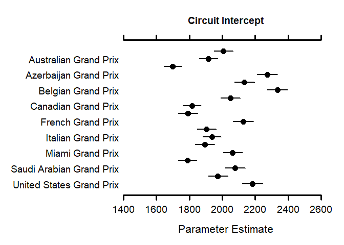
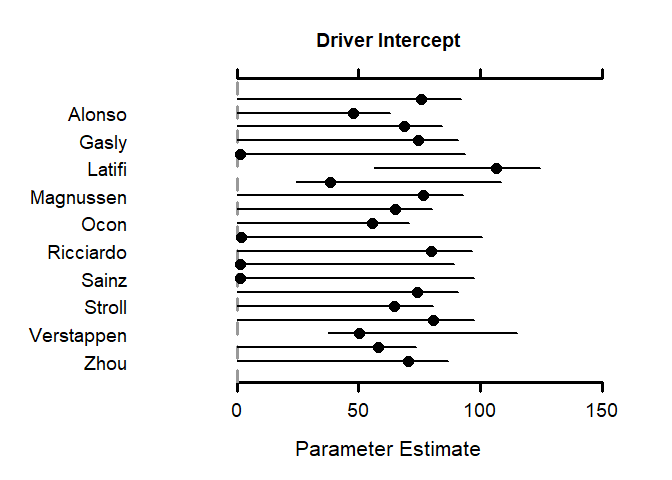
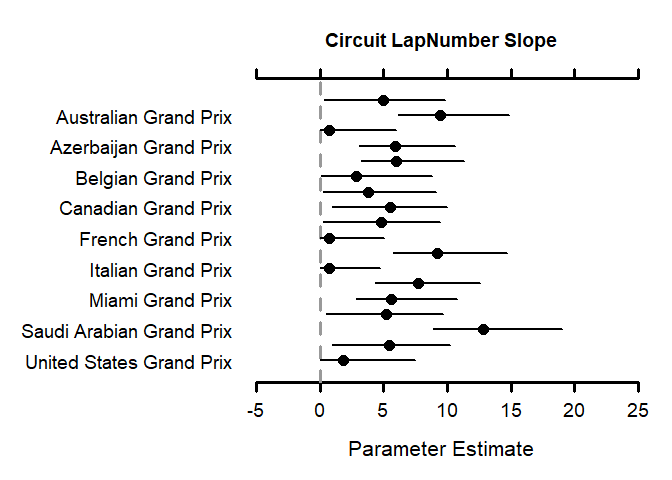

Loading packages

```r
library(MCMCvis)
library("R2jags")
```

```
## Carregando pacotes exigidos: rjags
```

```
## Carregando pacotes exigidos: coda
```

```
## Linked to JAGS 4.3.1
```

```
## Loaded modules: basemod,bugs
```

```
## 
## Attaching package: 'R2jags'
```

```
## The following object is masked from 'package:coda':
## 
##     traceplot
```

```r
library("readxl")
library("AICcmodavg")
```

Loading data


```r
df = read_excel("./files/Races_cleaned.xlsx")
```

```
## New names:
## • `` -> `...1`
```

```r
df$TyreType = as.factor(df$TyreType)
one_hot_encoded = model.matrix(~TyreType - 1, df)
df = cbind(df,one_hot_encoded)
```

Setting parameters for jags models


```r
y = as.numeric(unlist(df[,'msLapTime']))
x1 = as.numeric(unlist(df[,'LapNumber']))
x2 = as.numeric(unlist(df[,'TyreLife']))
x3_1 = as.factor(unlist(df[,'TyreTypeC1']))
x3_2 = as.factor(unlist(df[,'TyreTypeC2']))
x3_3 = as.factor(unlist(df[,'TyreTypeC3']))
x3_4 = as.factor(unlist(df[,'TyreTypeC4']))
x3_5 = as.factor(unlist(df[,'TyreTypeC5']))
x4 = as.numeric(unlist(df[,'GridPosition']))
x5 = as.numeric(unlist(df[,'CircuitLength']))
c <- as.factor(unlist(df['EventName']))
d <- as.factor(unlist(df['LastName']))
n <- length(y)
n_circuits <- length(unlist(unique(df['EventName'])))
n_drivers <- length(unlist(unique(df['LastName'])))
```

Optional - load previously run models


```r
load("./files/Models/modelo 1b.rda")
load("./files/Models/modelo 2b.rda")
load("./files/Models/modelo 3b.rda")
load("./files/Models/modelo 4b.rda")
load("./files/Models/modelo 5b.rda")
```

Modelo 1


```r
mod_1 <- "model{
  #likelihood
  for (i in 1:n){
    #likelihood
    y[i] ~ dnorm(y.hat[i],tau.y)
    y.hat[i] <- 0 + b1 * x1[i] + b2*x2[i] +b3_1 * x3_1[i] +b3_2 * x3_2[i] +b3_3 * x3_3[i] + b3_4 * x3_4[i] + b3_5 * x3_5[i] + b4 * x4[i] 
  }
  
  #prior
  b1 ~ dnorm(0,0.01)
  b2 ~ dnorm(0,0.01)
  b3_1 ~ dnorm(0,0.01)
  b3_2 ~ dnorm(0,0.01)
  b3_3 ~ dnorm(0,0.01)
  b3_4 ~ dnorm(0,0.01)
  b3_5 ~ dnorm(0,0.01)
  b4 ~ dnorm(0,0.01)
  b5 ~ dnorm(0,0.01)
 
  tau.y <- pow(sigma.y,-2)
  sigma.y ~ dgamma(1,1)
}"
```


```r
writeLines(mod_1, "./files/Models/mod_1.jags")
data_1 <- list("y","x1","x2","x3_1","x3_2","x3_3","x3_4","x3_5","x4","n") 
param_1 <- c("b1","b2","b3_1","b3_2","b3_3","b3_4","b3_5","b4","sigma.y") 
```


```r
inits_1 <- function(){
  list("b1"= 1,"b2"= 1,"b3_1"=1,"b3_2"=1,"b3_3"=1,"b3_4"=1,"b3_5"=1,"b4"= 1,"b5" = 1, sigma.y = 1)
}
```


```r
mod1.jags <- jags(data = data_1,
                  inits = inits_1,
                  parameters.to.save = param_1,
                  n.iter = 5000,
                  n.chains = 4,
                  model.file = "./files/Models/mod_1.jags")
```

```
## module glm loaded
```

```
## Compiling model graph
##    Resolving undeclared variables
##    Allocating nodes
## Graph information:
##    Observed stochastic nodes: 16310
##    Unobserved stochastic nodes: 10
##    Total graph size: 159471
## 
## Initializing model
```

```r
save(mod1.jags, file = "./files/Models/modelo 1b.rda")
```


```r
mod1.jags$BUGSoutput$summary
```

```
##                  mean         sd         2.5%          25%          50%
## b1         1202.03815   6.234862   1190.34799   1197.83496   1202.03313
## b2          654.67771   9.005336    636.88151    648.77511    654.63838
## b3_1         74.22379  10.012936     54.52566     67.61275     74.05200
## b3_2         95.04413   9.889454     75.72417     88.29275     94.89760
## b3_3        109.72947   9.852835     90.23202    103.25585    109.82138
## b3_4         82.34360  10.003935     62.16239     75.81830     82.46087
## b3_5         72.50128   9.971589     52.75474     65.90442     72.51586
## b4          692.79266   9.810896    673.08456    686.34710    692.88032
## deviance 408782.31169 193.472472 408404.97649 408651.26404 408779.41062
## sigma.y   28216.88281  94.837476  28033.64588  28152.17998  28217.17718
##                   75%        97.5%     Rhat n.eff
## b1         1206.20930   1214.27532 1.001240  3900
## b2          660.69504    672.38461 1.000884  5000
## b3_1         80.85895     94.22968 1.000688  5000
## b3_2        101.61628    114.63060 1.001006  5000
## b3_3        116.47051    128.97767 1.000804  5000
## b3_4         89.02637    101.48590 1.001080  5000
## b3_5         79.23708     92.06900 1.001066  5000
## b4          699.61200    711.49188 1.001037  5000
## deviance 408912.03714 409160.86930 1.000983  5000
## sigma.y   28280.37946  28405.23395 1.000956  5000
```

```r
mod1.jags$BUGSoutput$DIC
```

```
## [1] 427500.7
```

Modelo 2


```r
mod_2 <- "model{
  #likelihood
  for (i in 1:n){
    #likelihood
    y[i] ~ dnorm(y.hat[i],tau.y)
    y.hat[i] <- (0 + b5 * x5[i]) + b1 * x1[i] + b2*x2[i] +b3_1 * x3_1[i] +b3_2 * x3_2[i] +b3_3 * x3_3[i] + b3_4 * x3_4[i] + b3_5 * x3_5[i] + b4 * x4[i]
  }
  
  #prior
  b1 ~ dnorm(0,0.01)
  b2 ~ dnorm(0,0.01)
  b3_1 ~ dnorm(0,0.01)
  b3_2 ~ dnorm(0,0.01)
  b3_3 ~ dnorm(0,0.01)
  b3_4 ~ dnorm(0,0.01)
  b3_5 ~ dnorm(0,0.01)
  b4 ~ dnorm(0,0.01)
  b5 ~ dnorm(0,0.01)
  
  tau.y <- pow(sigma.y,-2)
  sigma.y ~ dgamma(1,1)
}"
```


```r
writeLines(mod_2, "./files/Models/mod_2.jags")
data_2 <- list("y","x1","x2","x3_1","x3_2","x3_3","x3_4","x3_5","x4","n","x5") #Adiciona x5
param_2 <- c("b1","b2","b3_1","b3_2","b3_3","b3_4","b3_5","b4","sigma.y","b5") #adiciona b5 
```


```r
inits_2 <- function(){
  list("b1"= 1,"b2"= 1,"b3_1"=1,"b3_2"=1,"b3_3"=1,"b3_4"=1,"b3_5"=1,"b4"= 1,"b5"= 1, sigma.y = 1)
}
```


```r
mod2.jags <- jags(data = data_2,
                  inits = inits_2,
                  parameters.to.save = param_2,
                  n.iter = 5000,
                  n.chains = 4,
                  model.file = "./files/Models/mod_2.jags")
```

```
## Compiling model graph
##    Resolving undeclared variables
##    Allocating nodes
## Graph information:
##    Observed stochastic nodes: 16310
##    Unobserved stochastic nodes: 10
##    Total graph size: 179503
## 
## Initializing model
```

```r
save(mod2.jags, file = "./files/Models/modelo 2b.rda")
```


```r
mod2.jags$BUGSoutput$summary
```

```
##                  mean         sd         2.5%          25%          50%
## b1         1183.57042   6.133274   1171.56660   1179.41989   1183.50868
## b2          648.33388   8.988915    630.36769    642.28605    648.45574
## b3_1         74.46150   9.956814     55.00108     67.77651     74.43625
## b3_2         95.18835  10.043422     75.58398     88.39844     95.09297
## b3_3        110.66776  10.111176     90.74447    103.90376    110.63812
## b3_4         82.85092   9.951115     62.37683     76.44100     82.84820
## b3_5         72.75582  10.037976     53.01396     66.24941     72.60430
## b4          694.32866   9.598978    675.49505    687.87909    694.21610
## b5          393.98059   9.912836    374.90324    387.21114    393.88787
## deviance 407425.82560 191.439466 407049.68970 407297.60185 407427.00080
## sigma.y   27597.10184  94.234416  27415.74004  27534.41217  27594.72045
##                   75%        97.5%     Rhat n.eff
## b1         1187.62397   1195.65247 1.000941  5000
## b2          654.40650    665.70788 1.002413  1400
## b3_1         81.24577     93.60314 1.001317  3500
## b3_2        101.84288    115.06910 1.000609  5000
## b3_3        117.46967    130.49785 1.001342  3400
## b3_4         89.38034    102.62922 1.001162  4400
## b3_5         79.38062     92.39242 1.001228  4000
## b4          700.67184    713.44971 1.000867  5000
## b5          400.69614    413.43386 1.000636  5000
## deviance 407555.30378 407798.25473 1.000855  5000
## sigma.y   27660.22025  27789.58052 1.000604  5000
```

```r
mod2.jags$BUGSoutput$DIC
```

```
## [1] 425755.7
```

Modelo 3


```r
mod_3 <- "model{
  #likelihood
  for (i in 1:n){
    #likelihood
    y[i] ~ dnorm(y.hat[i],tau.y)
    y.hat[i] <- (0 + b5 * x5[i] + int_circuito[c[i]]) + b1 * x1[i] + b2*x2[i] +b3_1 * x3_1[i] +b3_2 * x3_2[i] +b3_3 * x3_3[i] + b3_4 * x3_4[i] + b3_5 * x3_5[i] + b4 * x4[i]  # adiciona int_circuito[c[i]]
  }
  
  for (c in 1:n_circuits){
        int_circuito[c] ~ dnorm(0,tau.u[c])
      }
  
  #prior
  b1 ~ dnorm(0,0.01)
  b2 ~ dnorm(0,0.01)
  b3_1 ~ dnorm(0,0.01)
  b3_2 ~ dnorm(0,0.01)
  b3_3 ~ dnorm(0,0.01)
  b3_4 ~ dnorm(0,0.01)
  b3_5 ~ dnorm(0,0.01)
  b4 ~ dnorm(0,0.01)
  b5 ~ dnorm(0,0.01)
  tau.y <- pow(sigma.y,-2)
  sigma.y ~ dgamma(1,1)
  
  
  
  for (c in 1:n_circuits){
    tau.u[c] <- pow(sigma.u[c],-2)
    sigma.u[c] ~ dgamma(1,1)
}
  
}"
```


```r
writeLines(mod_3, "./files/Models/mod_3.jags")
data_3 <- list("y","x1","x2","x3_1","x3_2","x3_3","x3_4","x3_5","x4","n","c","x5","n_circuits") #Adiciona c, n_circuits
param_3 <- c("b1","b2","b3_1","b3_2","b3_3","b3_4","b3_5","b4","sigma.y","b5","sigma.u") #adiciona sigma.u
```


```r
inits_3 <- function(){
  list("b1"= 1,"b2"= 1,"b3_1"=1,"b3_2"=1,"b3_3"=1,"b3_4"=1,"b3_5"=1,"b4"= 1,"b5" = 1, sigma.y = 1, sigma.u = rep(1,n_circuits)) #adiciona sigma.u = rep(1,n_circuits)
}
```


```r
mod3.jags <- jags(data = data_3,
                  inits = inits_3,
                  parameters.to.save = param_3,
                  n.iter = 5000,
                  n.chains = 4,
                  model.file = "./files/Models/mod_3.jags")
```

```
## Compiling model graph
##    Resolving undeclared variables
##    Allocating nodes
## Graph information:
##    Observed stochastic nodes: 16310
##    Unobserved stochastic nodes: 46
##    Total graph size: 195955
## 
## Initializing model
```

```r
save(mod3.jags, file = "./files/Models/modelo 3b.rda")
```


```r
mod3.jags$BUGSoutput$summary
```

```
##                     mean         sd          2.5%          25%          50%
## b1             -46.61732  0.5063218    -47.594733    -46.95569    -46.61152
## b2              37.97577  0.9830363     36.081089     37.31804     37.98284
## b3_1            48.49538  9.7147770     29.862482     41.69288     48.50624
## b3_2            80.09590  9.0544400     62.098825     74.07458     80.09029
## b3_3            45.45795  8.5340849     28.757813     39.57252     45.42207
## b3_4            27.01390  9.1811397      8.815525     20.88062     27.01844
## b3_5            41.57695  9.8446417     22.814059     35.00243     41.74083
## b4              98.57698  1.2533705     96.163215     97.74394     98.58485
## b5             210.42425  9.9384302    190.760003    203.66925    210.41409
## deviance    270442.80210 20.1346111 270406.592728 270428.58756 270441.62526
## sigma.u[1]    2005.75212 26.0561962   1956.412368   1988.02221   2005.51647
## sigma.u[2]    1897.44289 25.4477360   1848.543377   1879.74703   1897.32615
## sigma.u[3]    1694.94610 23.3994610   1650.217984   1679.02401   1694.65734
## sigma.u[4]    2264.53289 27.2698851   2210.904861   2245.69408   2264.22266
## sigma.u[5]    2123.33771 26.3997084   2071.881988   2105.62869   2123.50581
## sigma.u[6]    2329.80033 28.1978258   2276.430885   2310.36370   2329.18879
## sigma.u[7]    2042.55842 26.5214158   1990.566017   2024.69793   2042.88262
## sigma.u[8]    1816.71341 24.7110986   1769.804805   1799.86315   1816.56806
## sigma.u[9]    1791.21779 24.2784617   1744.229387   1774.82299   1791.36816
## sigma.u[10]   2122.56299 26.3759654   2071.102755   2104.73142   2122.59847
## sigma.u[11]   1914.50492 25.1050355   1865.400807   1897.22609   1914.80342
## sigma.u[12]   1934.39613 25.6965743   1883.906781   1917.45622   1934.31896
## sigma.u[13]   1900.40085 25.2577845   1852.082168   1883.14656   1900.11885
## sigma.u[14]   2054.76456 25.9780640   2003.975742   2037.12107   2054.43165
## sigma.u[15]   1789.46086 24.0792405   1742.777910   1773.34538   1789.07650
## sigma.u[16]   2057.29419 26.4758645   2006.833850   2038.93952   2056.80991
## sigma.u[17]   1973.51658 26.2773762   1923.043582   1955.99354   1973.68052
## sigma.u[18]   2176.23588 26.6740394   2124.813214   2157.57045   2175.73914
## sigma.y        937.30469  5.0977005    927.263158    933.85357    937.30252
##                      75%        97.5%     Rhat n.eff
## b1             -46.28032    -45.61792 1.000755  5000
## b2              38.64818     39.91505 1.000941  5000
## b3_1            55.16522     67.77023 1.000667  5000
## b3_2            86.21462     98.17809 1.000653  5000
## b3_3            51.34251     61.66692 1.001205  4100
## b3_4            33.17305     44.85028 1.001067  5000
## b3_5            48.32826     60.67855 1.001232  4000
## b4              99.43759    100.97079 1.001803  2100
## b5             217.22238    229.54108 1.001155  4500
## deviance    270455.87728 270484.37906 1.000000     1
## sigma.u[1]    2022.89421   2058.70474 1.001529  2700
## sigma.u[2]    1914.38837   1947.83588 1.000974  5000
## sigma.u[3]    1710.48044   1741.60680 1.000764  5000
## sigma.u[4]    2283.59366   2317.76218 1.000812  5000
## sigma.u[5]    2141.23055   2174.27425 1.001503  2800
## sigma.u[6]    2348.15348   2386.15910 1.001845  2000
## sigma.u[7]    2060.52606   2095.14805 1.001713  2200
## sigma.u[8]    1833.29090   1866.08773 1.001111  4900
## sigma.u[9]    1807.47004   1839.69480 1.000669  5000
## sigma.u[10]   2140.32332   2175.10240 1.001339  3400
## sigma.u[11]   1931.44564   1963.04084 1.001281  3700
## sigma.u[12]   1950.75968   1987.06842 1.001521  2700
## sigma.u[13]   1917.44310   1949.81732 1.000892  5000
## sigma.u[14]   2071.71127   2106.27397 1.000733  5000
## sigma.u[15]   1805.27381   1837.91093 1.000656  5000
## sigma.u[16]   2075.04598   2110.01288 1.001443  3000
## sigma.u[17]   1991.16710   2026.03130 1.000744  5000
## sigma.u[18]   2194.41107   2229.70813 1.001213  4100
## sigma.y        940.67097    947.31634 1.000909  5000
```

```r
mod3.jags$BUGSoutput$DIC
```

```
## [1] 270645.6
```

Modelo 4


```r
mod_4 <- "model{
  #likelihood
  for (i in 1:n){
    #likelihood
    y[i] ~ dnorm(y.hat[i],tau.y)
    y.hat[i] <- (0 + b5 * x5[i] + int_circuito[c[i]] + int_piloto[d[i]]) + b1 * x1[i] + b2*x2[i] +b3_1 * x3_1[i] +b3_2 * x3_2[i] +b3_3 * x3_3[i] + b3_4 * x3_4[i] + b3_5 * x3_5[i] + b4 * x4[i]  # adiciona int_piloto[d[i]]
  }
  
  for (c in 1:n_circuits){
        int_circuito[c] ~ dnorm(0,tau.u[c])
  }
      
  for (d in 1:n_drivers){
        int_piloto[d] ~ dnorm(0,tau.v[d])
  }
  
  #prior
  b1 ~ dnorm(0,0.01)
  b2 ~ dnorm(0,0.01)
  b3_1 ~ dnorm(0,0.01)
  b3_2 ~ dnorm(0,0.01)
  b3_3 ~ dnorm(0,0.01)
  b3_4 ~ dnorm(0,0.01)
  b3_5 ~ dnorm(0,0.01)
  b4 ~ dnorm(0,0.01)
  b5 ~ dnorm(0,0.01)
  
  tau.y <- pow(sigma.y,-2)
  sigma.y ~ dgamma(1,1)
  
  for (c in 1:n_circuits){
    tau.u[c] <- pow(sigma.u[c],-2)
    sigma.u[c] ~ dgamma(1,1)
  }

  for (d in 1:n_drivers){
    tau.v[d] <- pow(sigma.v[d],-2)
    sigma.v[d] ~ dgamma(1,1)
  }
  

}"
```


```r
writeLines(mod_4, "./files/Models/mod_4.jags")
data_4 <- list("y","x1","x2","x3_1","x3_2","x3_3","x3_4","x3_5","x4","n","c","x5","n_circuits","d","n_drivers") #Adiciona d, n_drivers
param_4 <- c("b1","b2","b3_1","b3_2","b3_3","b3_4","b3_5","b4","sigma.y","b5","sigma.u","sigma.v") #adiciona sigma.u
```


```r
inits_4 <- function(){
  list("b1"= 1,"b2"= 1,"b3_1"=1,"b3_2"=1,"b3_3"=1,"b3_4"=1,"b3_5"=1,"b4"= 1,"b5" = 1, sigma.y = 1, sigma.u = rep(1,n_circuits), sigma.v = rep(1,n_drivers))
}
```


```r
mod4.jags <- jags(data = data_4,
                  inits = inits_4,
                  parameters.to.save = param_4,
                  n.iter = 5000,
                  n.chains = 4,
                  model.file = "./files/Models/mod_4.jags")
```

```
## Compiling model graph
##    Resolving undeclared variables
##    Allocating nodes
## Graph information:
##    Observed stochastic nodes: 16310
##    Unobserved stochastic nodes: 86
##    Total graph size: 212694
## 
## Initializing model
```

```r
save(mod4.jags, file = "./files/Models/modelo 4b.rda")
```


```r
mod4.jags$BUGSoutput$summary
```

```
##                     mean          sd          2.5%           25%           50%
## b1             -46.10994   0.4469333 -4.701513e+01 -4.641241e+01    -46.110438
## b2              35.68215   0.8906949  3.388243e+01  3.508907e+01     35.692477
## b3_1            49.23666  10.4389177  2.944301e+01  4.210708e+01     48.946319
## b3_2            70.09078   9.9009880  5.119763e+01  6.331676e+01     69.897580
## b3_3            54.07204   9.4114130  3.627079e+01  4.759318e+01     53.765964
## b3_4            36.30410   9.5295920  1.802971e+01  2.974878e+01     36.427747
## b3_5            42.22162  10.1459252  2.256028e+01  3.533928e+01     42.239836
## b4              49.47656   7.0081590  3.564122e+01  4.699048e+01     52.749153
## b5             224.22058  26.4430761  1.920676e+02  2.057180e+02    214.309102
## deviance    266818.08295 218.5904111  2.664165e+05  2.667357e+05 266923.407550
## sigma.u[1]    1656.84178 622.8582458  5.611562e+02  1.463600e+03   2004.939995
## sigma.u[2]    1520.94897 672.6622632  3.427264e+02  1.237409e+03   1898.080458
## sigma.u[3]    1362.41374 595.4329231  3.180976e+02  1.113546e+03   1696.063360
## sigma.u[4]    1956.56075 550.2528564  9.810228e+02  1.824641e+03   2261.457044
## sigma.u[5]    1796.69554 585.0983133  7.638054e+02  1.628899e+03   2122.497125
## sigma.u[6]    2028.51054 537.9990667  1.074109e+03  1.899068e+03   2326.896376
## sigma.u[7]    1701.58803 610.0064607  6.275447e+02  1.516975e+03   2041.647692
## sigma.u[8]    1404.58068 733.8860782  1.257038e+02  9.583567e+02   1817.357727
## sigma.u[9]    1352.14139 780.4209924  1.389197e-01  4.289160e+02   1792.215529
## sigma.u[10]   1795.29672 585.6744757  7.616558e+02  1.614397e+03   2121.874472
## sigma.u[11]   1542.66027 662.3656621  3.818527e+02  1.285427e+03   1913.412175
## sigma.u[12]   1568.42225 653.4473636  4.213068e+02  1.317093e+03   1934.109785
## sigma.u[13]   1525.62899 669.2021939  3.533235e+02  1.256139e+03   1900.233364
## sigma.u[14]   1715.94331 606.0722296  6.485207e+02  1.531841e+03   2053.938925
## sigma.u[15]   1350.58419 779.5634752  1.058021e-01  4.365229e+02   1789.801403
## sigma.u[16]   1718.98719 604.8537313  6.536319e+02  1.539582e+03   2055.767740
## sigma.u[17]   1617.75345 635.0288891  5.028691e+02  1.401723e+03   1972.907266
## sigma.u[18]   1856.57326 570.6311144  8.464188e+02  1.708947e+03   2174.107204
## sigma.v[1]     452.03556 781.2011109  3.832348e-02  4.419661e-01      1.168082
## sigma.v[2]     450.14889 777.9595592  3.400267e-02  4.348257e-01      1.195862
## sigma.v[3]     451.02095 779.5850960  3.794066e-02  4.227145e-01      1.125768
## sigma.v[4]     451.47852 780.3335543  3.334096e-02  3.983704e-01      1.125488
## sigma.v[5]     508.56891 738.5825940  7.246675e+01  7.945633e+01     84.576438
## sigma.v[6]     500.14964 757.0243554  5.347046e+01  6.076681e+01     65.383861
## sigma.v[7]     517.31455 730.7238126  8.499270e+01  9.262473e+01     98.186679
## sigma.v[8]     451.88702 780.9447199  4.122848e-02  4.179867e-01      1.199420
## sigma.v[9]     450.92252 779.4482882  3.319130e-02  4.077232e-01      1.111853
## sigma.v[10]    450.56166 778.8388210  4.390831e-02  4.146645e-01      1.125095
## sigma.v[11]    513.00584 734.8696213  7.816407e+01  8.596222e+01     91.259244
## sigma.v[12]    452.15392 781.3714889  4.811977e-02  4.682892e-01      1.227170
## sigma.v[13]    505.12278 740.6286269  6.752642e+01  7.508319e+01     79.973725
## sigma.v[14]    509.85788 735.6874708  7.482213e+01  8.248057e+01     87.622392
## sigma.v[15]    451.33771 780.0783420  3.846419e-02  4.016450e-01      1.166609
## sigma.v[16]    450.67839 779.0006143  2.831029e-02  4.159522e-01      1.119620
## sigma.v[17]    451.93791 781.0581261  4.333200e-02  4.077280e-01      1.151997
## sigma.v[18]    522.19962 727.8744395  9.106434e+01  9.929917e+01    104.546466
## sigma.v[19]    451.18055 779.8607752  3.993011e-02  4.282394e-01      1.128042
## sigma.v[20]    451.17811 779.9600874  3.942496e-02  3.901575e-01      1.062273
## sigma.y        841.31855   7.0895186  8.261102e+02  8.365955e+02    842.540982
##                      75%        97.5%      Rhat n.eff
## b1             -45.81568    -45.24347  1.017263   150
## b2              36.29787     37.38691  1.007309   380
## b3_1            56.20712     69.99803  1.116549    27
## b3_2            76.75020     89.99889  1.210204    16
## b3_3            60.35031     72.77804  1.203593    17
## b3_4            42.77843     54.82498  1.062204    45
## b3_5            49.03688     61.88898  1.058714    47
## b4              54.10198     56.24512  7.641130     4
## b5             242.17102    279.27511  3.676471     5
## deviance    266959.09173 267017.49164  9.303380     4
## sigma.u[1]    2027.04395   2064.71079 51.973355     4
## sigma.u[2]    1920.36182   1954.67220 60.519211     4
## sigma.u[3]    1716.04735   1749.52229 56.141628     4
## sigma.u[4]    2285.62962   2324.91690 39.545404     4
## sigma.u[5]    2145.72004   2184.48595 45.704560     4
## sigma.u[6]    2350.95159   2389.56054 38.823288     4
## sigma.u[7]    2064.45136   2102.50949 49.658933     4
## sigma.u[8]    1838.81645   1872.77948 64.991399     4
## sigma.u[9]    1812.47661   1847.08970  9.792150     4
## sigma.u[10]   2144.39152   2183.07961 46.501552     4
## sigma.u[11]   1935.59162   1971.97962 58.641257     4
## sigma.u[12]   1956.84770   1992.25820 55.412224     4
## sigma.u[13]   1922.97868   1957.22451 60.005767     4
## sigma.u[14]   2077.46073   2114.11815 48.464478     4
## sigma.u[15]   1810.76334   1847.97300  8.897303     4
## sigma.u[16]   2078.94608   2116.92787 49.414327     4
## sigma.u[17]   1995.12904   2031.64504 55.419067     4
## sigma.u[18]   2197.42848   2235.86304 42.550008     4
## sigma.v[1]      31.62540   1836.82255  4.944647     4
## sigma.v[2]      35.79573   1828.65575  4.895168     4
## sigma.v[3]      31.60265   1831.95179  5.105066     4
## sigma.v[4]      29.69622   1834.10272  5.008977     4
## sigma.v[5]     215.44267   1818.33987 34.281747     4
## sigma.v[6]     180.74360   1843.00561 30.941220     4
## sigma.v[7]     232.83669   1814.57983 35.780951     4
## sigma.v[8]      43.10663   1835.05292  5.053048     4
## sigma.v[9]      25.98364   1831.19531  5.018783     4
## sigma.v[10]     35.88158   1828.12780  5.228844     4
## sigma.v[11]    221.51029   1815.63796 34.881462     4
## sigma.v[12]     35.00950   1837.64362  5.308097     4
## sigma.v[13]    206.96464   1817.77717 33.000545     4
## sigma.v[14]    215.00151   1816.13420 34.514564     4
## sigma.v[15]     33.86101   1831.24033  4.951300     4
## sigma.v[16]     33.74363   1831.49461  4.827436     4
## sigma.v[17]     30.95079   1836.13113  4.963751     4
## sigma.v[18]    247.21054   1815.31210 36.579589     4
## sigma.v[19]     35.08507   1834.45171  5.076565     4
## sigma.v[20]     32.62606   1832.70023  5.272901     4
## sigma.y        846.47412    852.80635  2.050323     6
```

```r
mod4.jags$BUGSoutput$DIC
```

```
## [1] 267494.5
```

Modelo 5


```r
mod_5 <- "model{
  #likelihood
  for (i in 1:n){
    #likelihood
    y[i] ~ dnorm(y.hat[i],tau.y)
    y.hat[i] <- (0 + b5 * x5[i] + int_circuito[c[i]] + int_piloto[d[i]])  + (b1 + slope_circuito[c[i]]) * x1[i] + b2*x2[i] + b3_1 * x3_1[i] + b3_2 * x3_2[i] + b3_3 * x3_3[i] + b3_4 * x3_4[i] + b3_5 * x3_5[i] + b4 * x4[i]  # adiciona slope_circuito[c[i]]
  }
  
  for (c in 1:n_circuits){
        int_circuito[c] ~ dnorm(0,tau.u[c])
        slope_circuito[c] ~ dnorm(0,tau.w[c])
  }
      
  for (d in 1:n_drivers){
        int_piloto[d] ~ dnorm(0,tau.v[d])
  }
  
  #prior
  b1 ~ dnorm(0,0.01)
  b2 ~ dnorm(0,0.01)
  b3_1 ~ dnorm(0,0.01)
  b3_2 ~ dnorm(0,0.01)
  b3_3 ~ dnorm(0,0.01)
  b3_4 ~ dnorm(0,0.01)
  b3_5 ~ dnorm(0,0.01)
  b4 ~ dnorm(0,0.01)
  b5 ~ dnorm(0,0.01)
  
  tau.y <- pow(sigma.y,-2)
  sigma.y ~ dgamma(1,1)
  
  for (c in 1:n_circuits){
    tau.u[c] <- pow(sigma.u[c],-2)
    sigma.u[c] ~ dgamma(1,1)
      tau.w[c] <- pow(sigma.w[c],-2)
    sigma.w[c] ~ dgamma(1,1)
  }

  for (d in 1:n_drivers){
    tau.v[d] <- pow(sigma.v[d],-2)
    sigma.v[d] ~ dgamma(1,1)
  }
  

}"
```


```r
writeLines(mod_5, "./files/Models/mod_5.jags")
data_5 <- list("y","x1","x2","x3_1","x3_2","x3_3","x3_4","x3_5","x4","n","c","x5","n_circuits","d","n_drivers") 
param_5 <- c("b1","b2","b3_1","b3_2","b3_3","b3_4","b3_5","b4","sigma.y","b5","sigma.u","sigma.v","sigma.w") #adiciona sigma.w
```


```r
inits_5 <- function(){
  list("b1"= 1,"b2"= 1,"b3_1"=1,"b3_2"=1,"b3_3"=1,"b3_4"=1,"b3_5"=1,"b4"= 1,"b5" = 1, sigma.y = 1, sigma.u = rep(1,n_circuits), sigma.v = rep(1,n_drivers), sigma.w = rep(1,n_circuits))
}
```


```r
mod5.jags <- jags(data = data_5,
                  inits = inits_5,
                  parameters.to.save = param_5,
                  n.iter = 5000,
                  n.chains = 4,
                  model.file = "./files/Models/mod_5.jags")
```

```
## Compiling model graph
##    Resolving undeclared variables
##    Allocating nodes
## Graph information:
##    Observed stochastic nodes: 16310
##    Unobserved stochastic nodes: 122
##    Total graph size: 213654
## 
## Initializing model
```

```r
save(mod5.jags, file = "./files/Models/modelo 5b.rda")
```


```r
mod5.jags$BUGSoutput$summary
```

```
##                      mean         sd          2.5%           25%           50%
## b1             -52.236237   2.694335 -5.546731e+01 -5.376398e+01 -5.275836e+01
## b2              41.358939   1.015966  3.937672e+01  4.067474e+01  4.136062e+01
## b3_1            51.126247   9.753872  3.191575e+01  4.449027e+01  5.131856e+01
## b3_2            87.119650   9.221202  6.915265e+01  8.075685e+01  8.711472e+01
## b3_3            31.511353   8.696193  1.442747e+01  2.561081e+01  3.143470e+01
## b3_4            31.719813   9.181036  1.379590e+01  2.553137e+01  3.172363e+01
## b3_5            40.991277   9.850606  2.169659e+01  3.435698e+01  4.083110e+01
## b4              56.040342   3.092191  4.966214e+01  5.393518e+01  5.683804e+01
## b5             210.371681  10.120936  1.908141e+02  2.035625e+02  2.103120e+02
## deviance    265034.007684 107.032448  2.648438e+05  2.649470e+05  2.650451e+05
## sigma.u[1]    2005.362474  26.014979  1.955918e+03  1.987271e+03  2.005378e+03
## sigma.u[2]    1916.078051  25.637977  1.866862e+03  1.898580e+03  1.915699e+03
## sigma.u[3]    1699.917727  24.760795  1.651137e+03  1.683012e+03  1.699654e+03
## sigma.u[4]    2273.454154  27.942512  2.219829e+03  2.254870e+03  2.273126e+03
## sigma.u[5]    2133.762106  27.182711  2.081920e+03  2.115444e+03  2.133229e+03
## sigma.u[6]    2334.392901  28.048659  2.279226e+03  2.315299e+03  2.333982e+03
## sigma.u[7]    2049.498497  26.338929  1.998630e+03  2.031356e+03  2.049228e+03
## sigma.u[8]    1815.347444  25.013566  1.766463e+03  1.798145e+03  1.815590e+03
## sigma.u[9]    1791.547251  25.597639  1.740998e+03  1.774246e+03  1.791157e+03
## sigma.u[10]   2127.368530  27.204146  2.073327e+03  2.109239e+03  2.127037e+03
## sigma.u[11]   1903.959306  25.809835  1.854665e+03  1.886292e+03  1.903892e+03
## sigma.u[12]   1938.593332  25.538495  1.888218e+03  1.920968e+03  1.938302e+03
## sigma.u[13]   1894.440398  25.880716  1.843514e+03  1.876652e+03  1.894815e+03
## sigma.u[14]   2063.457490  26.682378  2.011490e+03  2.045366e+03  2.063364e+03
## sigma.u[15]   1788.825503  25.006836  1.740219e+03  1.772042e+03  1.788442e+03
## sigma.u[16]   2078.017010  27.073407  2.024793e+03  2.059734e+03  2.077819e+03
## sigma.u[17]   1972.756371  26.225389  1.922146e+03  1.955228e+03  1.971416e+03
## sigma.u[18]   2182.346835  27.262135  2.128616e+03  2.164243e+03  2.182605e+03
## sigma.v[1]      59.223403  34.045673  1.220679e-01  3.297870e+01  7.585966e+01
## sigma.v[2]      37.968931  21.815324  1.209197e-01  1.504176e+01  4.772031e+01
## sigma.v[3]      53.768803  30.918830  1.432933e-01  3.172698e+01  6.871593e+01
## sigma.v[4]      58.078043  33.322658  1.216886e-01  3.279318e+01  7.426957e+01
## sigma.v[5]      21.900226  36.119070  3.772005e-02  4.376496e-01  1.198388e+00
## sigma.v[6]      98.465829  20.580298  5.821025e+01  8.706690e+01  1.066881e+02
## sigma.v[7]      51.336962  27.323705  2.586954e+01  3.337808e+01  3.824700e+01
## sigma.v[8]      59.795806  34.317017  1.154919e-01  3.456012e+01  7.660504e+01
## sigma.v[9]      50.962694  29.234452  1.022222e-01  2.873371e+01  6.500474e+01
## sigma.v[10]     43.955709  25.267856  1.040733e-01  2.553657e+01  5.569963e+01
## sigma.v[11]     24.942117  38.475654  4.446987e-02  5.224277e-01  1.538914e+00
## sigma.v[12]     62.225075  35.663697  1.183840e-01  3.975010e+01  7.985331e+01
## sigma.v[13]     20.739975  34.173643  3.680824e-02  4.387435e-01  1.176885e+00
## sigma.v[14]     22.638597  37.381813  3.990379e-02  4.196020e-01  1.264587e+00
## sigma.v[15]     58.002208  33.294807  1.320755e-01  3.077506e+01  7.421125e+01
## sigma.v[16]     50.499822  29.070111  1.130623e-01  2.561348e+01  6.442160e+01
## sigma.v[17]     62.695671  36.036480  1.031734e-01  3.371076e+01  8.054970e+01
## sigma.v[18]     62.126747  25.031091  3.885692e+01  4.556360e+01  5.011936e+01
## sigma.v[19]     45.645215  26.252216  1.170994e-01  2.570709e+01  5.798960e+01
## sigma.v[20]     55.097000  31.621388  1.339167e-01  3.168286e+01  7.038810e+01
## sigma.w[1]       5.054064   1.792138  8.166967e-01  4.025697e+00  4.968578e+00
## sigma.w[2]       9.651727   1.973313  6.491230e+00  8.230715e+00  9.419776e+00
## sigma.w[3]       1.176120   1.296484  2.826472e-02  3.137676e-01  7.557940e-01
## sigma.w[4]       6.108001   1.696432  3.385553e+00  4.893521e+00  5.892890e+00
## sigma.w[5]       6.251602   1.771624  3.527962e+00  4.988237e+00  5.980356e+00
## sigma.w[6]       3.077852   2.042885  1.481294e-01  1.500856e+00  2.847472e+00
## sigma.w[7]       4.008587   1.881804  6.261940e-01  2.725503e+00  3.824796e+00
## sigma.w[8]       5.632187   1.754245  1.705836e+00  4.565261e+00  5.551877e+00
## sigma.w[9]       4.877995   1.768001  6.204563e-01  3.828492e+00  4.806496e+00
## sigma.w[10]      1.132378   1.156259  2.962505e-02  3.056185e-01  7.700216e-01
## sigma.w[11]      9.426303   1.924970  6.197318e+00  8.124245e+00  9.190065e+00
## sigma.w[12]      1.056939   1.049389  2.574088e-02  3.048307e-01  7.298883e-01
## sigma.w[13]      7.937448   1.824856  4.797863e+00  6.694459e+00  7.752968e+00
## sigma.w[14]      5.826279   1.745240  3.144312e+00  4.550628e+00  5.573964e+00
## sigma.w[15]      5.260581   1.763186  1.197833e+00  4.191808e+00  5.186190e+00
## sigma.w[16]     13.053443   2.249570  9.288177e+00  1.146382e+01  1.283735e+01
## sigma.w[17]      5.579717   1.810959  1.487862e+00  4.496855e+00  5.478070e+00
## sigma.w[18]      2.172295   1.683866  5.868609e-02  8.889669e-01  1.861379e+00
## sigma.y        797.618901   5.006436  7.879528e+02  7.941315e+02  7.975570e+02
##                       75%         97.5%     Rhat n.eff
## b1             -51.558945    -42.597298 1.325690    18
## b2              42.065754     43.354408 1.243673    15
## b3_1            57.746927     70.091286 1.007678   360
## b3_2            93.534222    105.046630 1.058834    49
## b3_3            37.242930     48.875082 1.059757    48
## b3_4            38.145096     49.125207 1.000945  5000
## b3_5            47.603267     60.823325 1.000942  5000
## b4              58.244196     60.729185 2.781752     5
## b5             217.109120    230.133582 1.000883  5000
## deviance    265109.922254 265230.327731 2.064256     6
## sigma.u[1]    2023.078081   2057.824128 1.036089    74
## sigma.u[2]    1933.467711   1967.760221 1.035223    75
## sigma.u[3]    1717.284499   1746.979083 1.043941    62
## sigma.u[4]    2292.159309   2328.615488 1.021116   120
## sigma.u[5]    2151.622818   2188.790923 1.018470   140
## sigma.u[6]    2353.285028   2388.601003 1.026983    98
## sigma.u[7]    2067.202413   2101.771918 1.035019    76
## sigma.u[8]    1831.819335   1865.030190 1.026691    99
## sigma.u[9]    1808.566368   1842.771779 1.036967    74
## sigma.u[10]   2145.004606   2182.493452 1.025250   110
## sigma.u[11]   1921.074811   1955.156593 1.031862    85
## sigma.u[12]   1955.500203   1988.041484 1.020177   130
## sigma.u[13]   1911.466685   1944.754087 1.031604    83
## sigma.u[14]   2081.339695   2116.459692 1.029892    90
## sigma.u[15]   1805.164552   1838.898258 1.037154    71
## sigma.u[16]   2095.994520   2131.353715 1.032658    84
## sigma.u[17]   1990.207143   2026.416781 1.025097   110
## sigma.u[18]   2200.323074   2236.182301 1.017620   150
## sigma.v[1]      81.169870     90.388624 5.508145     4
## sigma.v[2]      52.702480     60.969272 4.430990     4
## sigma.v[3]      73.702311     82.508414 6.119026     4
## sigma.v[4]      79.566958     89.031573 5.321816     4
## sigma.v[5]      19.226829     91.893818 3.153910     5
## sigma.v[6]     112.547216    122.488512 5.482918     4
## sigma.v[7]      62.577645    105.749959 4.849867     4
## sigma.v[8]      81.926809     90.907294 5.269025     4
## sigma.v[9]      69.998259     78.471481 5.273271     4
## sigma.v[10]     60.592507     69.057229 4.779611     4
## sigma.v[11]     51.913368     98.245776 2.595537     5
## sigma.v[12]     85.073125     94.366200 5.152917     4
## sigma.v[13]     14.059089     87.036876 3.151146     5
## sigma.v[14]     16.774209     94.580742 3.150321     5
## sigma.v[15]     79.497713     88.383869 5.483393     4
## sigma.v[16]     69.314439     78.647719 5.112096     4
## sigma.v[17]     85.760465     95.196788 5.242889     4
## sigma.v[18]     72.895771    112.726507 5.340678     4
## sigma.v[19]     62.906573     71.975208 4.757448     4
## sigma.v[20]     75.456353     84.907662 5.500176     4
## sigma.w[1]       6.006144      8.924195 1.275242    36
## sigma.w[2]      10.851066     14.171545 1.005205   550
## sigma.w[3]       1.525476      5.054570 1.028911   110
## sigma.w[4]       7.114610      9.802441 1.037056    75
## sigma.w[5]       7.234934     10.371813 1.020385   130
## sigma.w[6]       4.273330      7.715863 1.041208    67
## sigma.w[7]       5.085473      8.290679 1.073712    82
## sigma.w[8]       6.619877      9.428435 1.248757    35
## sigma.w[9]       5.861149      8.637351 1.295364    30
## sigma.w[10]      1.554582      4.310421 1.010744   330
## sigma.w[11]     10.531356     13.785306 1.028243   130
## sigma.w[12]      1.496698      3.931635 1.011815   300
## sigma.w[13]      9.043227     11.973297 1.037404    99
## sigma.w[14]      6.816051      9.866734 1.019084   150
## sigma.w[15]      6.276278      8.959273 1.257957    34
## sigma.w[16]     14.439685     18.114174 1.006226   450
## sigma.w[17]      6.591610      9.387245 1.242645    37
## sigma.w[18]      2.997144      6.522089 1.027133   120
## sigma.y        800.969459    807.424325 1.159979    20
```

```r
mod5.jags$BUGSoutput$DIC
```

```
## [1] 267385.2
```

```{r}}
MCMCplot(object = mod5.jags,
         params = c('b1','b2','b3_1','b3_2','b3_3','b3_4','b3_5','b4','b5','sigma.y'), 
         labels = c('LapNumber','TyreLife','C1','C2','C3','C4','C5','GridPosition','CircuitLength','sigma y'),
         ci = c(2.5,97.5))
```


```r
MCMCplot(object = mod5.jags,
         params = "sigma.u", 
         labels = levels(c),
         main = "Circuit Intercept",
         ci = c(2.5,97.5))
```

<!-- -->


```r
MCMCplot(object = mod5.jags,
         params = "sigma.v", 
         labels = levels(d),
         main = "Driver Intercept",
         ci = c(2.5,97.5))
```

<!-- -->


```r
MCMCplot(object = mod5.jags,
         params = "sigma.w", 
         labels = levels(c),
         main = "Circuit LapNumber Slope",
         ci = c(2.5,97.5))
```

<!-- -->
