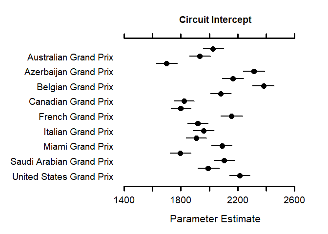
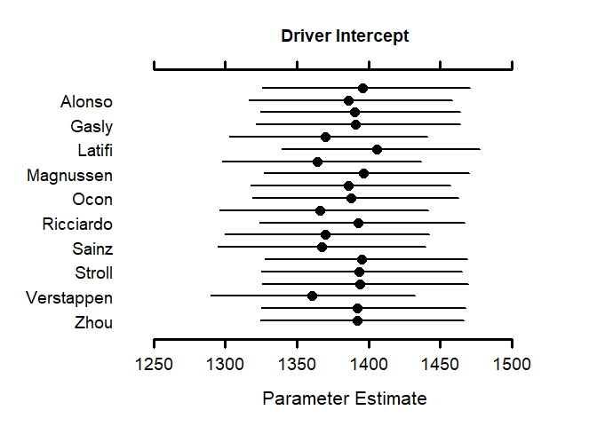

Loading packages

```r
library(MCMCvis)
library("R2jags")
```

```
## Carregando pacotes exigidos: rjags
```

```
## Carregando pacotes exigidos: coda
```

```
## Linked to JAGS 4.3.1
```

```
## Loaded modules: basemod,bugs
```

```
## 
## Attaching package: 'R2jags'
```

```
## The following object is masked from 'package:coda':
## 
##     traceplot
```

```r
library("readxl")
library("AICcmodavg")
```

Loading data


```r
df = read_excel("./files/Races_cleaned.xlsx")
```

```
## New names:
## • `` -> `...1`
```

```r
df$TyreType = as.factor(df$TyreType)
one_hot_encoded = model.matrix(~TyreType - 1, df)
df = cbind(df,one_hot_encoded)
```

Setting parameters for jags models


```r
y = as.numeric(unlist(df[,'msLapTime']))
x1 = as.numeric(unlist(df[,'LapNumber']))
x2 = as.numeric(unlist(df[,'TyreLife']))
x3_1 = as.factor(unlist(df[,'TyreTypeC1']))
x3_2 = as.factor(unlist(df[,'TyreTypeC2']))
x3_3 = as.factor(unlist(df[,'TyreTypeC3']))
x3_4 = as.factor(unlist(df[,'TyreTypeC4']))
x3_5 = as.factor(unlist(df[,'TyreTypeC5']))
x4 = as.numeric(unlist(df[,'GridPosition']))
x5 = as.numeric(unlist(df[,'CircuitLength']))
c <- as.factor(unlist(df['EventName']))
d <- as.factor(unlist(df['LastName']))
n <- length(y)
n_circuits <- length(unlist(unique(df['EventName'])))
n_drivers <- length(unlist(unique(df['LastName'])))
```

Optional - load previously run models


```r
load("./files/Models/modelo 1b.rda")
load("./files/Models/modelo 2b.rda")
load("./files/Models/modelo 3b.rda")
load("./files/Models/modelo 4b.rda")
load("./files/Models/modelo 5b.rda")
```

Modelo 1


```r
mod_1 <- "model{
  #likelihood
  for (i in 1:n){
    #likelihood
    y[i] ~ dnorm(y.hat[i],tau.y)
    y.hat[i] <- 0 + b1 * x1[i] + b2*x2[i] +b3_1 * x3_1[i] +b3_2 * x3_2[i] +b3_3 * x3_3[i] + b3_4 * x3_4[i] + b3_5 * x3_5[i]
  }
  
  #prior
  b1 ~ dnorm(0,1000)
  b2 ~ dnorm(0,1000)
  b3_1 ~ dnorm(0,1000)
  b3_2 ~ dnorm(0,1000)
  b3_3 ~ dnorm(0,1000)
  b3_4 ~ dnorm(0,1000)
  b3_5 ~ dnorm(0,1000)
  b5 ~ dnorm(0,1000)
 
  tau.y <- pow(sigma.y,-2)
  sigma.y ~ dgamma(1000,1)
}"
```


```r
writeLines(mod_1, "./files/Models/mod_1.jags")
data_1 <- list("y","x1","x2","x3_1","x3_2","x3_3","x3_4","x3_5","n") 
param_1 <- c("b1","b2","b3_1","b3_2","b3_3","b3_4","b3_5","sigma.y") 
```


```r
inits_1 <- function(){
  list("b1"= 1,"b2"= 1,"b3_1"=1,"b3_2"=1,"b3_3"=1,"b3_4"=1,"b3_5"=1,"b5" = 1, sigma.y = 1)
}
```


```r
mod1.jags <- jags(data = data_1,
                  inits = inits_1,
                  parameters.to.save = param_1,
                  n.iter = 5000,
                  n.chains = 4,
                  model.file = "./files/Models/mod_1.jags")
```

```
## module glm loaded
```

```
## Compiling model graph
##    Resolving undeclared variables
##    Allocating nodes
## Graph information:
##    Observed stochastic nodes: 16310
##    Unobserved stochastic nodes: 9
##    Total graph size: 135022
## 
## Initializing model
```

```r
save(mod1.jags, file = "./files/Models/modelo 1b.rda")
```


```r
mod1.jags$BUGSoutput$summary
```

```
##                  mean           sd          2.5%           25%          50%
## b1       2.090749e-02   0.03174840 -4.215295e-02 -6.394816e-04 2.095197e-02
## b2       9.498187e-03   0.03124862 -5.239829e-02 -1.148003e-02 9.830279e-03
## b3_1     2.605816e-04   0.03189856 -6.195836e-02 -2.126868e-02 2.180819e-04
## b3_2     1.414730e-03   0.03155720 -6.098065e-02 -1.951092e-02 1.671588e-03
## b3_3     5.988213e-04   0.03142813 -6.073590e-02 -2.069327e-02 6.099176e-04
## b3_4     1.036062e-03   0.03161240 -6.085077e-02 -2.030832e-02 9.369230e-04
## b3_5     8.322613e-04   0.03167711 -6.197030e-02 -2.015938e-02 5.072955e-04
## deviance 4.419128e+05 223.16304459  4.414802e+05  4.417619e+05 4.419127e+05
## sigma.y  4.623996e+04 114.07180344  4.601838e+04  4.616220e+04 4.623965e+04
##                   75%        97.5%     Rhat n.eff
## b1       4.282261e-02 8.198345e-02 1.001278  3700
## b2       3.014011e-02 6.960425e-02 1.000841  5000
## b3_1     2.170585e-02 6.329758e-02 1.000715  5000
## b3_2     2.281724e-02 6.262425e-02 1.001147  4600
## b3_3     2.166479e-02 6.207575e-02 1.000856  5000
## b3_4     2.209137e-02 6.213677e-02 1.000745  5000
## b3_5     2.247090e-02 6.293990e-02 1.001026  5000
## deviance 4.420643e+05 4.423488e+05 1.001007  5000
## sigma.y  4.631666e+04 4.646227e+04 1.001002  5000
```

```r
mod1.jags$BUGSoutput$DIC
```

```
## [1] 466816.5
```

Modelo 2


```r
mod_2 <- "model{
  #likelihood
  for (i in 1:n){
    #likelihood
    y[i] ~ dnorm(y.hat[i],tau.y)
    y.hat[i] <- (0 + b4 * x4[i] + b5 * x5[i] ) + b1 * x1[i] + b2*x2[i] +b3_1 * x3_1[i] +b3_2 * x3_2[i] +b3_3 * x3_3[i] + b3_4 * x3_4[i] + b3_5 * x3_5[i] 
  }
  
  #prior
  b1 ~ dnorm(0,1000)
  b2 ~ dnorm(0,1000)
  b3_1 ~ dnorm(0,1000)
  b3_2 ~ dnorm(0,1000)
  b3_3 ~ dnorm(0,1000)
  b3_4 ~ dnorm(0,1000)
  b3_5 ~ dnorm(0,1000)
  b4 ~ dnorm(0,1000)
  b5 ~ dnorm(0,1000)
  
  tau.y <- pow(sigma.y,-2)
  sigma.y ~ dgamma(1000,1)
}"
```


```r
writeLines(mod_2, "./files/Models/mod_2.jags")
data_2 <- list("y","x1","x2","x3_1","x3_2","x3_3","x3_4","x3_5","x4","n","x5") #Adiciona x5
param_2 <- c("b1","b2","b3_1","b3_2","b3_3","b3_4","b3_5","b4","sigma.y","b5") #adiciona b5 
```


```r
inits_2 <- function(){
  list("b1"= 1,"b2"= 1,"b3_1"=1,"b3_2"=1,"b3_3"=1,"b3_4"=1,"b3_5"=1,"b4"= 1,"b5"= 1, sigma.y = 1)
}
```


```r
mod2.jags <- jags(data = data_2,
                  inits = inits_2,
                  parameters.to.save = param_2,
                  n.iter = 5000,
                  n.chains = 4,
                  model.file = "./files/Models/mod_2.jags")
```

```
## Compiling model graph
##    Resolving undeclared variables
##    Allocating nodes
## Graph information:
##    Observed stochastic nodes: 16310
##    Unobserved stochastic nodes: 10
##    Total graph size: 179851
## 
## Initializing model
```

```r
save(mod2.jags, file = "./files/Models/modelo 2b.rda")
```


```r
mod2.jags$BUGSoutput$summary
```

```
##                  mean           sd          2.5%           25%           50%
## b1       1.987547e-02   0.03216146 -4.249030e-02 -1.607034e-03  1.907497e-02
## b2       1.002575e-02   0.03161820 -5.168389e-02 -1.153788e-02  1.006186e-02
## b3_1     3.007699e-04   0.03241340 -6.324834e-02 -2.195164e-02  3.418402e-04
## b3_2     2.613434e-04   0.03110598 -5.906569e-02 -2.114999e-02 -7.805434e-05
## b3_3     8.411227e-04   0.03159382 -6.247923e-02 -2.041530e-02  1.534248e-03
## b3_4     7.887579e-04   0.03177051 -5.994735e-02 -2.072316e-02  8.205937e-04
## b3_5     1.247774e-03   0.03186939 -6.135935e-02 -2.031490e-02  8.855829e-04
## b4       7.943653e-03   0.03153036 -5.392755e-02 -1.335100e-02  8.200110e-03
## b5       3.274066e-03   0.03148298 -5.775552e-02 -1.821434e-02  3.000256e-03
## deviance 4.419137e+05 217.40980440  4.415000e+05  4.417678e+05  4.419108e+05
## sigma.y  4.623946e+04 111.08949821  4.602039e+04  4.616661e+04  4.624042e+04
##                   75%        97.5%     Rhat n.eff
## b1       4.066744e-02 8.557694e-02 1.000749  5000
## b2       3.162387e-02 7.166604e-02 1.001362  3300
## b3_1     2.205164e-02 6.316196e-02 1.000884  5000
## b3_2     2.155190e-02 6.111355e-02 1.000750  5000
## b3_3     2.146150e-02 6.133437e-02 1.001246  3900
## b3_4     2.202520e-02 6.267446e-02 1.000679  5000
## b3_5     2.267737e-02 6.524550e-02 1.000995  5000
## b4       2.875590e-02 7.172992e-02 1.000633  5000
## b5       2.397214e-02 6.557423e-02 1.000939  5000
## deviance 4.420550e+05 4.423474e+05 1.001764  2100
## sigma.y  4.631332e+04 4.645262e+04 1.001768  2100
```

```r
mod2.jags$BUGSoutput$DIC
```

```
## [1] 465528.3
```

Modelo 3


```r
mod_3 <- "model{
  #likelihood
  for (i in 1:n){
    #likelihood
    y[i] ~ dnorm(y.hat[i],tau.y)
    y.hat[i] <- (0 + b4 * x4[i] + b5 * x5[i] + int_circuito[c[i]]) + b1 * x1[i] + b2*x2[i] +b3_1 * x3_1[i] +b3_2 * x3_2[i] +b3_3 * x3_3[i] + b3_4 * x3_4[i] + b3_5 * x3_5[i]  # adiciona int_circuito[c[i]]
  }
  
  for (c in 1:n_circuits){
        int_circuito[c] ~ dnorm(0,tau.u[c])
      }
  
  #prior
  b1 ~ dnorm(0,1000)
  b2 ~ dnorm(0,1000)
  b3_1 ~ dnorm(0,1000)
  b3_2 ~ dnorm(0,1000)
  b3_3 ~ dnorm(0,1000)
  b3_4 ~ dnorm(0,1000)
  b3_5 ~ dnorm(0,1000)
  b4 ~ dnorm(0,1000)
  b5 ~ dnorm(0,1000)
  tau.y <- pow(sigma.y,-2)
  sigma.y ~ dgamma(1000,1)
  
  
  
  for (c in 1:n_circuits){
    tau.u[c] <- pow(sigma.u[c],-2)
    sigma.u[c] ~ dgamma(1000,1)
}
  
}"
```


```r
writeLines(mod_3, "./files/Models/mod_3.jags")
data_3 <- list("y","x1","x2","x3_1","x3_2","x3_3","x3_4","x3_5","x4","n","c","x5","n_circuits") #Adiciona c, n_circuits
param_3 <- c("b1","b2","b3_1","b3_2","b3_3","b3_4","b3_5","b4","sigma.y","b5","sigma.u") #adiciona sigma.u
```


```r
inits_3 <- function(){
  list("b1"= 1,"b2"= 1,"b3_1"=1,"b3_2"=1,"b3_3"=1,"b3_4"=1,"b3_5"=1,"b4"= 1,"b5" = 1, sigma.y = 1, sigma.u = rep(1,n_circuits)) #adiciona sigma.u = rep(1,n_circuits)
}
```


```r
mod3.jags <- jags(data = data_3,
                  inits = inits_3,
                  parameters.to.save = param_3,
                  n.iter = 5000,
                  n.chains = 4,
                  model.file = "./files/Models/mod_3.jags")
```

```
## Compiling model graph
##    Resolving undeclared variables
##    Allocating nodes
## Graph information:
##    Observed stochastic nodes: 16310
##    Unobserved stochastic nodes: 46
##    Total graph size: 196322
## 
## Initializing model
```

```r
save(mod3.jags, file = "./files/Models/modelo 3b.rda")
```


```r
mod3.jags$BUGSoutput$summary
```

```
##                      mean          sd          2.5%           25%           50%
## b1          -1.029473e-01  0.03120604 -1.642374e-01 -1.242761e-01 -1.027175e-01
## b2          -7.682324e-03  0.03182574 -7.096147e-02 -2.864282e-02 -7.758351e-03
## b3_1        -5.629238e-04  0.03146455 -6.215625e-02 -2.193197e-02 -7.057878e-04
## b3_2        -1.368640e-04  0.03188429 -6.171617e-02 -2.141375e-02 -9.437714e-04
## b3_3         2.070631e-04  0.03161976 -6.219898e-02 -2.147942e-02  1.936344e-04
## b3_4        -2.052485e-04  0.03182539 -6.278483e-02 -2.195006e-02 -3.949556e-04
## b3_5         7.549094e-05  0.03147722 -6.192077e-02 -2.077752e-02 -1.466358e-05
## b4           3.402679e-02  0.03178475 -2.870372e-02  1.283584e-02  3.348518e-02
## b5           1.777782e-03  0.03134787 -5.978335e-02 -1.949510e-02  1.888541e-03
## deviance     2.807113e+05 11.44156367  2.806902e+05  2.807033e+05  2.807109e+05
## sigma.u[1]   2.422232e+03 33.03969990  2.359303e+03  2.399180e+03  2.421720e+03
## sigma.u[2]   2.320302e+03 32.52541411  2.257003e+03  2.298357e+03  2.319772e+03
## sigma.u[3]   2.122505e+03 31.77033710  2.059811e+03  2.101373e+03  2.122974e+03
## sigma.u[4]   2.676417e+03 34.46330080  2.610281e+03  2.653024e+03  2.675548e+03
## sigma.u[5]   2.537214e+03 34.28045677  2.471816e+03  2.513915e+03  2.536833e+03
## sigma.u[6]   2.738826e+03 34.65610321  2.671904e+03  2.715411e+03  2.738446e+03
## sigma.u[7]   2.460769e+03 33.90988127  2.394458e+03  2.437936e+03  2.460431e+03
## sigma.u[8]   2.237101e+03 32.76657478  2.173736e+03  2.214955e+03  2.237049e+03
## sigma.u[9]   2.209629e+03 33.06726319  2.144988e+03  2.186908e+03  2.209417e+03
## sigma.u[10]  2.539854e+03 33.90858817  2.473961e+03  2.516730e+03  2.539440e+03
## sigma.u[11]  2.327229e+03 33.60812814  2.262284e+03  2.304789e+03  2.326991e+03
## sigma.u[12]  2.359337e+03 33.15623205  2.294810e+03  2.337531e+03  2.358800e+03
## sigma.u[13]  2.318809e+03 33.39145726  2.254413e+03  2.295987e+03  2.317949e+03
## sigma.u[14]  2.471217e+03 33.88034005  2.405207e+03  2.448225e+03  2.470816e+03
## sigma.u[15]  2.205630e+03 32.79183807  2.142224e+03  2.182807e+03  2.205051e+03
## sigma.u[16]  2.477637e+03 33.13080387  2.414332e+03  2.455338e+03  2.477276e+03
## sigma.u[17]  2.386946e+03 32.95139349  2.322706e+03  2.365186e+03  2.386510e+03
## sigma.u[18]  2.587526e+03 33.60759147  2.522260e+03  2.565348e+03  2.587219e+03
## sigma.y      1.309241e+03  6.94354961  1.295986e+03  1.304554e+03  1.309089e+03
##                       75%         97.5%     Rhat n.eff
## b1          -8.164411e-02 -4.317214e-02 1.000962  5000
## b2           1.300171e-02  5.554795e-02 1.000776  5000
## b3_1         2.124892e-02  6.096998e-02 1.001137  4600
## b3_2         2.155602e-02  6.232189e-02 1.000622  5000
## b3_3         2.192046e-02  6.199664e-02 1.000848  5000
## b3_4         2.155851e-02  6.202148e-02 1.000633  5000
## b3_5         2.116706e-02  6.101246e-02 1.000792  5000
## b4           5.549096e-02  9.604433e-02 1.000858  5000
## b5           2.323663e-02  6.190537e-02 1.000606  5000
## deviance     2.807189e+05  2.807343e+05 1.000000     1
## sigma.u[1]   2.444438e+03  2.485496e+03 1.000622  5000
## sigma.u[2]   2.341594e+03  2.386249e+03 1.000895  5000
## sigma.u[3]   2.144124e+03  2.184960e+03 1.001879  2000
## sigma.u[4]   2.699326e+03  2.745865e+03 1.000805  5000
## sigma.u[5]   2.559763e+03  2.605228e+03 1.000644  5000
## sigma.u[6]   2.762205e+03  2.807516e+03 1.000888  5000
## sigma.u[7]   2.483108e+03  2.526929e+03 1.001204  4100
## sigma.u[8]   2.259308e+03  2.300678e+03 1.000673  5000
## sigma.u[9]   2.232127e+03  2.275185e+03 1.001003  5000
## sigma.u[10]  2.561778e+03  2.606615e+03 1.001568  2600
## sigma.u[11]  2.349929e+03  2.392866e+03 1.000741  5000
## sigma.u[12]  2.381764e+03  2.424740e+03 1.000611  5000
## sigma.u[13]  2.342379e+03  2.383695e+03 1.001139  4600
## sigma.u[14]  2.493729e+03  2.538773e+03 1.000812  5000
## sigma.u[15]  2.227531e+03  2.271400e+03 1.000954  5000
## sigma.u[16]  2.499215e+03  2.544242e+03 1.001365  3300
## sigma.u[17]  2.408917e+03  2.451679e+03 1.000879  5000
## sigma.u[18]  2.609326e+03  2.653642e+03 1.002184  1600
## sigma.y      1.313993e+03  1.323041e+03 1.000625  5000
```

```r
mod3.jags$BUGSoutput$DIC
```

```
## [1] 280776.7
```

Modelo 4


```r
mod_4 <- "model{
  #likelihood
  for (i in 1:n){
    #likelihood
    y[i] ~ dnorm(y.hat[i],tau.y)
    y.hat[i] <- (0 + b4 * x4[i] + b5 * x5[i] + int_circuito[c[i]] + int_piloto[d[i]]) + b1 * x1[i] + b2*x2[i] +b3_1 * x3_1[i] +b3_2 * x3_2[i] +b3_3 * x3_3[i] + b3_4 * x3_4[i] + b3_5 * x3_5[i] + b4 * x4[i]  # adiciona int_piloto[d[i]]
  }
  
  for (c in 1:n_circuits){
        int_circuito[c] ~ dnorm(0,tau.u[c])
  }
      
  for (d in 1:n_drivers){
        int_piloto[d] ~ dnorm(0,tau.v[d])
  }
  
  #prior
  b1 ~ dnorm(0,1000)
  b2 ~ dnorm(0,1000)
  b3_1 ~ dnorm(0,1000)
  b3_2 ~ dnorm(0,1000)
  b3_3 ~ dnorm(0,1000)
  b3_4 ~ dnorm(0,1000)
  b3_5 ~ dnorm(0,1000)
  b4 ~ dnorm(0,1000)
  b5 ~ dnorm(0,1000)
  
  tau.y <- pow(sigma.y,-2)
  sigma.y ~ dgamma(1000,1)
  
  for (c in 1:n_circuits){
    tau.u[c] <- pow(sigma.u[c],-2)
    sigma.u[c] ~ dgamma(1000,1)
  }

  for (d in 1:n_drivers){
    tau.v[d] <- pow(sigma.v[d],-2)
    sigma.v[d] ~ dgamma(1000,1)
  }
  

}"
```


```r
writeLines(mod_4, "./files/Models/mod_4.jags")
data_4 <- list("y","x1","x2","x3_1","x3_2","x3_3","x3_4","x3_5","x4","n","c","x5","n_circuits","d","n_drivers") #Adiciona d, n_drivers
param_4 <- c("b1","b2","b3_1","b3_2","b3_3","b3_4","b3_5","b4","sigma.y","b5","sigma.u","sigma.v") #adiciona sigma.u
```


```r
inits_4 <- function(){
  list("b1"= 1,"b2"= 1,"b3_1"=1,"b3_2"=1,"b3_3"=1,"b3_4"=1,"b3_5"=1,"b4"= 1,"b5" = 1, sigma.y = 1, sigma.u = rep(1,n_circuits), sigma.v = rep(1,n_drivers))
}
```


```r
mod4.jags <- jags(data = data_4,
                  inits = inits_4,
                  parameters.to.save = param_4,
                  n.iter = 5000,
                  n.chains = 4,
                  model.file = "./files/Models/mod_4.jags")
```

```
## Compiling model graph
##    Resolving undeclared variables
##    Allocating nodes
## Graph information:
##    Observed stochastic nodes: 16310
##    Unobserved stochastic nodes: 86
##    Total graph size: 212693
## 
## Initializing model
```

```r
save(mod4.jags, file = "./files/Models/modelo 4b.rda")
```


```r
mod4.jags$BUGSoutput$summary
```

```
##                      mean          sd          2.5%           25%           50%
## b1          -1.437214e-01  0.03115531 -2.060834e-01 -1.643676e-01 -1.442427e-01
## b2          -1.365077e-02  0.03214438 -7.749758e-02 -3.509999e-02 -1.343936e-02
## b3_1         4.491009e-04  0.03153707 -6.120057e-02 -2.081410e-02  2.533948e-05
## b3_2        -4.997708e-04  0.03159059 -6.169150e-02 -2.188565e-02 -8.920878e-04
## b3_3         1.517933e-03  0.03183805 -6.181875e-02 -2.007012e-02  1.761478e-03
## b3_4         1.511657e-04  0.03208669 -6.210378e-02 -2.144872e-02  1.279180e-04
## b3_5        -5.540738e-04  0.03161442 -6.269114e-02 -2.211224e-02 -4.248185e-04
## b4           1.705599e-02  0.03161840 -4.396165e-02 -5.146355e-03  1.724139e-02
## b5           4.102290e-04  0.03123052 -6.295861e-02 -2.013220e-02  1.442612e-05
## deviance     2.750297e+05 13.92568413  2.750037e+05  2.750201e+05  2.750291e+05
## sigma.u[1]   2.014151e+03 32.54929266  1.950334e+03  1.992512e+03  2.014453e+03
## sigma.u[2]   1.901180e+03 33.03194473  1.838198e+03  1.878612e+03  1.900258e+03
## sigma.u[3]   1.681187e+03 31.55669552  1.620160e+03  1.660247e+03  1.680784e+03
## sigma.u[4]   2.292233e+03 34.56945461  2.226523e+03  2.268498e+03  2.291943e+03
## sigma.u[5]   2.138955e+03 33.25837225  2.074199e+03  2.116800e+03  2.138612e+03
## sigma.u[6]   2.359709e+03 33.79615210  2.294451e+03  2.336855e+03  2.359324e+03
## sigma.u[7]   2.058044e+03 33.13384505  1.994408e+03  2.035084e+03  2.057493e+03
## sigma.u[8]   1.809482e+03 32.25474981  1.746896e+03  1.787172e+03  1.809529e+03
## sigma.u[9]   1.780141e+03 31.88085339  1.719437e+03  1.758586e+03  1.778921e+03
## sigma.u[10]  2.143700e+03 33.65667927  2.076581e+03  2.121379e+03  2.143826e+03
## sigma.u[11]  1.909839e+03 32.83374267  1.846163e+03  1.887511e+03  1.909538e+03
## sigma.u[12]  1.946148e+03 32.91264241  1.883862e+03  1.924095e+03  1.945386e+03
## sigma.u[13]  1.898503e+03 32.51144734  1.836364e+03  1.875707e+03  1.898496e+03
## sigma.u[14]  2.069265e+03 32.47151664  2.007009e+03  2.047338e+03  2.068675e+03
## sigma.u[15]  1.776438e+03 32.52338524  1.713186e+03  1.754612e+03  1.775832e+03
## sigma.u[16]  2.077403e+03 32.05057199  2.014734e+03  2.055482e+03  2.077658e+03
## sigma.u[17]  1.975268e+03 32.65131914  1.912203e+03  1.952955e+03  1.974982e+03
## sigma.u[18]  2.195537e+03 33.35340092  2.129597e+03  2.173010e+03  2.194973e+03
## sigma.v[1]   1.396006e+03 31.44354552  1.337026e+03  1.374438e+03  1.395469e+03
## sigma.v[2]   1.385884e+03 31.69594956  1.323524e+03  1.364763e+03  1.385634e+03
## sigma.v[3]   1.390231e+03 31.49242034  1.329048e+03  1.368935e+03  1.390534e+03
## sigma.v[4]   1.391335e+03 31.39234718  1.331756e+03  1.369921e+03  1.391014e+03
## sigma.v[5]   1.369054e+03 30.78382302  1.308284e+03  1.348188e+03  1.369368e+03
## sigma.v[6]   1.406273e+03 31.74926012  1.346197e+03  1.384243e+03  1.405916e+03
## sigma.v[7]   1.364726e+03 31.99290207  1.303998e+03  1.343357e+03  1.364195e+03
## sigma.v[8]   1.396277e+03 31.01995089  1.336524e+03  1.374763e+03  1.396056e+03
## sigma.v[9]   1.386242e+03 31.08774838  1.325484e+03  1.365112e+03  1.385778e+03
## sigma.v[10]  1.386823e+03 31.34099255  1.327811e+03  1.365014e+03  1.385617e+03
## sigma.v[11]  1.365963e+03 31.48834877  1.305623e+03  1.343662e+03  1.365141e+03
## sigma.v[12]  1.392791e+03 31.58325462  1.329530e+03  1.371783e+03  1.392707e+03
## sigma.v[13]  1.368894e+03 31.16001422  1.309086e+03  1.347085e+03  1.368384e+03
## sigma.v[14]  1.365241e+03 31.89708330  1.304849e+03  1.343836e+03  1.364540e+03
## sigma.v[15]  1.394424e+03 31.10315721  1.334371e+03  1.373031e+03  1.393887e+03
## sigma.v[16]  1.393352e+03 32.24898471  1.331908e+03  1.371390e+03  1.392916e+03
## sigma.v[17]  1.393719e+03 32.12704077  1.331394e+03  1.372230e+03  1.393128e+03
## sigma.v[18]  1.360568e+03 30.97571670  1.302030e+03  1.339668e+03  1.360182e+03
## sigma.v[19]  1.392083e+03 31.19865809  1.332278e+03  1.370598e+03  1.391742e+03
## sigma.v[20]  1.393467e+03 31.56078770  1.332377e+03  1.371772e+03  1.393086e+03
## sigma.y      1.106678e+03  6.03239644  1.094637e+03  1.102633e+03  1.106700e+03
##                       75%         97.5%     Rhat n.eff
## b1          -1.226674e-01 -8.193489e-02 1.000720  5000
## b2           8.103401e-03  4.867305e-02 1.000855  5000
## b3_1         2.194954e-02  6.260852e-02 1.000967  5000
## b3_2         2.052614e-02  6.246591e-02 1.001482  2800
## b3_3         2.283945e-02  6.412357e-02 1.001044  5000
## b3_4         2.171065e-02  6.130449e-02 1.001153  4500
## b3_5         2.078000e-02  6.184898e-02 1.001240  3900
## b4           3.918985e-02  7.828775e-02 1.001309  3500
## b5           2.205761e-02  6.085882e-02 1.000685  5000
## deviance     2.750392e+05  2.750578e+05 1.000000     1
## sigma.u[1]   2.035908e+03  2.079095e+03 1.000857  5000
## sigma.u[2]   1.923306e+03  1.967137e+03 1.001314  3500
## sigma.u[3]   1.702013e+03  1.742828e+03 1.000707  5000
## sigma.u[4]   2.315722e+03  2.360706e+03 1.000897  5000
## sigma.u[5]   2.161481e+03  2.205508e+03 1.000621  5000
## sigma.u[6]   2.382790e+03  2.424687e+03 1.000819  5000
## sigma.u[7]   2.080170e+03  2.123190e+03 1.001901  1900
## sigma.u[8]   1.831707e+03  1.872832e+03 1.001379  3200
## sigma.u[9]   1.802031e+03  1.843747e+03 1.000830  5000
## sigma.u[10]  2.165981e+03  2.208661e+03 1.001886  1900
## sigma.u[11]  1.931777e+03  1.974632e+03 1.001480  2800
## sigma.u[12]  1.967713e+03  2.010990e+03 1.002158  1600
## sigma.u[13]  1.920715e+03  1.962876e+03 1.002945  1100
## sigma.u[14]  2.090784e+03  2.135589e+03 1.001001  5000
## sigma.u[15]  1.797440e+03  1.841275e+03 1.001721  2200
## sigma.u[16]  2.098530e+03  2.140865e+03 1.000711  5000
## sigma.u[17]  1.997326e+03  2.040167e+03 1.000895  5000
## sigma.u[18]  2.217815e+03  2.261532e+03 1.001096  5000
## sigma.v[1]   1.416771e+03  1.457790e+03 1.001027  5000
## sigma.v[2]   1.406657e+03  1.448178e+03 1.001493  2800
## sigma.v[3]   1.411587e+03  1.451396e+03 1.000827  5000
## sigma.v[4]   1.412135e+03  1.454197e+03 1.001726  2200
## sigma.v[5]   1.390009e+03  1.428898e+03 1.001639  2400
## sigma.v[6]   1.427684e+03  1.468849e+03 1.001103  5000
## sigma.v[7]   1.386175e+03  1.429705e+03 1.001529  2700
## sigma.v[8]   1.417117e+03  1.457461e+03 1.000823  5000
## sigma.v[9]   1.407493e+03  1.447978e+03 1.000871  5000
## sigma.v[10]  1.407900e+03  1.449613e+03 1.000834  5000
## sigma.v[11]  1.386971e+03  1.429982e+03 1.001067  5000
## sigma.v[12]  1.413858e+03  1.454603e+03 1.000894  5000
## sigma.v[13]  1.390403e+03  1.430341e+03 1.000887  5000
## sigma.v[14]  1.386341e+03  1.429913e+03 1.000826  5000
## sigma.v[15]  1.415299e+03  1.457030e+03 1.001379  3200
## sigma.v[16]  1.415041e+03  1.456827e+03 1.000991  5000
## sigma.v[17]  1.415334e+03  1.458004e+03 1.001465  2900
## sigma.v[18]  1.381009e+03  1.423304e+03 1.000727  5000
## sigma.v[19]  1.412850e+03  1.454807e+03 1.000793  5000
## sigma.v[20]  1.414702e+03  1.454817e+03 1.001826  2000
## sigma.y      1.110837e+03  1.118411e+03 1.000930  5000
```

```r
mod4.jags$BUGSoutput$DIC
```

```
## [1] 275126.7
```

Modelo 5


```r
mod_5 <- "model{
  #likelihood
  for (i in 1:n){
    #likelihood
    y[i] ~ dnorm(y.hat[i],tau.y)
    y.hat[i] <- (0 + b4 * x4[i] + b5 * x5[i] + int_circuito[c[i]] + int_piloto[d[i]])  + (b1 + slope_circuito[c[i]]) * x1[i] + b2*x2[i] + b3_1 * x3_1[i] + b3_2 * x3_2[i] + b3_3 * x3_3[i] + b3_4 * x3_4[i] + b3_5 * x3_5[i] + b4 * x4[i]  # adiciona slope_circuito[c[i]]
  }
  
  for (c in 1:n_circuits){
        int_circuito[c] ~ dnorm(0,tau.u[c])
        slope_circuito[c] ~ dnorm(0,tau.w[c])
  }
      
  for (d in 1:n_drivers){
        int_piloto[d] ~ dnorm(0,tau.v[d])
  }
  
  #prior
  b1 ~ dnorm(0,1000)
  b2 ~ dnorm(0,1000)
  b3_1 ~ dnorm(0,1000)
  b3_2 ~ dnorm(0,1000)
  b3_3 ~ dnorm(0,1000)
  b3_4 ~ dnorm(0,1000)
  b3_5 ~ dnorm(0,1000)
  b4 ~ dnorm(0,1000)
  b5 ~ dnorm(0,1000)
  
  tau.y <- pow(sigma.y,-2)
  sigma.y ~ dgamma(1000,1)
  
  for (c in 1:n_circuits){
    tau.u[c] <- pow(sigma.u[c],-2)
    sigma.u[c] ~ dgamma(1000,1)
      tau.w[c] <- pow(sigma.w[c],-2)
    sigma.w[c] ~ dgamma(1000,1)
  }

  for (d in 1:n_drivers){
    tau.v[d] <- pow(sigma.v[d],-2)
    sigma.v[d] ~ dgamma(1000,1)
  }
  

}"
```


```r
writeLines(mod_5, "./files/Models/mod_5.jags")
data_5 <- list("y","x1","x2","x3_1","x3_2","x3_3","x3_4","x3_5","x4","n","c","x5","n_circuits","d","n_drivers") 
param_5 <- c("b1","b2","b3_1","b3_2","b3_3","b3_4","b3_5","b4","sigma.y","b5","sigma.u","sigma.v","sigma.w") #adiciona sigma.w
```


```r
inits_5 <- function(){
  list("b1"= 1,"b2"= 1,"b3_1"=1,"b3_2"=1,"b3_3"=1,"b3_4"=1,"b3_5"=1,"b4"= 1,"b5" = 1, sigma.y = 1, sigma.u = rep(1,n_circuits), sigma.v = rep(1,n_drivers), sigma.w = rep(1,n_circuits))
}
```


```r
mod5.jags <- jags(data = data_5,
                  inits = inits_5,
                  parameters.to.save = param_5,
                  n.iter = 5000,
                  n.chains = 4,
                  model.file = "./files/Models/mod_5.jags")
```

```
## Compiling model graph
##    Resolving undeclared variables
##    Allocating nodes
## Graph information:
##    Observed stochastic nodes: 16310
##    Unobserved stochastic nodes: 122
##    Total graph size: 213653
## 
## Initializing model
```

```r
save(mod5.jags, file = "./files/Models/modelo 5b.rda")
```


```r
mod5.jags$BUGSoutput$summary
```

```
##                      mean          sd          2.5%           25%           50%
## b1           2.743678e-04  0.03176056 -6.369434e-02 -2.107266e-02  3.699660e-04
## b2           4.430919e-02  0.03169768 -1.810899e-02  2.301206e-02  4.395303e-02
## b3_1         5.980068e-04  0.03154071 -6.125950e-02 -2.038590e-02  6.637600e-04
## b3_2         9.218654e-04  0.03191406 -6.196823e-02 -2.046392e-02  1.579841e-03
## b3_3         8.466346e-04  0.03196540 -6.194991e-02 -2.105912e-02  4.809729e-04
## b3_4         1.018393e-04  0.03162906 -6.174425e-02 -2.158124e-02  3.824392e-04
## b3_5        -1.480514e-04  0.03088442 -6.070273e-02 -2.127453e-02 -8.216284e-05
## b4           2.618940e-02  0.03204629 -3.659173e-02  4.295738e-03  2.617899e-02
## b5           1.884961e-03  0.03092490 -5.993649e-02 -1.869094e-02  1.970025e-03
## deviance     2.663400e+05 13.89670292  2.663151e+05  2.663303e+05  2.663391e+05
## sigma.u[1]   2.027974e+03 33.00060955  1.965451e+03  2.006207e+03  2.027169e+03
## sigma.u[2]   1.933121e+03 32.88838688  1.868882e+03  1.910418e+03  1.932941e+03
## sigma.u[3]   1.699125e+03 32.44406510  1.637040e+03  1.677057e+03  1.698603e+03
## sigma.u[4]   2.312561e+03 33.80166629  2.249178e+03  2.289667e+03  2.312637e+03
## sigma.u[5]   2.165858e+03 33.56084079  2.100882e+03  2.143337e+03  2.165540e+03
## sigma.u[6]   2.381177e+03 34.40764622  2.314455e+03  2.358104e+03  2.380915e+03
## sigma.u[7]   2.082140e+03 32.55374391  2.018712e+03  2.059425e+03  2.082194e+03
## sigma.u[8]   1.824353e+03 31.91271456  1.760865e+03  1.803295e+03  1.823833e+03
## sigma.u[9]   1.800954e+03 31.63727601  1.740228e+03  1.779626e+03  1.800923e+03
## sigma.u[10]  2.155848e+03 33.80895411  2.092026e+03  2.133276e+03  2.154953e+03
## sigma.u[11]  1.918329e+03 32.65372384  1.853608e+03  1.896359e+03  1.918017e+03
## sigma.u[12]  1.959165e+03 33.16424848  1.894131e+03  1.937054e+03  1.959255e+03
## sigma.u[13]  1.910281e+03 32.69405943  1.847026e+03  1.888067e+03  1.909997e+03
## sigma.u[14]  2.089548e+03 33.03424622  2.024827e+03  2.066854e+03  2.089271e+03
## sigma.u[15]  1.796725e+03 32.56307440  1.733744e+03  1.774323e+03  1.796195e+03
## sigma.u[16]  2.106578e+03 33.10128563  2.043051e+03  2.084169e+03  2.105900e+03
## sigma.u[17]  1.992156e+03 32.94438335  1.929595e+03  1.969673e+03  1.991463e+03
## sigma.u[18]  2.213727e+03 32.71016889  2.149723e+03  2.191190e+03  2.214445e+03
## sigma.v[1]   1.396166e+03 32.14579113  1.334131e+03  1.374298e+03  1.395698e+03
## sigma.v[2]   1.386035e+03 32.34732881  1.323479e+03  1.364030e+03  1.386087e+03
## sigma.v[3]   1.390878e+03 31.45114066  1.331339e+03  1.369281e+03  1.390537e+03
## sigma.v[4]   1.391796e+03 31.93865119  1.331775e+03  1.369844e+03  1.391158e+03
## sigma.v[5]   1.370238e+03 31.07809324  1.309644e+03  1.349654e+03  1.369982e+03
## sigma.v[6]   1.406507e+03 30.90193978  1.346883e+03  1.385785e+03  1.406000e+03
## sigma.v[7]   1.364568e+03 31.00179278  1.304579e+03  1.343147e+03  1.364387e+03
## sigma.v[8]   1.396588e+03 31.80306654  1.335030e+03  1.375083e+03  1.396122e+03
## sigma.v[9]   1.386866e+03 31.12514885  1.327177e+03  1.365579e+03  1.385987e+03
## sigma.v[10]  1.388474e+03 31.63976242  1.328257e+03  1.367638e+03  1.387634e+03
## sigma.v[11]  1.367018e+03 31.76280324  1.305379e+03  1.345952e+03  1.365961e+03
## sigma.v[12]  1.392804e+03 31.32283368  1.331866e+03  1.371828e+03  1.392805e+03
## sigma.v[13]  1.370252e+03 31.76732610  1.308027e+03  1.349384e+03  1.370037e+03
## sigma.v[14]  1.367797e+03 32.31680028  1.304848e+03  1.346653e+03  1.367322e+03
## sigma.v[15]  1.395484e+03 31.51919081  1.335321e+03  1.374555e+03  1.395394e+03
## sigma.v[16]  1.393233e+03 31.58803551  1.332935e+03  1.371871e+03  1.393049e+03
## sigma.v[17]  1.394862e+03 32.34514653  1.333424e+03  1.372534e+03  1.393937e+03
## sigma.v[18]  1.360479e+03 31.48798118  1.298571e+03  1.339050e+03  1.360284e+03
## sigma.v[19]  1.392884e+03 31.38483086  1.333715e+03  1.371254e+03  1.392068e+03
## sigma.v[20]  1.392658e+03 31.12251576  1.333132e+03  1.371623e+03  1.392318e+03
## sigma.w[1]   9.985996e+02 31.72271928  9.370842e+02  9.768688e+02  9.984509e+02
## sigma.w[2]   9.984652e+02 31.32354404  9.377146e+02  9.771747e+02  9.982747e+02
## sigma.w[3]   9.986981e+02 31.47390429  9.382410e+02  9.778771e+02  9.976396e+02
## sigma.w[4]   9.995397e+02 31.48098080  9.376834e+02  9.783987e+02  9.995440e+02
## sigma.w[5]   9.993507e+02 32.00673336  9.375963e+02  9.777313e+02  9.989837e+02
## sigma.w[6]   9.993641e+02 31.55341519  9.384417e+02  9.780425e+02  9.992397e+02
## sigma.w[7]   1.000551e+03 31.45088305  9.402141e+02  9.794005e+02  1.000492e+03
## sigma.w[8]   9.988168e+02 31.92729417  9.367959e+02  9.774061e+02  9.983623e+02
## sigma.w[9]   9.989226e+02 31.66219079  9.376023e+02  9.771493e+02  9.985625e+02
## sigma.w[10]  9.985105e+02 31.61886742  9.372839e+02  9.771114e+02  9.980159e+02
## sigma.w[11]  9.992940e+02 31.38433590  9.399145e+02  9.780149e+02  9.989300e+02
## sigma.w[12]  9.988554e+02 32.47297457  9.373199e+02  9.768463e+02  9.980579e+02
## sigma.w[13]  9.992722e+02 31.69655252  9.385018e+02  9.773390e+02  9.989660e+02
## sigma.w[14]  9.991659e+02 31.66542184  9.381294e+02  9.775297e+02  9.982857e+02
## sigma.w[15]  9.991714e+02 31.48516077  9.379556e+02  9.780926e+02  9.987367e+02
## sigma.w[16]  9.993979e+02 31.44537748  9.401934e+02  9.778061e+02  9.989775e+02
## sigma.w[17]  9.987745e+02 31.16690536  9.389732e+02  9.775507e+02  9.984757e+02
## sigma.w[18]  9.991436e+02 31.09069491  9.386886e+02  9.784138e+02  9.986148e+02
## sigma.y      8.544668e+02  4.72744059  8.454024e+02  8.512631e+02  8.544368e+02
##                      75%        97.5%     Rhat n.eff
## b1          2.173172e-02 6.143635e-02 1.001417  3100
## b2          6.543181e-02 1.060714e-01 1.001519  2700
## b3_1        2.205652e-02 6.106143e-02 1.000970  5000
## b3_2        2.197027e-02 6.334890e-02 1.000721  5000
## b3_3        2.179324e-02 6.440317e-02 1.000730  5000
## b3_4        2.157837e-02 6.069184e-02 1.000773  5000
## b3_5        2.112266e-02 6.066963e-02 1.000633  5000
## b4          4.765034e-02 8.768949e-02 1.001006  5000
## b5          2.308105e-02 6.199537e-02 1.000830  5000
## deviance    2.663488e+05 2.663699e+05 1.000000     1
## sigma.u[1]  2.050443e+03 2.094134e+03 1.002615  1200
## sigma.u[2]  1.954607e+03 1.997784e+03 1.000803  5000
## sigma.u[3]  1.720526e+03 1.763295e+03 1.000890  5000
## sigma.u[4]  2.334647e+03 2.379355e+03 1.001029  5000
## sigma.u[5]  2.188187e+03 2.233006e+03 1.001982  1800
## sigma.u[6]  2.403838e+03 2.447850e+03 1.000827  5000
## sigma.u[7]  2.103546e+03 2.146642e+03 1.001618  2500
## sigma.u[8]  1.846129e+03 1.888757e+03 1.002415  1400
## sigma.u[9]  1.822127e+03 1.864004e+03 1.002563  1300
## sigma.u[10] 2.178279e+03 2.224143e+03 1.001340  3400
## sigma.u[11] 1.940004e+03 1.983442e+03 1.001674  2300
## sigma.u[12] 1.981179e+03 2.025096e+03 1.002000  1800
## sigma.u[13] 1.931892e+03 1.974314e+03 1.000907  5000
## sigma.u[14] 2.112066e+03 2.153963e+03 1.001075  5000
## sigma.u[15] 1.819082e+03 1.860833e+03 1.002441  1400
## sigma.u[16] 2.129362e+03 2.172227e+03 1.001397  3100
## sigma.u[17] 2.014275e+03 2.058806e+03 1.000640  5000
## sigma.u[18] 2.235768e+03 2.278208e+03 1.001709  2300
## sigma.v[1]  1.417659e+03 1.460033e+03 1.001379  3200
## sigma.v[2]  1.408007e+03 1.448504e+03 1.001698  2300
## sigma.v[3]  1.412165e+03 1.453705e+03 1.000926  5000
## sigma.v[4]  1.413206e+03 1.455321e+03 1.000909  5000
## sigma.v[5]  1.391018e+03 1.432039e+03 1.002002  1800
## sigma.v[6]  1.426993e+03 1.467253e+03 1.001239  3900
## sigma.v[7]  1.386142e+03 1.426679e+03 1.001122  4800
## sigma.v[8]  1.418064e+03 1.460149e+03 1.002625  1200
## sigma.v[9]  1.407827e+03 1.447225e+03 1.001282  3700
## sigma.v[10] 1.408630e+03 1.453267e+03 1.001647  2400
## sigma.v[11] 1.388135e+03 1.430646e+03 1.001621  2400
## sigma.v[12] 1.413751e+03 1.455067e+03 1.001491  2800
## sigma.v[13] 1.391703e+03 1.432299e+03 1.001355  3300
## sigma.v[14] 1.390016e+03 1.431373e+03 1.001073  5000
## sigma.v[15] 1.416418e+03 1.457150e+03 1.004120   710
## sigma.v[16] 1.413664e+03 1.456336e+03 1.001142  4600
## sigma.v[17] 1.416643e+03 1.458221e+03 1.001865  2000
## sigma.v[18] 1.382106e+03 1.424163e+03 1.000744  5000
## sigma.v[19] 1.413399e+03 1.455831e+03 1.001343  3400
## sigma.v[20] 1.413056e+03 1.455183e+03 1.001314  3500
## sigma.w[1]  1.019906e+03 1.062007e+03 1.000987  5000
## sigma.w[2]  1.019974e+03 1.060889e+03 1.001739  2200
## sigma.w[3]  1.020067e+03 1.061966e+03 1.002282  1500
## sigma.w[4]  1.020140e+03 1.061575e+03 1.001823  2000
## sigma.w[5]  1.021358e+03 1.060514e+03 1.001974  1800
## sigma.w[6]  1.020239e+03 1.063354e+03 1.001442  3000
## sigma.w[7]  1.021788e+03 1.063951e+03 1.000694  5000
## sigma.w[8]  1.019842e+03 1.063712e+03 1.001606  2500
## sigma.w[9]  1.020016e+03 1.062601e+03 1.001381  3200
## sigma.w[10] 1.019900e+03 1.062231e+03 1.000806  5000
## sigma.w[11] 1.020187e+03 1.061453e+03 1.001522  2700
## sigma.w[12] 1.020461e+03 1.064980e+03 1.001068  5000
## sigma.w[13] 1.021308e+03 1.061504e+03 1.000833  5000
## sigma.w[14] 1.019985e+03 1.062989e+03 1.001291  3600
## sigma.w[15] 1.020646e+03 1.061452e+03 1.000944  5000
## sigma.w[16] 1.020737e+03 1.061861e+03 1.001714  2200
## sigma.w[17] 1.019538e+03 1.060316e+03 1.001268  3700
## sigma.w[18] 1.019488e+03 1.061354e+03 1.000811  5000
## sigma.y     8.576006e+02 8.638515e+02 1.000790  5000
```

```r
mod5.jags$BUGSoutput$DIC
```

```
## [1] 266436.5
```

```{r}}
MCMCplot(object = mod5.jags,
         params = c('b1','b2','b3_1','b3_2','b3_3','b3_4','b3_5','b4','b5','sigma.y'), 
         labels = c('LapNumber','TyreLife','C1','C2','C3','C4','C5','GridPosition','CircuitLength','sigma y'),
         ci = c(2.5,97.5))
```


```r
MCMCplot(object = mod5.jags,
         params = "sigma.u", 
         labels = levels(c),
         main = "Circuit Intercept",
         ci = c(2.5,97.5))
```

<!-- -->


```r
MCMCplot(object = mod5.jags,
         params = "sigma.v", 
         labels = levels(d),
         main = "Driver Intercept",
         ci = c(2.5,97.5))
```

<!-- -->


```r
MCMCplot(object = mod5.jags,
         params = "sigma.w", 
         labels = levels(c),
         main = "Circuit LapNumber Slope",
         ci = c(2.5,97.5))
```

<!-- -->
