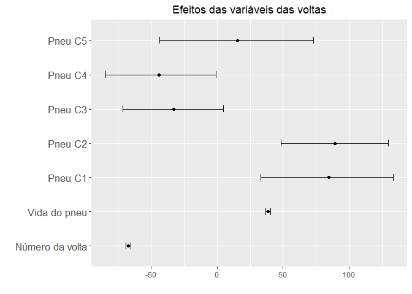
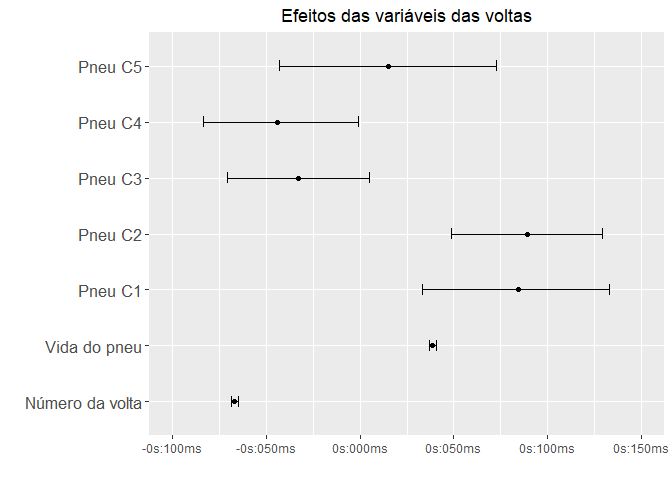
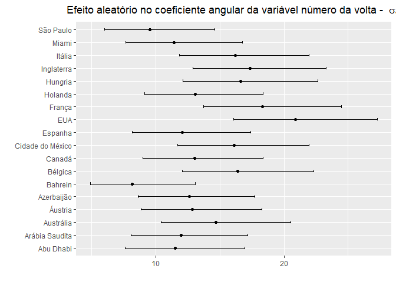
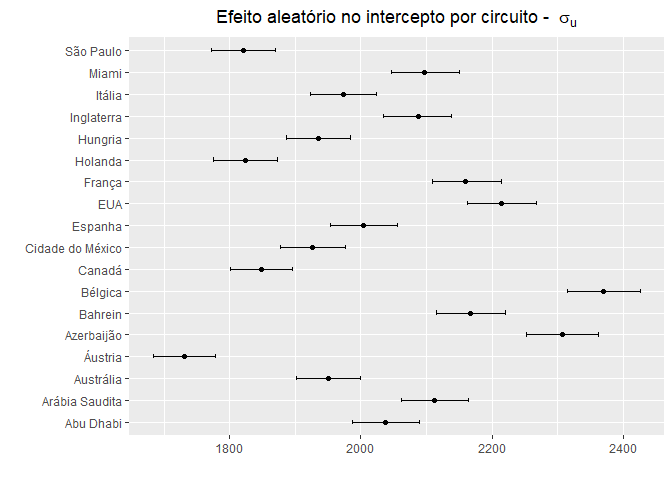
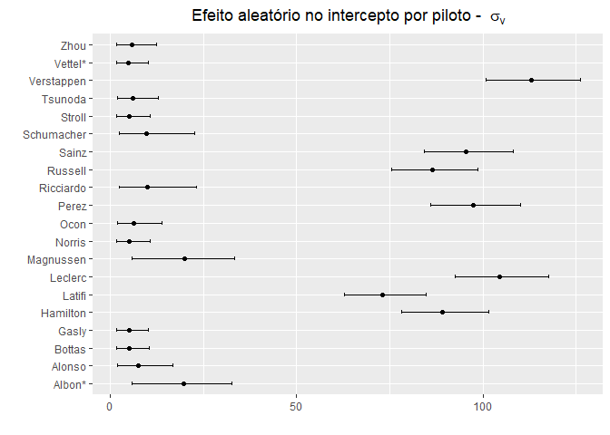

Loading packages

```r
library(MCMCvis)
library("R2jags")
```

```
## Carregando pacotes exigidos: rjags
```

```
## Carregando pacotes exigidos: coda
```

```
## Linked to JAGS 4.3.1
```

```
## Loaded modules: basemod,bugs
```

```
## 
## Attaching package: 'R2jags'
```

```
## The following object is masked from 'package:coda':
## 
##     traceplot
```

```r
library("readxl")
library("AICcmodavg")
library("dplyr")
```

```
## 
## Attaching package: 'dplyr'
```

```
## The following objects are masked from 'package:stats':
## 
##     filter, lag
```

```
## The following objects are masked from 'package:base':
## 
##     intersect, setdiff, setequal, union
```

```r
library("ggplot2")
```

Loading data


```r
df = read_excel("./files/Races_cleaned.xlsx")
```

```
## New names:
## • `` -> `...1`
```

```r
df$TyreType = as.factor(df$TyreType)
one_hot_encoded = model.matrix(~TyreType - 1, df)
df = cbind(df,one_hot_encoded)
df = df %>% rename('Local' = "PlaceBrazilianPortuguese")
```

Setting parameters for jags models


```r
y = as.numeric(unlist(df[,'msLapTime']))
x1 = as.numeric(unlist(df[,'LapNumber']))
x2 = as.numeric(unlist(df[,'TyreLife']))
x3_1 = as.factor(unlist(df[,'TyreTypeC1']))
x3_2 = as.factor(unlist(df[,'TyreTypeC2']))
x3_3 = as.factor(unlist(df[,'TyreTypeC3']))
x3_4 = as.factor(unlist(df[,'TyreTypeC4']))
x3_5 = as.factor(unlist(df[,'TyreTypeC5']))
x4 = as.numeric(unlist(df[,'GridPosition']))
x5 = as.numeric(unlist(df[,'CircuitLength']))
c <- as.factor(unlist(df['Local']))
d <- as.factor(unlist(df['LastName']))
n <- length(y)
n_circuits <- length(unlist(unique(df['Local'])))
n_drivers <- length(unlist(unique(df['LastName'])))
```

Optional - load previously run models


```r
load("./files/Models/modelo 1b.rda")
load("./files/Models/modelo 2b.rda")
load("./files/Models/modelo 3b.rda")
load("./files/Models/modelo 4b.rda")
load("./files/Models/modelo 5b.rda")
```

Modelo 1


```r
mod_1 <- "model{
  #likelihood
  for (i in 1:n){
    #likelihood
    y[i] ~ dnorm(y.hat[i],tau.y)
    y.hat[i] <- 0 + b1 * x1[i] + b2*x2[i] +b3_1 * x3_1[i] +b3_2 * x3_2[i] +b3_3 * x3_3[i] + b3_4 * x3_4[i] + b3_5 * x3_5[i]
  }
  
  #prior
  b1 ~ dnorm(0,1)
  b2 ~ dnorm(0,1)
  b3_1 ~ dnorm(0,1)
  b3_2 ~ dnorm(0,1)
  b3_3 ~ dnorm(0,1)
  b3_4 ~ dnorm(0,1)
  b3_5 ~ dnorm(0,1)
  b5 ~ dnorm(0,1)
 
  tau.y <- pow(sigma.y,-2)
  sigma.y ~ dgamma(5,1)
}"
```


```r
writeLines(mod_1, "./files/Models/mod_1.jags")
data_1 <- list("y","x1","x2","x3_1","x3_2","x3_3","x3_4","x3_5","n") 
param_1 <- c("b1","b2","b3_1","b3_2","b3_3","b3_4","b3_5","sigma.y","y.hat") 
```


```r
inits_1 <- function(){
  list("b1"= 1,"b2"= 1,"b3_1"=1,"b3_2"=1,"b3_3"=1,"b3_4"=1,"b3_5"=1,"b5" = 1, "sigma.y" = 1)
}
```


```r
mod1.jags <- jags(data = data_1,
                  inits = inits_1,
                  parameters.to.save = param_1,
                  n.iter = 10000,
                  n.chains = 4,
                  model.file = "./files/Models/mod_1.jags")
save(mod1.jags, file = "./files/Models/modelo 1b.rda")
```


```r
mod1.jags$BUGSoutput$summary
```

```
##                      mean          sd          2.5%          25%          50%
## b1           2.074227e+01   0.9758790  1.879827e+01 2.008589e+01 2.074518e+01
## b2           9.737355e+00   1.0167426  7.779340e+00 9.042303e+00 9.736128e+00
## b3_1         7.085346e-01   0.9942932 -1.278747e+00 6.476766e-02 7.083243e-01
## b3_2         9.387672e-01   1.0071679 -1.086797e+00 2.715882e-01 9.357779e-01
## b3_3         1.027547e+00   0.9820093 -9.397642e-01 3.483152e-01 1.037685e+00
## b3_4         7.766098e-01   0.9941553 -1.150093e+00 9.257095e-02 7.816218e-01
## b3_5         6.913175e-01   0.9852668 -1.252069e+00 3.141481e-02 6.931646e-01
## deviance     4.419690e+05 223.6470223  4.415483e+05 4.418141e+05 4.419689e+05
## sigma.y      4.568106e+04 111.4667432  4.546785e+04 4.560368e+04 4.568161e+04
## y.hat[1]     6.612958e+01   3.9552647  5.830004e+01 6.353504e+01 6.599576e+01
## y.hat[2]     9.660920e+01   5.0661602  8.653696e+01 9.324674e+01 9.649136e+01
##                       75%        97.5%     Rhat n.eff
## b1           2.141681e+01 2.262539e+01 1.001635  2200
## b2           1.043488e+01 1.173485e+01 1.000889  4000
## b3_1         1.376699e+00 2.636391e+00 1.001612  2200
## b3_2         1.612237e+00 2.936935e+00 1.002493  1300
## b3_3         1.710818e+00 2.910334e+00 1.001402  2800
## b3_4         1.432676e+00 2.742884e+00 1.000762  4000
## b3_5         1.347877e+00 2.605262e+00 1.000754  4000
## deviance     4.421218e+05 4.423984e+05 1.001617  2200
## sigma.y      4.575746e+04 4.589493e+04 1.001677  2100
## y.hat[1]     6.883614e+01 7.380804e+01 1.000940  4000
## y.hat[2]     1.000466e+02 1.064061e+02 1.000875  4000
##  [ reached getOption("max.print") -- omitted 16308 rows ]
```

```r
mod1.jags$BUGSoutput$DIC
```

```
## [1] 466963.2
```

Modelo 2


```r
mod_2 <- "model{
  #likelihood
  for (i in 1:n){
    #likelihood
    y[i] ~ dnorm(y.hat[i],tau.y)
    y.hat[i] <- (0 + b4 * x4[i] + b5 * x5[i] ) + b1 * x1[i] + b2*x2[i] +b3_1 * x3_1[i] +b3_2 * x3_2[i] +b3_3 * x3_3[i] + b3_4 * x3_4[i] + b3_5 * x3_5[i] 
  }
  
  #prior
  b1 ~ dnorm(0,1)
  b2 ~ dnorm(0,1)
  b3_1 ~ dnorm(0,1)
  b3_2 ~ dnorm(0,1)
  b3_3 ~ dnorm(0,1)
  b3_4 ~ dnorm(0,1)
  b3_5 ~ dnorm(0,1)
  b4 ~ dnorm(0,1)
  b5 ~ dnorm(0,1)
  
  tau.y <- pow(sigma.y,-2)
  sigma.y ~ dgamma(5,1)
}"
```


```r
writeLines(mod_2, "./files/Models/mod_2.jags")
data_2 <- list("y","x1","x2","x3_1","x3_2","x3_3","x3_4","x3_5","x4","n","x5") #Adiciona x4, x5
param_2 <- c("b1","b2","b3_1","b3_2","b3_3","b3_4","b3_5","b4","sigma.y","b5","y.hat") #adiciona b4, b5
```


```r
inits_2 <- function(){
  list("b1"= 1,"b2"= 1,"b3_1"=1,"b3_2"=1,"b3_3"=1,"b3_4"=1,"b3_5"=1,"b4"= 1,"b5"= 1, "sigma.y" = 1)
}
```


```r
mod2.jags <- jags(data = data_2,
                  inits = inits_2,
                  parameters.to.save = param_2,
                  n.iter = 10000,
                  n.chains = 4,
                  model.file = "./files/Models/mod_2.jags")

save(mod2.jags, file = "./files/Models/modelo 2b.rda")
```


```r
mod2.jags$BUGSoutput$summary
```

```
##                      mean          sd          2.5%          25%          50%
## b1           2.074241e+01   0.9758687     18.861929 2.006113e+01 2.075266e+01
## b2           9.739188e+00   0.9908023      7.828919 9.067370e+00 9.721700e+00
## b3_1         7.188441e-01   1.0120018     -1.287804 3.099623e-02 7.174515e-01
## b3_2         9.068584e-01   1.0266193     -1.170971 2.132121e-01 9.213869e-01
## b3_3         1.031395e+00   1.0017624     -0.920100 3.560604e-01 1.023378e+00
## b3_4         7.977626e-01   0.9891647     -1.188412 1.637382e-01 7.817244e-01
## b3_5         6.784548e-01   0.9958377     -1.307868 2.033249e-02 6.929618e-01
## b4           7.302805e+00   1.0013818      5.339783 6.641645e+00 7.308616e+00
## b5           3.563280e+00   1.0178958      1.594826 2.867389e+00 3.558801e+00
## deviance     4.418972e+05 226.3520487 441455.387436 4.417400e+05 4.418997e+05
## sigma.y      4.565108e+04 113.8214712  45434.781516 4.557306e+04 4.564968e+04
##                       75%        97.5%     Rhat n.eff
## b1           2.138831e+01 2.263776e+01 1.000888  4000
## b2           1.038641e+01 1.170936e+01 1.002021  1600
## b3_1         1.400085e+00 2.682206e+00 1.001910  1800
## b3_2         1.589868e+00 2.907001e+00 1.000790  4000
## b3_3         1.694095e+00 3.011303e+00 1.001202  3600
## b3_4         1.464114e+00 2.741095e+00 1.000995  4000
## b3_5         1.349119e+00 2.611510e+00 1.000560  4000
## b4           7.969442e+00 9.279173e+00 1.000752  4000
## b5           4.246908e+00 5.637161e+00 1.001209  3500
## deviance     4.420544e+05 4.423303e+05 1.001607  2300
## sigma.y      4.573058e+04 4.587550e+04 1.001735  2000
##  [ reached getOption("max.print") -- omitted 16310 rows ]
```

```r
mod2.jags$BUGSoutput$DIC
```

```
## [1] 467500
```

Modelo 3


```r
mod_3 <- "model{
  #likelihood
  for (i in 1:n){
    #likelihood
    y[i] ~ dnorm(y.hat[i],tau.y)
    y.hat[i] <- (0 + b4 * x4[i] + b5 * x5[i] + int_circuito[c[i]]) + b1 * x1[i] + b2*x2[i] +b3_1 * x3_1[i] +b3_2 * x3_2[i] +b3_3 * x3_3[i] + b3_4 * x3_4[i] + b3_5 * x3_5[i]  # adiciona int_circuito[c[i]]
  }
  
  for (c in 1:n_circuits){
        int_circuito[c] ~ dnorm(0,tau.u[c])
      }
  
  #prior
  b1 ~ dnorm(0,1)
  b2 ~ dnorm(0,1)
  b3_1 ~ dnorm(0,1)
  b3_2 ~ dnorm(0,1)
  b3_3 ~ dnorm(0,1)
  b3_4 ~ dnorm(0,1)
  b3_5 ~ dnorm(0,1)
  b4 ~ dnorm(0,1)
  b5 ~ dnorm(0,1)
  tau.y <- pow(sigma.y,-2)
  sigma.y ~ dgamma(5,1)
  
  
  
  for (c in 1:n_circuits){
    tau.u[c] <- pow(sigma.u[c],-2)
    sigma.u[c] ~ dgamma(5,1)
}
  
}"
```


```r
writeLines(mod_3, "./files/Models/mod_3.jags")
data_3 <- list("y","x1","x2","x3_1","x3_2","x3_3","x3_4","x3_5","x4","n","c","x5","n_circuits") #Adiciona c, n_circuits
param_3 <- c("b1","b2","b3_1","b3_2","b3_3","b3_4","b3_5","b4","sigma.y","b5","sigma.u","y.hat") #adiciona sigma.u
```


```r
inits_3 <- function(){
  list("b1"= 1,"b2"= 1,"b3_1"=1,"b3_2"=1,"b3_3"=1,"b3_4"=1,"b3_5"=1,"b4"= 1,"b5" = 1, "sigma.y" = 1, sigma.u = rep(1,n_circuits)) #adiciona sigma.u = rep(1,n_circuits)
}
```


```r
mod3.jags <- jags(data = data_3,
                  inits = inits_3,
                  parameters.to.save = param_3,
                  n.iter = 10000,
                  n.chains = 4,
                  model.file = "./files/Models/mod_3.jags")

save(mod3.jags, file = "./files/Models/modelo 3b.rda")
```


```r
mod3.jags$BUGSoutput$summary
```

```
##                       mean         sd          2.5%           25%           50%
## b1           -3.292436e+01  0.4501517 -3.383244e+01 -3.322684e+01 -3.292069e+01
## b2            1.360279e+01  0.7172456  1.222282e+01  1.311420e+01  1.359030e+01
## b3_1          4.199364e-01  0.9992612 -1.528172e+00 -2.478820e-01  4.137338e-01
## b3_2          7.518211e-01  1.0129131 -1.240117e+00  6.671951e-02  7.586834e-01
## b3_3          6.227861e-01  1.0005334 -1.330361e+00 -3.051508e-02  6.278399e-01
## b3_4          2.382778e-01  1.0271940 -1.805951e+00 -4.549062e-01  2.530179e-01
## b3_5          4.224589e-01  0.9958725 -1.485659e+00 -2.431962e-01  4.236058e-01
## b4            3.766869e+01  0.8360931  3.605577e+01  3.709559e+01  3.766291e+01
## b5            2.073805e+00  0.9931900  1.444273e-01  1.397599e+00  2.080396e+00
## deviance      2.728394e+05 71.2116093  2.727010e+05  2.727914e+05  2.728372e+05
## sigma.u[1]    2.035550e+03 26.1193435  1.984786e+03  2.017936e+03  2.035175e+03
##                        75%         97.5%     Rhat n.eff
## b1           -3.262081e+01    -32.069381 1.000785  4000
## b2            1.409050e+01     15.001283 1.000708  4000
## b3_1          1.090908e+00      2.400166 1.000824  4000
## b3_2          1.455140e+00      2.730391 1.000755  4000
## b3_3          1.289953e+00      2.562942 1.001463  2600
## b3_4          9.312452e-01      2.259886 1.001853  1800
## b3_5          1.098744e+00      2.408219 1.000919  4000
## b4            3.823751e+01     39.272854 1.002373  1300
## b5            2.742173e+00      4.021148 1.001183  3700
## deviance      2.728870e+05 272981.130137 1.001850  1900
## sigma.u[1]    2.052851e+03   2089.314494 1.000838  4000
##  [ reached getOption("max.print") -- omitted 16328 rows ]
```

```r
mod3.jags$BUGSoutput$DIC
```

```
## [1] 275372.7
```

Modelo 4


```r
mod_4 <- "model{
  #likelihood
  for (i in 1:n){
    #likelihood
    y[i] ~ dnorm(y.hat[i],tau.y)
    y.hat[i] <- (0 + b4 * x4[i] + b5 * x5[i] + int_circuito[c[i]] + int_piloto[d[i]]) + b1 * x1[i] + b2*x2[i] +b3_1 * x3_1[i] +b3_2 * x3_2[i] +b3_3 * x3_3[i] + b3_4 * x3_4[i] + b3_5 * x3_5[i] + b4 * x4[i]  # adiciona int_piloto[d[i]]
  }
  
  for (c in 1:n_circuits){
        int_circuito[c] ~ dnorm(0,tau.u[c])
  }
      
  for (d in 1:n_drivers){
        int_piloto[d] ~ dnorm(0,tau.v[d])
  }
  
  #prior
  b1 ~ dnorm(0,1)
  b2 ~ dnorm(0,1)
  b3_1 ~ dnorm(0,1)
  b3_2 ~ dnorm(0,1)
  b3_3 ~ dnorm(0,1)
  b3_4 ~ dnorm(0,1)
  b3_5 ~ dnorm(0,1)
  b4 ~ dnorm(0,1)
  b5 ~ dnorm(0,1)
  
  tau.y <- pow(sigma.y,-2)
  sigma.y ~ dgamma(5,1)
  
  for (c in 1:n_circuits){
    tau.u[c] <- pow(sigma.u[c],-2)
    sigma.u[c] ~ dgamma(5,1)
  }

  for (d in 1:n_drivers){
    tau.v[d] <- pow(sigma.v[d],-2)
    sigma.v[d] ~ dgamma(5,1)
  }
  

}"
```


```r
writeLines(mod_4, "./files/Models/mod_4.jags")
data_4 <- list("y","x1","x2","x3_1","x3_2","x3_3","x3_4","x3_5","x4","n","c","x5","n_circuits","d","n_drivers") #Adiciona d, n_drivers
param_4 <- c("b1","b2","b3_1","b3_2","b3_3","b3_4","b3_5","b4","sigma.y","b5","sigma.u","sigma.v","y.hat") #adiciona sigma.u
```


```r
inits_4 <- function(){
  list("b1"= 1,"b2"= 1,"b3_1"=1,"b3_2"=1,"b3_3"=1,"b3_4"=1,"b3_5"=1,"b4"= 1,"b5" = 1, "sigma.y" = 1, sigma.u = rep(1,n_circuits), sigma.v = rep(1,n_drivers))
}
```


```r
mod4.jags <- jags(data = data_4,
                  inits = inits_4,
                  parameters.to.save = param_4,
                  n.iter = 10000,
                  n.chains = 4,
                  model.file = "./files/Models/mod_4.jags")

save(mod4.jags, file = "./files/Models/modelo 4b.rda")
```


```r
mod4.jags$BUGSoutput$summary
```

```
##                       mean          sd          2.5%           25%
## b1           -3.538865e+01   0.3968125 -3.615716e+01 -3.565736e+01
## b2            1.576234e+01   0.6496850  1.445893e+01  1.532954e+01
## b3_1          4.598125e-01   1.0269470 -1.486878e+00 -2.568788e-01
## b3_2          7.214754e-01   0.9995978 -1.234356e+00  5.232344e-02
## b3_3          7.903767e-01   0.9896858 -1.168164e+00  1.300035e-01
## b3_4          2.315364e-01   0.9911527 -1.771211e+00 -4.280889e-01
## b3_5          4.135555e-01   1.0201625 -1.629766e+00 -2.597170e-01
## b4            1.576522e+01   3.1278917  1.166544e+01  1.271318e+01
## b5            2.392249e+00   1.0414477  3.201033e-01  1.700490e+00
## deviance      2.671881e+05 144.5595976  2.669778e+05  2.670511e+05
## sigma.u[1]    1.314279e+03 725.4658964  5.667257e+02  5.888086e+02
##                        50%           75%         97.5%      Rhat n.eff
## b1           -3.539676e+01 -3.511557e+01    -34.617441  1.000685  4000
## b2            1.577909e+01  1.618706e+01     17.021601  1.008598   310
## b3_1          4.624987e-01  1.179308e+00      2.440453  1.002206  1500
## b3_2          7.117131e-01  1.363888e+00      2.672265  1.005252   530
## b3_3          7.876426e-01  1.448682e+00      2.754690  1.002745  1100
## b3_4          2.330607e-01  8.891874e-01      2.188415  1.000873  4000
## b3_5          4.392304e-01  1.092378e+00      2.411098  1.001427  2700
## b4            1.578191e+01  1.880227e+01     19.911574  7.326153     4
## b5            2.394946e+00  3.092455e+00      4.388325  1.056147    50
## deviance      2.671959e+05  2.673224e+05 267411.414290  4.427598     4
## sigma.u[1]    1.120883e+03  2.038461e+03   2082.389389 51.933336     4
##  [ reached getOption("max.print") -- omitted 16348 rows ]
```

```r
mod4.jags$BUGSoutput$DIC
```

```
## [1] 268411.4
```

Modelo 5


```r
mod_5 <- "model{
  #likelihood
  for (i in 1:n){
    #likelihood
    y[i] ~ dnorm(y.hat[i],tau.y)
    y.hat[i] <- (0 + b4 * x4[i] + b5 * x5[i] + int_circuito[c[i]] + int_piloto[d[i]])  + (b1 + slope_circuito[c[i]]) * x1[i] + b2*x2[i] + b3_1 * x3_1[i] + b3_2 * x3_2[i] + b3_3 * x3_3[i] + b3_4 * x3_4[i] + b3_5 * x3_5[i] + b4 * x4[i]  # adiciona slope_circuito[c[i]]
  }
  
  for (c in 1:n_circuits){
        int_circuito[c] ~ dnorm(0,tau.u[c])
        slope_circuito[c] ~ dnorm(0,tau.w[c])
  }
      
  for (d in 1:n_drivers){
        int_piloto[d] ~ dnorm(0,tau.v[d])
  }
  
  #prior
  b1 ~ dnorm(0,1)
  b2 ~ dnorm(0,1)
  b3_1 ~ dnorm(0,1)
  b3_2 ~ dnorm(0,1)
  b3_3 ~ dnorm(0,1)
  b3_4 ~ dnorm(0,1)
  b3_5 ~ dnorm(0,1)
  b4 ~ dnorm(0,1)
  b5 ~ dnorm(0,1)
  
  tau.y <- pow(sigma.y,-2)
  sigma.y ~ dgamma(5,1)
  
  for (c in 1:n_circuits){
    tau.u[c] <- pow(sigma.u[c],-2)
    sigma.u[c] ~ dgamma(5,1)
      tau.w[c] <- pow(sigma.w[c],-2)
    sigma.w[c] ~ dgamma(5,1)
  }

  for (d in 1:n_drivers){
    tau.v[d] <- pow(sigma.v[d],-2)
    sigma.v[d] ~ dgamma(5,1)
  }
  

}"
```


```r
writeLines(mod_5, "./files/Models/mod_5.jags")
data_5 <- list("y","x1","x2","x3_1","x3_2","x3_3","x3_4","x3_5","x4","n","c","x5","n_circuits","d","n_drivers") 
param_5 <- c("b1","b2","b3_1","b3_2","b3_3","b3_4","b3_5","b4","sigma.y","b5","sigma.u","sigma.v","sigma.w","y.hat") #adiciona sigma.w
```


```r
inits_5 <- function(){
  list("b1"= 1,"b2"= 1,"b3_1"=1,"b3_2"=1,"b3_3"=1,"b3_4"=1,"b3_5"=1,"b4"= 1,"b5" = 1, "sigma.y" = 1, "sigma.u" = rep(1,n_circuits), "sigma.v" = rep(1,n_drivers), "sigma.w" = rep(1,n_circuits))
}
```


```r
mod5.jags <- jags(data = data_5,
                  inits = inits_5,
                  parameters.to.save = param_5,
                  n.iter = 10000,
                  n.chains = 4,
                  model.file = "./files/Models/mod_5.jags")

save(mod5.jags, file = "./files/Models/modelo 5b.rda")
```


```r
mod5.jags$BUGSoutput$summary
```

```
##                       mean         sd          2.5%           25%           50%
## b1           -4.278583e+00  1.0047680 -6.202959e+00 -4.977394e+00 -4.264934e+00
## b2            2.243691e+01  0.6697627  2.111765e+01  2.198624e+01  2.244383e+01
## b3_1          4.579877e-01  1.0036517 -1.486716e+00 -2.272546e-01  4.577389e-01
## b3_2          9.762225e-01  0.9903510 -9.807357e-01  3.031968e-01  9.692398e-01
## b3_3          3.573185e-01  0.9995402 -1.599847e+00 -3.124994e-01  3.578870e-01
## b3_4          1.739516e-01  1.0097666 -1.790764e+00 -5.042934e-01  1.780935e-01
## b3_5          3.890961e-01  0.9906812 -1.590437e+00 -2.745326e-01  3.709102e-01
## b4            1.872554e+01  0.6157316  1.749812e+01  1.831077e+01  1.873163e+01
## b5            2.096911e+00  0.9959029  1.443242e-01  1.412472e+00  2.100504e+00
## deviance      2.649164e+05 44.3407291  2.648302e+05  2.648864e+05  2.649153e+05
## sigma.u[1]    2.037766e+03 26.4924351  1.986820e+03  2.019704e+03  2.037495e+03
##                        75%         97.5%     Rhat n.eff
## b1           -3.589530e+00     -2.322532 1.000933  4000
## b2            2.288971e+01     23.709259 1.001135  3900
## b3_1          1.136897e+00      2.442689 1.000797  4000
## b3_2          1.640813e+00      2.959677 1.001469  2600
## b3_3          1.035921e+00      2.334882 1.001115  4000
## b3_4          8.534239e-01      2.097311 1.001055  4000
## b3_5          1.038531e+00      2.351610 1.001226  3400
## b4            1.912980e+01     19.928487 1.000850  4000
## b5            2.786772e+00      3.971826 1.001118  4000
## deviance      2.649453e+05 265007.894564 1.000571  4000
## sigma.u[1]    2.055825e+03   2089.454253 1.000562  4000
##  [ reached getOption("max.print") -- omitted 16366 rows ]
```

```r
mod5.jags$BUGSoutput$DIC
```

```
## [1] 265900.1
```

## Analisando modelo 5


```r
model_data = data.frame(mod5.jags$BUGSoutput$summary)
model_data
```

```
##                     mean         sd         X2.5.          X25.          X50.
## b1         -4.278583e+00  1.0047680 -6.202959e+00 -4.977394e+00 -4.264934e+00
## b2          2.243691e+01  0.6697627  2.111765e+01  2.198624e+01  2.244383e+01
## b3_1        4.579877e-01  1.0036517 -1.486716e+00 -2.272546e-01  4.577389e-01
## b3_2        9.762225e-01  0.9903510 -9.807357e-01  3.031968e-01  9.692398e-01
## b3_3        3.573185e-01  0.9995402 -1.599847e+00 -3.124994e-01  3.578870e-01
## b3_4        1.739516e-01  1.0097666 -1.790764e+00 -5.042934e-01  1.780935e-01
## b3_5        3.890961e-01  0.9906812 -1.590437e+00 -2.745326e-01  3.709102e-01
## b4          1.872554e+01  0.6157316  1.749812e+01  1.831077e+01  1.873163e+01
## b5          2.096911e+00  0.9959029  1.443242e-01  1.412472e+00  2.100504e+00
## deviance    2.649164e+05 44.3407291  2.648302e+05  2.648864e+05  2.649153e+05
## sigma.u[1]  2.037766e+03 26.4924351  1.986820e+03  2.019704e+03  2.037495e+03
##                     X75.        X97.5.     Rhat n.eff
## b1         -3.589530e+00     -2.322532 1.000933  4000
## b2          2.288971e+01     23.709259 1.001135  3900
## b3_1        1.136897e+00      2.442689 1.000797  4000
## b3_2        1.640813e+00      2.959677 1.001469  2600
## b3_3        1.035921e+00      2.334882 1.001115  4000
## b3_4        8.534239e-01      2.097311 1.001055  4000
## b3_5        1.038531e+00      2.351610 1.001226  3400
## b4          1.912980e+01     19.928487 1.000850  4000
## b5          2.786772e+00      3.971826 1.001118  4000
## deviance    2.649453e+05 265007.894564 1.000571  4000
## sigma.u[1]  2.055825e+03   2089.454253 1.000562  4000
##  [ reached 'max' / getOption("max.print") -- omitted 16366 rows ]
```


```r
model_data <- cbind(rownames(model_data), data.frame(model_data, row.names=NULL))
colnames(model_data)[1] = "parameters"
model_data
```

```
##    parameters          mean         sd         X2.5.          X25.
## 1          b1 -4.278583e+00  1.0047680 -6.202959e+00 -4.977394e+00
## 2          b2  2.243691e+01  0.6697627  2.111765e+01  2.198624e+01
## 3        b3_1  4.579877e-01  1.0036517 -1.486716e+00 -2.272546e-01
## 4        b3_2  9.762225e-01  0.9903510 -9.807357e-01  3.031968e-01
## 5        b3_3  3.573185e-01  0.9995402 -1.599847e+00 -3.124994e-01
## 6        b3_4  1.739516e-01  1.0097666 -1.790764e+00 -5.042934e-01
## 7        b3_5  3.890961e-01  0.9906812 -1.590437e+00 -2.745326e-01
## 8          b4  1.872554e+01  0.6157316  1.749812e+01  1.831077e+01
## 9          b5  2.096911e+00  0.9959029  1.443242e-01  1.412472e+00
## 10   deviance  2.649164e+05 44.3407291  2.648302e+05  2.648864e+05
##             X50.          X75.        X97.5.     Rhat n.eff
## 1  -4.264934e+00 -3.589530e+00     -2.322532 1.000933  4000
## 2   2.244383e+01  2.288971e+01     23.709259 1.001135  3900
## 3   4.577389e-01  1.136897e+00      2.442689 1.000797  4000
## 4   9.692398e-01  1.640813e+00      2.959677 1.001469  2600
## 5   3.578870e-01  1.035921e+00      2.334882 1.001115  4000
## 6   1.780935e-01  8.534239e-01      2.097311 1.001055  4000
## 7   3.709102e-01  1.038531e+00      2.351610 1.001226  3400
## 8   1.873163e+01  1.912980e+01     19.928487 1.000850  4000
## 9   2.100504e+00  2.786772e+00      3.971826 1.001118  4000
## 10  2.649153e+05  2.649453e+05 265007.894564 1.000571  4000
##  [ reached 'max' / getOption("max.print") -- omitted 16367 rows ]
```


```r
levels(c)
```

```
##  [1] "Abu Dhabi"        "Arábia Saudita"   "Austrália"        "Áustria"         
##  [5] "Azerbaijão"       "Bahrein"          "Bélgica"          "Canadá"          
##  [9] "Cidade do México" "Espanha"          "EUA"              "França"          
## [13] "Holanda"          "Hungria"          "Inglaterra"       "Itália"          
## [17] "Miami"            "São Paulo"
```

```r
levels(d)
```

```
##  [1] "Albon*"     "Alonso"     "Bottas"     "Gasly"      "Hamilton"  
##  [6] "Latifi"     "Leclerc"    "Magnussen"  "Norris"     "Ocon"      
## [11] "Perez"      "Ricciardo"  "Russell"    "Sainz"      "Schumacher"
## [16] "Stroll"     "Tsunoda"    "Verstappen" "Vettel*"    "Zhou"
```

```r
model_data$parameters
```

```
##   [1] "b1"          "b2"          "b3_1"        "b3_2"        "b3_3"       
##   [6] "b3_4"        "b3_5"        "b4"          "b5"          "deviance"   
##  [11] "sigma.u[1]"  "sigma.u[2]"  "sigma.u[3]"  "sigma.u[4]"  "sigma.u[5]" 
##  [16] "sigma.u[6]"  "sigma.u[7]"  "sigma.u[8]"  "sigma.u[9]"  "sigma.u[10]"
##  [21] "sigma.u[11]" "sigma.u[12]" "sigma.u[13]" "sigma.u[14]" "sigma.u[15]"
##  [26] "sigma.u[16]" "sigma.u[17]" "sigma.u[18]" "sigma.v[1]"  "sigma.v[2]" 
##  [31] "sigma.v[3]"  "sigma.v[4]"  "sigma.v[5]"  "sigma.v[6]"  "sigma.v[7]" 
##  [36] "sigma.v[8]"  "sigma.v[9]"  "sigma.v[10]" "sigma.v[11]" "sigma.v[12]"
##  [41] "sigma.v[13]" "sigma.v[14]" "sigma.v[15]" "sigma.v[16]" "sigma.v[17]"
##  [46] "sigma.v[18]" "sigma.v[19]" "sigma.v[20]" "sigma.w[1]"  "sigma.w[2]" 
##  [51] "sigma.w[3]"  "sigma.w[4]"  "sigma.w[5]"  "sigma.w[6]"  "sigma.w[7]" 
##  [56] "sigma.w[8]"  "sigma.w[9]"  "sigma.w[10]" "sigma.w[11]" "sigma.w[12]"
##  [61] "sigma.w[13]" "sigma.w[14]" "sigma.w[15]" "sigma.w[16]" "sigma.w[17]"
##  [66] "sigma.w[18]" "sigma.y"     "y.hat[1]"    "y.hat[2]"    "y.hat[3]"   
##  [71] "y.hat[4]"    "y.hat[5]"    "y.hat[6]"    "y.hat[7]"    "y.hat[8]"   
##  [76] "y.hat[9]"    "y.hat[10]"   "y.hat[11]"   "y.hat[12]"   "y.hat[13]"  
##  [81] "y.hat[14]"   "y.hat[15]"   "y.hat[16]"   "y.hat[17]"   "y.hat[18]"  
##  [86] "y.hat[19]"   "y.hat[20]"   "y.hat[21]"   "y.hat[22]"   "y.hat[23]"  
##  [91] "y.hat[24]"   "y.hat[25]"   "y.hat[26]"   "y.hat[27]"   "y.hat[28]"  
##  [96] "y.hat[29]"   "y.hat[30]"   "y.hat[31]"   "y.hat[32]"   "y.hat[33]"  
##  [ reached getOption("max.print") -- omitted 16277 entries ]
```


```r
filter_values1 <- c("b1","b2","b3_1","b3_2","b3_3","b3_4","b3_5","b4","b5")

# Filter the data frame to only include rows where y is in the filter_values list
model_data_1 <- model_data %>% 
                filter(parameters
                        %in% filter_values1)
model_data_1
```

```
##   parameters       mean        sd      X2.5.       X25.       X50.       X75.
## 1         b1 -4.2785834 1.0047680 -6.2029586 -4.9773940 -4.2649337 -3.5895302
## 2         b2 22.4369119 0.6697627 21.1176496 21.9862391 22.4438267 22.8897123
## 3       b3_1  0.4579877 1.0036517 -1.4867156 -0.2272546  0.4577389  1.1368967
## 4       b3_2  0.9762225 0.9903510 -0.9807357  0.3031968  0.9692398  1.6408128
## 5       b3_3  0.3573185 0.9995402 -1.5998475 -0.3124994  0.3578870  1.0359213
## 6       b3_4  0.1739516 1.0097666 -1.7907642 -0.5042934  0.1780935  0.8534239
## 7       b3_5  0.3890961 0.9906812 -1.5904365 -0.2745326  0.3709102  1.0385309
## 8         b4 18.7255360 0.6157316 17.4981212 18.3107654 18.7316288 19.1298018
## 9         b5  2.0969110 0.9959029  0.1443242  1.4124720  2.1005039  2.7867725
##      X97.5.     Rhat n.eff
## 1 -2.322532 1.000933  4000
## 2 23.709259 1.001135  3900
## 3  2.442689 1.000797  4000
## 4  2.959677 1.001469  2600
## 5  2.334882 1.001115  4000
## 6  2.097311 1.001055  4000
## 7  2.351610 1.001226  3400
## 8 19.928487 1.000850  4000
## 9  3.971826 1.001118  4000
```
## Efeitos Fixos


```r
ggplot(model_data %>% filter(parameters == 'sigma.y'), aes(x = parameters, y = mean)) +
  geom_point() +
  geom_errorbar(aes(ymin = X2.5., ymax = X97.5.), width = 0.2) +
  coord_flip() +
  scale_x_discrete(labels = c(bquote("Erro do modelo - "~sigma))) +
  xlab("") + ylab("") + ggtitle("Erro modelo") + 
  theme(plot.title = element_text(hjust = 0.5))
```

<!-- -->


```r
ggplot(model_data_1, aes(x = parameters, y = mean)) +
  geom_point() +
  geom_errorbar(aes(ymin = X2.5., ymax = X97.5.), width = 0.2) +
  coord_flip() +
  scale_x_discrete(labels = c('Número da volta', 'Vida do pneu', 'Pneu C1', 'Pneu C2', 'Pneu C3', 'Pneu C4', 'Pneu C5','Grid Position', 'Tamanho do circuito')) +
  xlab("") + ylab("") + ggtitle("Efeitos fixos") + 
  theme(plot.title = element_text(hjust = 0.5), axis.text.y = element_text(size = 13))
```

<!-- -->
## Efeitos aleatórios no coeficiente angular da covariável número da volta


```r
indices <- grep("^sigma.w", model_data$parameters)
filter_values2 <- model_data$parameters[indices]
```


```r
# Filter the data frame to only include rows where y is in the filter_values list
model_data_2 <- model_data %>% filter(parameters %in% filter_values2)
model_data_2
```

```
##     parameters      mean       sd     X2.5.      X25.      X50.      X75.
## 1   sigma.w[1] 11.493456 2.393662  7.601808  9.765463 11.198762 12.896045
## 2   sigma.w[2] 20.899745 2.871691 16.079183 18.869414 20.649313 22.664042
## 3   sigma.w[3] 18.311564 2.762985 13.721313 16.357006 18.063068 19.929717
## 4   sigma.w[4] 13.098355 2.383351  9.108846 11.412596 12.876140 14.519198
## 5   sigma.w[5] 16.593012 2.649462 12.104742 14.747565 16.322990 18.188372
## 6   sigma.w[6] 17.328038 2.648343 12.894905 15.466140 17.093016 18.961236
## 7   sigma.w[7] 16.211559 2.621421 11.812823 14.313094 15.971214 17.808512
## 8   sigma.w[8] 11.437206 2.304632  7.633528  9.782711 11.138103 12.824924
## 9   sigma.w[9]  9.537831 2.225659  5.986238  7.908715  9.243595 10.891594
## 10 sigma.w[10] 11.982007 2.340761  8.078364 10.305074 11.726856 13.386720
## 11 sigma.w[11] 14.665134 2.529102 10.426124 12.930592 14.396529 16.117884
## 12 sigma.w[12] 12.855051 2.443814  8.838731 11.079505 12.576893 14.373264
## 13 sigma.w[13] 12.612055 2.367113  8.600820 10.912212 12.376333 14.065451
## 14 sigma.w[14]  8.180878 2.142436  4.912337  6.652222  7.877158  9.377183
## 15 sigma.w[15] 16.369603 2.642233 12.057581 14.483436 16.101224 17.932061
## 16 sigma.w[16] 13.032137 2.433820  8.972700 11.318722 12.810595 14.503370
## 17 sigma.w[17] 16.126845 2.644497 11.689984 14.303827 15.892470 17.691518
## 18 sigma.w[18] 12.053921 2.345341  8.179195 10.409204 11.789029 13.468791
##      X97.5.     Rhat n.eff
## 1  16.91927 1.002744  1100
## 2  27.27050 1.000757  4000
## 3  24.45812 1.000598  4000
## 4  18.35186 1.001922  1800
## 5  22.62913 1.000529  4000
## 6  23.25992 1.000609  4000
## 7  21.92408 1.000654  4000
## 8  16.74514 1.001055  4000
## 9  14.57345 1.000809  4000
## 10 17.15939 1.001493  2500
## 11 20.50903 1.000840  4000
## 12 18.28444 1.001203  3600
## 13 17.71562 1.000670  4000
## 14 13.08431 1.000799  4000
## 15 22.30849 1.000966  4000
## 16 18.37925 1.001139  3900
## 17 21.94319 1.000811  4000
## 18 17.40346 1.000939  4000
```


```r
ggplot(model_data_2, aes(x = parameters, y = mean)) +
  geom_point() +
  geom_errorbar(aes(ymin = X2.5., ymax = X97.5.), width = 0.2) +
  coord_flip() + scale_y_continuous(limits = NULL) +
  scale_x_discrete(labels = levels(c)) +
  xlab("") + ylab("")+labs(title = bquote("Efeito aleatório no coeficiente angular da variável número da volta - "~sigma[w]))+
  theme(plot.title = element_text(hjust = 0.5))
```

<!-- -->
## Efeitos aleatórios no intercepto do circuito


```r
indices <- grep("^sigma.u", model_data$parameters)
filter_values3 <- model_data$parameters[indices]
```


```r
# Filter the data frame to only include rows where y is in the filter_values list
model_data_3 <- model_data %>% filter(parameters %in% filter_values3)
model_data_3
```

```
##     parameters     mean       sd    X2.5.     X25.     X50.     X75.   X97.5.
## 1   sigma.u[1] 2037.766 26.49244 1986.820 2019.704 2037.495 2055.825 2089.454
## 2   sigma.u[2] 2112.606 26.38362 2061.883 2094.390 2112.372 2129.810 2164.757
## 3   sigma.u[3] 1949.964 25.41148 1901.832 1932.824 1949.393 1966.381 1999.957
## 4   sigma.u[4] 1731.052 24.19631 1684.183 1714.827 1730.856 1747.349 1778.237
## 5   sigma.u[5] 2306.899 28.19333 2253.065 2287.510 2306.752 2325.719 2362.208
## 6   sigma.u[6] 2167.465 27.25938 2115.364 2149.482 2166.842 2185.802 2221.059
## 7   sigma.u[7] 2370.434 28.38689 2314.625 2351.440 2370.268 2389.506 2426.282
## 8   sigma.u[8] 1848.065 24.55100 1801.263 1831.140 1848.099 1864.226 1896.298
## 9   sigma.u[9] 1926.420 25.46367 1877.048 1909.014 1926.122 1943.728 1977.087
## 10 sigma.u[10] 2004.003 25.79825 1953.965 1986.239 2003.013 2020.973 2055.313
## 11 sigma.u[11] 2215.101 27.07909 2162.916 2197.012 2215.139 2233.518 2268.544
## 12 sigma.u[12] 2159.377 26.97387 2109.025 2140.880 2159.273 2177.188 2213.712
## 13 sigma.u[13] 1823.340 24.57913 1774.972 1806.872 1822.878 1839.230 1873.377
## 14 sigma.u[14] 1935.244 24.97902 1886.468 1918.551 1934.959 1951.709 1984.027
## 15 sigma.u[15] 2087.163 26.40211 2034.438 2069.332 2087.148 2104.558 2138.043
## 16 sigma.u[16] 1973.171 25.47171 1923.607 1956.196 1972.765 1989.827 2024.503
## 17 sigma.u[17] 2097.607 26.35938 2046.445 2079.535 2097.739 2114.663 2151.021
## 18 sigma.u[18] 1820.186 24.57526 1772.106 1803.366 1819.970 1836.213 1869.197
##        Rhat n.eff
## 1  1.000562  4000
## 2  1.002071  1600
## 3  1.001011  4000
## 4  1.000668  4000
## 5  1.001620  2200
## 6  1.001601  2300
## 7  1.001169  3700
## 8  1.000897  4000
## 9  1.001970  1700
## 10 1.000735  4000
## 11 1.001568  2300
## 12 1.000579  4000
## 13 1.000932  4000
## 14 1.001852  1800
## 15 1.000683  4000
## 16 1.001748  2000
## 17 1.000829  4000
## 18 1.000832  4000
```


```r
ggplot(model_data_3, aes(x = factor(parameters, levels = parameters), y = mean)) +
  geom_point() +
  geom_errorbar(aes(ymin = X2.5., ymax = X97.5.), width = 0.2) +
  coord_flip() + scale_y_continuous(limits = NULL) +
  scale_x_discrete(labels = levels(c)) +
  xlab("") + ylab("") +labs(title = bquote("Efeito aleatório no intercepto por circuito - "~sigma[u]))+
  theme(plot.title = element_text(hjust = 0.5))
```

<!-- -->


## Efeitos aleatórios no intercepto do piloto


```r
indices <- grep("^sigma.v", model_data$parameters)
filter_values4 <- model_data$parameters[indices]
```


```r
# Filter the data frame to only include rows where y is in the filter_values list
model_data_4 <- model_data %>% filter(parameters %in% filter_values4)
model_data_4
```

```
##     parameters       mean       sd      X2.5.       X25.       X50.       X75.
## 1   sigma.v[1]  19.719834 6.944628   5.729107  14.966068  20.043118  24.657857
## 2   sigma.v[2]   7.582872 3.869927   2.056948   4.696942   6.862353   9.756003
## 3   sigma.v[3]   5.001614 2.252982   1.629354   3.368059   4.693940   6.261474
## 4   sigma.v[4]   5.092801 2.271780   1.600957   3.431364   4.764580   6.413765
## 5   sigma.v[5]  89.235757 6.015036  78.159158  84.973079  88.983579  93.261635
## 6   sigma.v[6]  73.068669 5.551381  62.895679  69.168704  72.832354  76.697781
## 7   sigma.v[7] 104.514889 6.368594  92.685145 100.122606 104.327348 108.827966
## 8   sigma.v[8]  20.004977 7.100096   5.768007  15.318557  20.278704  24.877210
## 9   sigma.v[9]   5.118077 2.290836   1.678150   3.421929   4.755406   6.420821
## 10 sigma.v[10]   6.329962 3.104209   1.884346   4.072166   5.766439   7.948817
## 11 sigma.v[11]  97.540358 6.195976  85.948480  93.299556  97.396035 101.581798
## 12 sigma.v[12]   9.890401 5.499848   2.425674   5.701465   8.716389  13.152440
## 13 sigma.v[13]  86.413970 5.934586  75.438058  82.291494  86.169902  90.368751
## 14 sigma.v[14]  95.606890 6.127959  84.307906  91.318466  95.532210  99.581966
## 15 sigma.v[15]   9.771558 5.308942   2.509983   5.739255   8.665485  12.716175
## 16 sigma.v[16]   5.195575 2.331490   1.629210   3.532905   4.881043   6.518539
## 17 sigma.v[17]   6.011985 2.890671   1.831091   3.919565   5.555864   7.641599
## 18 sigma.v[18] 113.095904 6.568861 100.803506 108.580830 112.893022 117.394325
## 19 sigma.v[19]   4.976964 2.236401   1.650316   3.359482   4.622162   6.217393
## 20 sigma.v[20]   5.797883 2.714712   1.762134   3.797267   5.391888   7.343154
##       X97.5.     Rhat n.eff
## 1   32.54465 1.001853  1800
## 2   16.70086 1.003737   770
## 3   10.42334 1.001361  2900
## 4   10.31760 1.001017  4000
## 5  101.48886 1.000858  4000
## 6   84.72320 1.001980  1700
## 7  117.66894 1.000634  4000
## 8   33.48084 1.002547  1200
## 9   10.60097 1.001439  2700
## 10  13.78656 1.000708  4000
## 11 110.20766 1.001033  4000
## 12  23.02837 1.000877  4000
## 13  98.69811 1.000730  4000
## 14 108.10633 1.001847  1900
## 15  22.59741 1.000988  4000
## 16  10.75700 1.001626  2200
## 17  12.86974 1.000899  4000
## 18 126.10062 1.000835  4000
## 19  10.31574 1.001393  2800
## 20  12.34607 1.000554  4000
```


```r
ggplot(model_data_4, aes(x = factor(parameters, levels = parameters), y = mean)) +
  geom_point() +
  geom_errorbar(aes(ymin = X2.5., ymax = X97.5.), width = 0.2) +
  coord_flip() + scale_y_continuous(limits = NULL) +
  scale_x_discrete(labels = levels(d)) +
  xlab("") + ylab("") +labs(title = bquote("Efeito aleatório no intercepto por piloto - "~sigma[v]))+
  theme(plot.title = element_text(hjust = 0.5))
```

<!-- -->


```r
MCMCtrace(mod5.jags, pdf = TRUE, filename = 'EfeitosFixos.pdf', params = filter_values1)
```


```r
indices <- grep("^y.hat", model_data$parameters)
filter_values5 <- model_data[indices,"mean"]
filter_values5
```

```
##   [1]  99718.00  99674.78  99631.55  99588.32  99545.09  99501.86  99458.63
##   [8]  99415.40  99372.17  99328.94  99285.71  99242.48  99199.25  98800.32
##  [15]  98757.09  98713.87  98670.64  98627.41  98584.18  98540.95  98497.72
##  [22]  98454.49  98411.26  98368.03  98324.80  98281.57  98238.34  97682.97
##  [29]  97639.74  97596.52  97553.29  97510.06  97466.83  97423.60  97380.37
##  [36]  97337.14  97293.91  97250.68  97207.45  97164.22  96591.76  96548.53
##  [43]  96505.30  96462.07  96418.84  96375.61  99992.28  99949.05  99905.82
##  [50]  99862.59  99819.36  99776.13  99732.90  99689.67  99646.44  99603.21
##  [57]  99559.98  99516.75  99005.64  98962.41  98919.18  98875.95  98832.72
##  [64]  98789.49  98746.26  98703.04  98659.81  98616.58  98573.35  98530.12
##  [71]  98486.89  98443.66  98400.43  98357.20  98313.97  97758.60  97715.37
##  [78]  97672.14  97628.91  97585.69  97542.46  97499.23  97456.00  97412.77
##  [85]  96843.59  96800.36  96757.13  96713.90  96670.67  96627.45 100133.18
##  [92] 100089.95 100046.72 100003.49  99960.26  99917.03  99873.80  99830.57
##  [99]  99787.35  99388.52
##  [ reached getOption("max.print") -- omitted 16210 entries ]
```


```r
y
```

```
##   [1]  97853  98272  98414  98471  98712  98835  98951  98807  99123  99306
##  [11]  99256  99279  99629  97520  97634  97408  97562  97807  97752  97774
##  [21]  97913  98061  98371  98785  99051  98887  99354  96674  96399  96501
##  [31]  96561  96663  96623  96939  96807  97044  97040  97346  97509  97413
##  [41]  95027  95127  95429  95427  95673  96373  98649  99049  98923  99101
##  [51]  99594  99588  99275  99424  99682  99942 100097 100165  97477  97172
##  [61]  97561  97581  98059  97721  97914  98244  98242  98264  98444  98846
##  [71]  98729  98953  99004  99105  99386  96454  96600  96893  97012  97044
##  [81]  97271  96771  97269  97260  95740  95880  96565  96075  95767  96269
##  [91]  99002  99075  98892  98923  99707  99682  99758 100274 101581  99330
##  [ reached getOption("max.print") -- omitted 16210 entries ]
```

.


