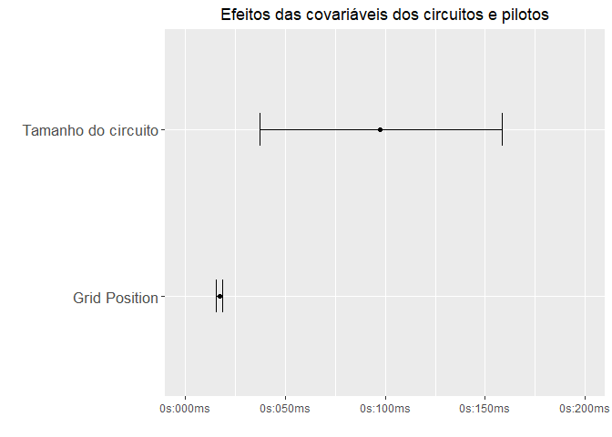
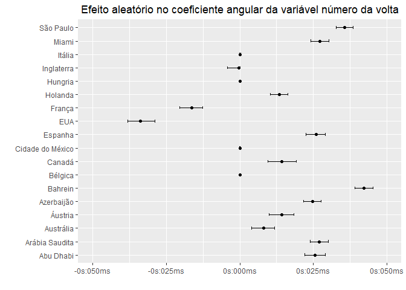
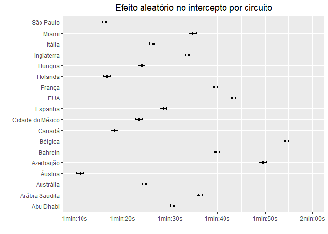
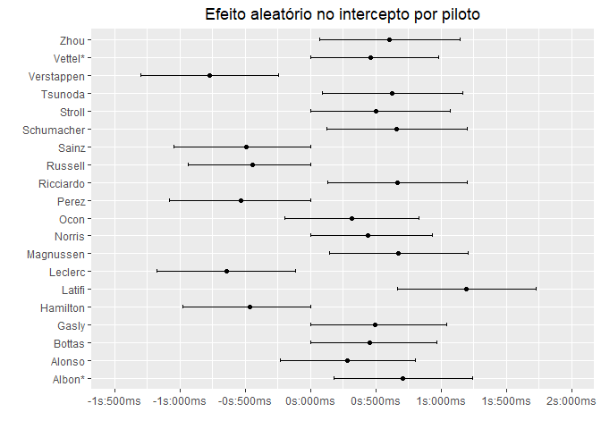
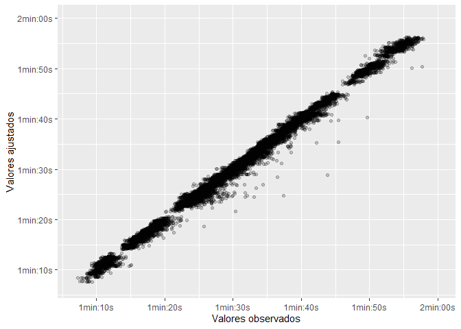
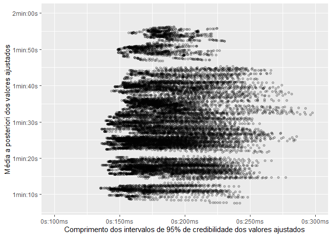

Loading packages

```r
library(MCMCvis)
library("R2jags")
```

```
## Carregando pacotes exigidos: rjags
```

```
## Carregando pacotes exigidos: coda
```

```
## Linked to JAGS 4.3.1
```

```
## Loaded modules: basemod,bugs
```

```
## 
## Attaching package: 'R2jags'
```

```
## The following object is masked from 'package:coda':
## 
##     traceplot
```

```r
library("readxl")
library("AICcmodavg")
library("dplyr")
```

```
## 
## Attaching package: 'dplyr'
```

```
## The following objects are masked from 'package:stats':
## 
##     filter, lag
```

```
## The following objects are masked from 'package:base':
## 
##     intersect, setdiff, setequal, union
```

```r
library("ggplot2")
```

Loading data


```r
df = read_excel("./files/Races_cleaned.xlsx")
```

```
## New names:
## • `` -> `...1`
```

```r
df$TyreType = as.factor(df$TyreType)
one_hot_encoded = model.matrix(~TyreType - 1, df)
df = cbind(df,one_hot_encoded)
df = df %>% rename('Local' = "PlaceBrazilianPortuguese")
```

Setting parameters for jags models


```r
y = as.numeric(unlist(df[,'msLapTime']))
x1 = as.numeric(unlist(df[,'LapNumber']))
x2 = as.numeric(unlist(df[,'TyreLife']))
x3_1 = as.factor(unlist(df[,'TyreTypeC1']))
x3_2 = as.factor(unlist(df[,'TyreTypeC2']))
x3_3 = as.factor(unlist(df[,'TyreTypeC3']))
x3_4 = as.factor(unlist(df[,'TyreTypeC4']))
x3_5 = as.factor(unlist(df[,'TyreTypeC5']))
x4 = as.numeric(unlist(df[,'GridPosition']))
x5 = as.numeric(unlist(df[,'CircuitLength']))
c <- as.factor(unlist(df['Local']))
d <- as.factor(unlist(df['LastName']))
n <- length(y)
n_circuits <- length(unlist(unique(df['Local'])))
n_drivers <- length(unlist(unique(df['LastName'])))
```

Optional - load previously run models


```r
load("./files/Models/modelo 1b.rda")
load("./files/Models/modelo 2b.rda")
load("./files/Models/modelo 3b.rda")
load("./files/Models/modelo 4b.rda")
load("./files/Models/modelo 5b.rda")
```

Modelo 1


```r
mod_1 <- "model{
  #likelihood
  for (i in 1:n){
    #likelihood
    residuo[i] <- y[i] - y.hat[i]
    y[i] ~ dnorm(y.hat[i],tau.y)
    y.hat[i] <- 0 + b1 * x1[i] + b2*x2[i] +b3_1 * x3_1[i] +b3_2 * x3_2[i] +b3_3 * x3_3[i] + b3_4 * x3_4[i] + b3_5 * x3_5[i]
  }
  
  #prior
  b1 ~ dnorm(0,0.001)
  b2 ~ dnorm(0,0.001)
  b3_1 ~ dnorm(0,0.001)
  b3_2 ~ dnorm(0,0.001)
  b3_3 ~ dnorm(0,0.001)
  b3_4 ~ dnorm(0,0.001)
  b3_5 ~ dnorm(0,0.001)
  b5 ~ dnorm(0,0.001)
 
  tau.y <- pow(sigma.y,-2)
  sigma.y ~ dgamma(0.01,0.01)
}"
```


```r
writeLines(mod_1, "./files/Models/mod_1.jags")
data_1 <- list("y","x1","x2","x3_1","x3_2","x3_3","x3_4","x3_5","n") 
param_1 <- c("b1","b2","b3_1","b3_2","b3_3","b3_4","b3_5","sigma.y","y.hat") 
```


```r
inits_1 <- function(){
  list("b1"= 1,"b2"= 1,"b3_1"=1,"b3_2"=1,"b3_3"=1,"b3_4"=1,"b3_5"=1,"b5" = 1, "sigma.y" = 1)
}
```


```r
mod1.jags <- jags(data = data_1,
                  inits = inits_1,
                  parameters.to.save = param_1,
                  n.iter = 10000,
                  n.chains = 2,
                  model.file = "./files/Models/mod_1.jags")
save(mod1.jags, file = "./files/Models/modelo 1b.rda")
```


```r
mod1.jags$BUGSoutput$summary
```

```
##                     mean         sd        2.5%         25%         50%
## b1             1496.0354   13.19770   1471.2938   1487.1453   1495.7291
## b2             1045.6502   24.34648    997.3660   1030.0593   1045.8415
## b3_1            215.2363   32.14334    153.1897    193.5051    215.4090
## b3_2            272.7556   32.34894    205.5754    252.0224    272.7037
## b3_3            323.0205   31.84414    258.9594    301.1981    324.2251
## b3_4            237.7196   32.26555    177.6058    216.1735    236.6989
## b3_5            210.4821   30.97552    148.8144    189.2479    210.5697
## deviance     396621.4920   48.09682 396530.1446 396590.6437 396619.1690
## sigma.y       45526.4495  259.31255  45012.7581  45355.3610  45527.1702
## y.hat[1]       6665.6058   94.58493   6481.1120   6600.8115   6666.4967
## y.hat[2]       9207.2914  101.40529   9009.2828   9137.2002   9207.6702
##                      75%       97.5%     Rhat n.eff
## b1             1504.9862   1522.1371 1.000599  2000
## b2             1061.5758   1093.3986 1.001325  1800
## b3_1            237.2968    278.3477 1.001602  2000
## b3_2            294.1179    337.3355 1.001626  1300
## b3_3            344.6198    383.9173 1.002309   830
## b3_4            258.5039    302.4103 1.001086  2000
## b3_5            231.1063    272.1897 1.000542  2000
## deviance     396655.0418 396717.2395 1.000753  2000
## sigma.y       45693.8138  46054.3213 1.002124   920
## y.hat[1]       6729.3317   6851.3474 1.000990  2000
## y.hat[2]       9275.6101   9404.8986 1.001186  2000
##  [ reached getOption("max.print") -- omitted 16308 rows ]
```

```r
mod1.jags$BUGSoutput$DIC
```

```
## [1] 397778.5
```

Modelo 2


```r
mod_2 <- "model{
  #likelihood
  for (i in 1:n){
    #likelihood
    residuo[i] <- y[i] - y.hat[i]
    y[i] ~ dnorm(y.hat[i],tau.y)
    y.hat[i] <- (0 + b4 * x4[i] + b5 * x5[i] ) + b1 * x1[i] + b2*x2[i] +b3_1 * x3_1[i] +b3_2 * x3_2[i] +b3_3 * x3_3[i] + b3_4 * x3_4[i] + b3_5 * x3_5[i] 
  }
  
  #prior
  b1 ~ dnorm(0,0.001)
  b2 ~ dnorm(0,0.001)
  b3_1 ~ dnorm(0,0.001)
  b3_2 ~ dnorm(0,0.001)
  b3_3 ~ dnorm(0,0.001)
  b3_4 ~ dnorm(0,0.001)
  b3_5 ~ dnorm(0,0.001)
  b4 ~ dnorm(0,0.001)
  b5 ~ dnorm(0,0.001)
  
  tau.y <- pow(sigma.y,-2)
  sigma.y ~ dgamma(0.01,0.01)
}"
```


```r
writeLines(mod_2, "./files/Models/mod_2.jags")
data_2 <- list("y","x1","x2","x3_1","x3_2","x3_3","x3_4","x3_5","x4","n","x5") #Adiciona x4, x5
param_2 <- c("b1","b2","b3_1","b3_2","b3_3","b3_4","b3_5","b4","sigma.y","b5","y.hat") #adiciona b4, b5
```


```r
inits_2 <- function(){
  list("b1"= 1,"b2"= 1,"b3_1"=1,"b3_2"=1,"b3_3"=1,"b3_4"=1,"b3_5"=1,"b4"= 1,"b5"= 1, "sigma.y" = 1)
}
```


```r
mod2.jags <- jags(data = data_2,
                  inits = inits_2,
                  parameters.to.save = param_2,
                  n.iter = 10000,
                  n.chains = 2,
                  model.file = "./files/Models/mod_2.jags")

save(mod2.jags, file = "./files/Models/modelo 2b.rda")
```


```r
mod2.jags$BUGSoutput$summary
```

```
##                     mean         sd        2.5%         25%         50%
## b1             1048.8626   12.36247   1024.9468   1040.5572   1048.3951
## b2              844.3271   21.40659    802.3803    829.7287    844.2133
## b3_1            246.7368   31.72208    184.5069    226.1894    247.4416
## b3_2            317.2842   32.03578    252.7820    296.5994    318.3310
## b3_3            370.9245   31.56140    310.1620    348.9914    371.0100
## b3_4            269.0454   31.52712    207.7289    248.1952    269.2352
## b3_5            241.6697   31.84173    178.0712    220.5816    241.5521
## b4             1774.0489   24.55520   1725.4742   1757.0705   1773.6683
## b5             1371.9182   33.24236   1308.2398   1348.3168   1372.0745
## deviance     387336.2209  118.68221 387096.5586 387257.6415 387336.8207
## sigma.y       34360.9724  222.38466  33929.7352  34207.8024  34358.2217
##                      75%       97.5%     Rhat n.eff
## b1             1057.2174   1073.0082 1.000574  2000
## b2              859.1111    885.6265 1.000881  2000
## b3_1            267.6765    309.3038 1.001830  1100
## b3_2            337.8456    378.9777 1.001146  2000
## b3_3            391.6911    433.5194 1.001642  1300
## b3_4            289.7010    330.6139 1.002007  2000
## b3_5            263.7507    303.4563 1.001961  1300
## b4             1791.0534   1820.3976 1.000765  2000
## b5             1394.3260   1435.9888 1.000602  2000
## deviance     387417.7778 387558.3941 1.000582  2000
## sigma.y       34511.4685  34806.5014 1.002450   920
##  [ reached getOption("max.print") -- omitted 16310 rows ]
```

```r
mod2.jags$BUGSoutput$DIC
```

```
## [1] 394382.1
```

Modelo 3


```r
mod_3 <- "model{
  #likelihood
  for (i in 1:n){
    #likelihood
    residuo[i] <- y[i] - y.hat[i]
    y[i] ~ dnorm(y.hat[i],tau.y)
    y.hat[i] <- (0 + b4 * x4[i] + b5 * x5[i] + int_circuito[c[i]]) + b1 * x1[i] + b2*x2[i] +b3_1 * x3_1[i] +b3_2 * x3_2[i] +b3_3 * x3_3[i] + b3_4 * x3_4[i] + b3_5 * x3_5[i]  # adiciona int_circuito[c[i]]
  }
  
  for (c in 1:n_circuits){
        int_circuito[c] ~ dnorm(0,tau.u[c])
      }
  
  #prior
  b1 ~ dnorm(0,0.001)
  b2 ~ dnorm(0,0.001)
  b3_1 ~ dnorm(0,0.001)
  b3_2 ~ dnorm(0,0.001)
  b3_3 ~ dnorm(0,0.001)
  b3_4 ~ dnorm(0,0.001)
  b3_5 ~ dnorm(0,0.001)
  b4 ~ dnorm(0,0.001)
  b5 ~ dnorm(0,0.001)
  tau.y <- pow(sigma.y,-2)
  sigma.y ~ dgamma(0.01,0.01)
  
  
  
  for (c in 1:n_circuits){
    tau.u[c] <- pow(sigma.u[c],-2)
    sigma.u[c] ~ dgamma(0.01,0.01)
}
  
}"
```


```r
writeLines(mod_3, "./files/Models/mod_3.jags")
data_3 <- list("y","x1","x2","x3_1","x3_2","x3_3","x3_4","x3_5","x4","n","c","x5","n_circuits") #Adiciona c, n_circuits
param_3 <- c("b1","b2","b3_1","b3_2","b3_3","b3_4","b3_5","b4","sigma.y","b5","int_circuito","y.hat") #adiciona sigma.u
```


```r
inits_3 <- function(){
  list("b1"= 1,"b2"= 1,"b3_1"=1,"b3_2"=1,"b3_3"=1,"b3_4"=1,"b3_5"=1,"b4"= 1,"b5" = 1, "sigma.y" = 1, sigma.u = rep(1,n_circuits)) #adiciona sigma.u = rep(1,n_circuits)
}
```


```r
mod3.jags <- jags(data = data_3,
                  inits = inits_3,
                  parameters.to.save = param_3,
                  n.iter = 10000,
                  n.chains = 2,
                  model.file = "./files/Models/mod_3.jags")

save(mod3.jags, file = "./files/Models/modelo 3b.rda")
```


```r
mod3.jags$BUGSoutput$summary
```

```
##                          mean          sd         2.5%           25%
## b1                  -48.24688   0.5024938    -49.23076    -48.586689
## b2                   34.89130   1.0064605     32.88365     34.208240
## b3_1                 71.89145  26.7099261     18.21633     54.130795
## b3_2                107.76354  21.0432665     67.31086     93.349613
## b3_3                -12.43534  19.8047562    -49.79508    -26.395909
## b3_4                -79.95868  22.6481250   -124.11022    -95.228982
## b3_5                 26.33021  31.3836832    -35.39658      3.966604
## b4                  100.70783   1.2722873     98.26718     99.839120
## b5                   97.55650  31.8198267     35.17365     76.256301
## deviance         269660.67493   9.0989603 269644.91174 269654.399831
## int_circuito[1]   90660.74882 191.1951465  90289.47625  90532.674545
##                           50%           75%        97.5%     Rhat n.eff
## b1                  -48.24832 -4.790854e+01    -47.26801 1.000694  2000
## b2                   34.92362  3.555605e+01     36.85025 1.001054  2000
## b3_1                 71.58346  8.959615e+01    123.49257 1.001903  1100
## b3_2                107.50809  1.220354e+02    150.96170 1.002396   800
## b3_3                -12.25442  9.193424e-01     27.59860 1.000513  2000
## b3_4                -79.88376 -6.435229e+01    -35.72534 1.001022  2000
## b3_5                 26.29936  4.718358e+01     87.93421 1.001106  2000
## b4                  100.70072  1.015036e+02    103.32055 1.001519  1500
## b5                   98.00523  1.196195e+02    159.58814 1.000824  2000
## deviance         269659.79101  2.696663e+05 269680.91428 1.000000     1
## int_circuito[1]   90660.22983  9.078685e+04  91033.59802 1.000648  2000
##  [ reached getOption("max.print") -- omitted 16328 rows ]
```

```r
mod3.jags$BUGSoutput$DIC
```

```
## [1] 269702.1
```

Modelo 4


```r
mod_4 <- "model{
  #likelihood
  for (i in 1:n){
    #likelihood
    residuo[i] <- y[i] - y.hat[i]
    y[i] ~ dnorm(y.hat[i],tau.y)
    y.hat[i] <- (0 + b4 * x4[i] + b5 * x5[i] + int_circuito[c[i]] + int_piloto[d[i]]) + b1 * x1[i] + b2*x2[i] +b3_1 * x3_1[i] +b3_2 * x3_2[i] +b3_3 * x3_3[i] + b3_4 * x3_4[i] + b3_5 * x3_5[i] + b4 * x4[i]  # adiciona int_piloto[d[i]]
    
  }
  
  for (c in 1:n_circuits){
        int_circuito[c] ~ dnorm(0,tau.u[c])
  }
      
  for (d in 1:n_drivers){
        int_piloto[d] ~ dnorm(0,tau.v[d])
  }
  
  #prior
  b1 ~ dnorm(0,0.001)
  b2 ~ dnorm(0,0.001)
  b3_1 ~ dnorm(0,0.001)
  b3_2 ~ dnorm(0,0.001)
  b3_3 ~ dnorm(0,0.001)
  b3_4 ~ dnorm(0,0.001)
  b3_5 ~ dnorm(0,0.001)
  b4 ~ dnorm(0,0.001)
  b5 ~ dnorm(0,0.001)
  
  tau.y <- pow(sigma.y,-2)
  sigma.y ~ dgamma(0.01,0.01)
  
  for (c in 1:n_circuits){
    tau.u[c] <- pow(sigma.u[c],-2)
    sigma.u[c] ~ dgamma(0.01,0.01)
  }

  for (d in 1:n_drivers){
    tau.v[d] <- pow(sigma.v[d],-2)
    sigma.v[d] ~ dgamma(0.01,0.01)
  }
  

}"
```


```r
writeLines(mod_4, "./files/Models/mod_4.jags")
data_4 <- list("y","x1","x2","x3_1","x3_2","x3_3","x3_4","x3_5","x4","n","c","x5","n_circuits","d","n_drivers") #Adiciona d, n_drivers
param_4 <- c("b1","b2","b3_1","b3_2","b3_3","b3_4","b3_5","b4","sigma.y","b5","int_circuito", "int_piloto","y.hat") #adiciona sigma.u
```


```r
inits_4 <- function(){
  list("b1"= 1,"b2"= 1,"b3_1"=1,"b3_2"=1,"b3_3"=1,"b3_4"=1,"b3_5"=1,"b4"= 1,"b5" = 1, "sigma.y" = 1, sigma.u = rep(1,n_circuits), sigma.v = rep(1,n_drivers))
}
```


```r
mod4.jags <- jags(data = data_4,
                  inits = inits_4,
                  parameters.to.save = param_4,
                  n.iter = 10000,
                  n.chains = 2,
                  model.file = "./files/Models/mod_4.jags")

save(mod4.jags, file = "./files/Models/modelo 4b.rda")
```


```r
mod4.jags$BUGSoutput$summary
```

```
##                           mean           sd          2.5%           25%
## b1               -4.732106e+01 4.445938e-01 -4.821050e+01 -4.761596e+01
## b2                3.342263e+01 8.881244e-01  3.170492e+01  3.279905e+01
## b3_1              6.722049e+01 2.509144e+01  1.746442e+01  5.051333e+01
## b3_2              5.478317e+01 2.023872e+01  1.534527e+01  4.130642e+01
## b3_3              5.011369e+00 1.934950e+01 -3.352048e+01 -7.883584e+00
## b3_4             -2.756136e+01 2.198420e+01 -6.980188e+01 -4.248803e+01
## b3_5              1.419638e+01 2.978509e+01 -4.382740e+01 -6.116810e+00
## b4                1.681186e+01 8.577296e-01  1.510515e+01  1.623010e+01
## b5                9.991816e+01 3.149203e+01  3.744898e+01  7.928663e+01
## deviance          2.662563e+05 1.079311e+01  2.662363e+05  2.662488e+05
## int_circuito[1]   9.059970e+04 1.892769e+02  9.022991e+04  9.047198e+04
##                            50%           75%         97.5%     Rhat n.eff
## b1               -4.733002e+01 -4.702023e+01 -4.647993e+01 1.000498  2000
## b2                3.341017e+01  3.403171e+01  3.510972e+01 1.000883  2000
## b3_1              6.737205e+01  8.452911e+01  1.140025e+02 1.000564  2000
## b3_2              5.461880e+01  6.779623e+01  9.445603e+01 1.002778  1700
## b3_3              5.259997e+00  1.769893e+01  4.232283e+01 1.002733   670
## b3_4             -2.805902e+01 -1.290484e+01  1.519296e+01 1.001778  1200
## b3_5              1.412240e+01  3.451864e+01  7.113150e+01 1.002856  1900
## b4                1.683639e+01  1.739675e+01  1.848883e+01 1.003491   500
## b5                1.008194e+02  1.208363e+02  1.624003e+02 1.002039   980
## deviance          2.662561e+05  2.662634e+05  2.662785e+05 1.000000     1
## int_circuito[1]   9.059335e+04  9.072964e+04  9.097244e+04 1.003928   440
##  [ reached getOption("max.print") -- omitted 16348 rows ]
```

```r
mod4.jags$BUGSoutput$DIC
```

```
## [1] 266314.5
```

Modelo 5


```r
mod_5 <- "model{
  #likelihood
  for (i in 1:n){
    #likelihood
    residuo[i] <- y[i] - y.hat[i]
    y[i] ~ dnorm(y.hat[i],tau.y)
    y.hat[i] <- (0 + b4 * x4[i] + b5 * x5[i] + int_circuito[c[i]] + int_piloto[d[i]])  + (b1 + slope_circuito[c[i]]) * x1[i] + b2*x2[i] + b3_1 * x3_1[i] + b3_2 * x3_2[i] + b3_3 * x3_3[i] + b3_4 * x3_4[i] + b3_5 * x3_5[i] + b4 * x4[i]  # adiciona slope_circuito[c[i]]
  }
  
  for (c in 1:n_circuits){
        int_circuito[c] ~ dnorm(0,tau.u[c])
        slope_circuito[c] ~ dnorm(0,tau.w[c])
  }
      
  for (d in 1:n_drivers){
        int_piloto[d] ~ dnorm(0,tau.v[d])
  }
  
  #prior
  b1 ~ dnorm(0,0.001)
  b2 ~ dnorm(0,0.001)
  b3_1 ~ dnorm(0,0.001)
  b3_2 ~ dnorm(0,0.001)
  b3_3 ~ dnorm(0,0.001)
  b3_4 ~ dnorm(0,0.001)
  b3_5 ~ dnorm(0,0.001)
  b4 ~ dnorm(0,0.001)
  b5 ~ dnorm(0,0.001)
  
  tau.y <- pow(sigma.y,-2)
  sigma.y ~ dgamma(0.01,0.01)
  
  for (c in 1:n_circuits){
    tau.u[c] <- pow(sigma.u[c],-2)
    sigma.u[c] ~ dgamma(0.01,0.01)
      tau.w[c] <- pow(sigma.w[c],-2)
    sigma.w[c] ~ dgamma(0.01,0.01)
  }

  for (d in 1:n_drivers){
    tau.v[d] <- pow(sigma.v[d],-2)
    sigma.v[d] ~ dgamma(0.01,0.01)
  }
  

}"
```


```r
writeLines(mod_5, "./files/Models/mod_5.jags")
data_5 <- list("y","x1","x2","x3_1","x3_2","x3_3","x3_4","x3_5","x4","n","c","x5","n_circuits","d","n_drivers") 
param_5 <- c("b1","b2","b3_1","b3_2","b3_3","b3_4","b3_5","b4","sigma.y","b5","int_circuito", "int_piloto", "slope_circuito","y.hat") #adiciona sigma.w
```


```r
inits_5 <- function(){
  list("b1"= 1,"b2"= 1,"b3_1"=1,"b3_2"=1,"b3_3"=1,"b3_4"=1,"b3_5"=1,"b4"= 1,"b5" = 1, "sigma.y" = 1, "sigma.u" = rep(1,n_circuits), "sigma.v" = rep(1,n_drivers), "sigma.w" = rep(1,n_circuits))
}
```


```r
mod5.jags <- jags(data = data_5,
                  inits = inits_5,
                  parameters.to.save = param_5,
                  n.iter = 10000,
                  n.chains = 2,
                  model.file = "./files/Models/mod_5.jags")

save(mod5.jags, file = "./files/Models/modelo 5b.rda")
```


```r
mod5.jags$BUGSoutput$summary
```

```
##                             mean           sd          2.5%           25%
## b1                 -6.706266e+01 9.840248e-01 -6.891120e+01 -6.772805e+01
## b2                  3.872236e+01 8.932905e-01  3.699782e+01  3.811520e+01
## b3_1                8.438464e+01 2.562638e+01  3.331074e+01  6.777250e+01
## b3_2                8.924571e+01 2.020250e+01  4.851057e+01  7.596213e+01
## b3_3               -3.289621e+01 1.903829e+01 -7.111330e+01 -4.563334e+01
## b3_4               -4.406553e+01 2.112807e+01 -8.395057e+01 -5.814568e+01
## b3_5                1.528935e+01 2.991452e+01 -4.337154e+01 -4.652600e+00
## b4                  1.727236e+01 8.031647e-01  1.569393e+01  1.673869e+01
## b5                  9.744542e+01 3.068286e+01  3.731050e+01  7.675811e+01
## deviance            2.641505e+05 1.233981e+01  2.641278e+05  2.641419e+05
## int_circuito[1]     9.087135e+04 5.092526e+02  9.008969e+04  9.039682e+04
##                              50%           75%         97.5%      Rhat n.eff
## b1                 -6.707982e+01 -6.643272e+01 -6.501710e+01  1.005668   440
## b2                  3.871431e+01  3.933494e+01  4.045083e+01  1.002871  1200
## b3_1                8.455866e+01  1.017382e+02  1.331031e+02  1.003584   520
## b3_2                8.923462e+01  1.021833e+02  1.294663e+02  1.007188   230
## b3_3               -3.288271e+01 -2.033716e+01  4.843119e+00  1.004683   360
## b3_4               -4.447655e+01 -3.080281e+01 -8.377131e-01  1.007040   230
## b3_5                1.508077e+01  3.513269e+01  7.282961e+01  1.002595   720
## b4                  1.726269e+01  1.782193e+01  1.882886e+01  1.097620    21
## b5                  9.788166e+01  1.185134e+02  1.584114e+02  1.001762  1200
## deviance            2.641501e+05  2.641585e+05  2.641765e+05  1.000000     1
## int_circuito[1]     9.086361e+04  9.134417e+04  9.166195e+04  6.137695     2
##  [ reached getOption("max.print") -- omitted 16366 rows ]
```

```r
mod5.jags$BUGSoutput$DIC
```

```
## [1] 264225.7
```


```r
timeMS_formatter <- function(x) {
  x[is.na(x)] <- 0
#  h <- trunc(x / 24 / 60 / 1000)
  m <- trunc(x / 60 / 1000)
  s <- (x / 1000) %% 60
  s <- round(s, 2)
  lab <- sprintf('%02dmin:%02ds', m, s) # Format the strings as MM:SS
  lab <- gsub('^00h:', '', lab)              # Remove leading 00: if present
  lab <- gsub('^0', '', lab)                # Remove leading 0 if present
}

timeS_formatter <- function(x) {
  x[is.na(x)] <- 0
  s <- floor(abs(x)/1000)
  ms <- abs(x) %% 1000
  s <- ifelse(x<0, -s, s)
  lab <- sprintf('%ds:%03dms', s, ms) 
  lab <- ifelse(substr(lab,1,1) == '0' & x <0 , paste("-",lab,sep= ""), lab)
  lab
}
```


## Analisando modelo 5


```r
model_data = data.frame(mod5.jags$BUGSoutput$summary)
model_data
```

```
##                         mean          sd        X2.5.         X25.         X50.
## b1                 -67.06266   0.9840248    -68.91120    -67.72805    -67.07982
## b2                  38.72236   0.8932905     36.99782     38.11520     38.71431
## b3_1                84.38464  25.6263751     33.31074     67.77250     84.55866
## b3_2                89.24571  20.2025027     48.51057     75.96213     89.23462
## b3_3               -32.89621  19.0382930    -71.11330    -45.63334    -32.88271
## b3_4               -44.06553  21.1280692    -83.95057    -58.14568    -44.47655
## b3_5                15.28935  29.9145245    -43.37154     -4.65260     15.08077
## b4                  17.27236   0.8031647     15.69393     16.73869     17.26269
## b5                  97.44542  30.6828605     37.31050     76.75811     97.88166
## deviance        264150.52188  12.3398053 264127.80019 264141.87033 264150.13512
## int_circuito[1]  90871.34816 509.2525619  90089.68516  90396.82102  90863.61357
##                         X75.        X97.5.     Rhat n.eff
## b1                 -66.43272 -6.501710e+01 1.005668   440
## b2                  39.33494  4.045083e+01 1.002871  1200
## b3_1               101.73824  1.331031e+02 1.003584   520
## b3_2               102.18327  1.294663e+02 1.007188   230
## b3_3               -20.33716  4.843119e+00 1.004683   360
## b3_4               -30.80281 -8.377131e-01 1.007040   230
## b3_5                35.13269  7.282961e+01 1.002595   720
## b4                  17.82193  1.882886e+01 1.097620    21
## b5                 118.51336  1.584114e+02 1.001762  1200
## deviance        264158.48621  2.641765e+05 1.000000     1
## int_circuito[1]  91344.16842  9.166195e+04 6.137695     2
##  [ reached 'max' / getOption("max.print") -- omitted 16366 rows ]
```


```r
model_data <- cbind(rownames(model_data), data.frame(model_data, row.names=NULL))
colnames(model_data)[1] = "parameters"
model_data
```

```
##    parameters         mean         sd        X2.5.         X25.         X50.
## 1          b1    -67.06266  0.9840248    -68.91120    -67.72805    -67.07982
## 2          b2     38.72236  0.8932905     36.99782     38.11520     38.71431
## 3        b3_1     84.38464 25.6263751     33.31074     67.77250     84.55866
## 4        b3_2     89.24571 20.2025027     48.51057     75.96213     89.23462
## 5        b3_3    -32.89621 19.0382930    -71.11330    -45.63334    -32.88271
## 6        b3_4    -44.06553 21.1280692    -83.95057    -58.14568    -44.47655
## 7        b3_5     15.28935 29.9145245    -43.37154     -4.65260     15.08077
## 8          b4     17.27236  0.8031647     15.69393     16.73869     17.26269
## 9          b5     97.44542 30.6828605     37.31050     76.75811     97.88166
## 10   deviance 264150.52188 12.3398053 264127.80019 264141.87033 264150.13512
##            X75.        X97.5.     Rhat n.eff
## 1     -66.43272 -6.501710e+01 1.005668   440
## 2      39.33494  4.045083e+01 1.002871  1200
## 3     101.73824  1.331031e+02 1.003584   520
## 4     102.18327  1.294663e+02 1.007188   230
## 5     -20.33716  4.843119e+00 1.004683   360
## 6     -30.80281 -8.377131e-01 1.007040   230
## 7      35.13269  7.282961e+01 1.002595   720
## 8      17.82193  1.882886e+01 1.097620    21
## 9     118.51336  1.584114e+02 1.001762  1200
## 10 264158.48621  2.641765e+05 1.000000     1
##  [ reached 'max' / getOption("max.print") -- omitted 16367 rows ]
```


```r
levels(c)
```

```
##  [1] "Abu Dhabi"        "Arábia Saudita"   "Austrália"        "Áustria"         
##  [5] "Azerbaijão"       "Bahrein"          "Bélgica"          "Canadá"          
##  [9] "Cidade do México" "Espanha"          "EUA"              "França"          
## [13] "Holanda"          "Hungria"          "Inglaterra"       "Itália"          
## [17] "Miami"            "São Paulo"
```

```r
levels(d)
```

```
##  [1] "Albon*"     "Alonso"     "Bottas"     "Gasly"      "Hamilton"  
##  [6] "Latifi"     "Leclerc"    "Magnussen"  "Norris"     "Ocon"      
## [11] "Perez"      "Ricciardo"  "Russell"    "Sainz"      "Schumacher"
## [16] "Stroll"     "Tsunoda"    "Verstappen" "Vettel*"    "Zhou"
```

```r
model_data$parameters
```

```
##   [1] "b1"                 "b2"                 "b3_1"              
##   [4] "b3_2"               "b3_3"               "b3_4"              
##   [7] "b3_5"               "b4"                 "b5"                
##  [10] "deviance"           "int_circuito[1]"    "int_circuito[2]"   
##  [13] "int_circuito[3]"    "int_circuito[4]"    "int_circuito[5]"   
##  [16] "int_circuito[6]"    "int_circuito[7]"    "int_circuito[8]"   
##  [19] "int_circuito[9]"    "int_circuito[10]"   "int_circuito[11]"  
##  [22] "int_circuito[12]"   "int_circuito[13]"   "int_circuito[14]"  
##  [25] "int_circuito[15]"   "int_circuito[16]"   "int_circuito[17]"  
##  [28] "int_circuito[18]"   "int_piloto[1]"      "int_piloto[2]"     
##  [31] "int_piloto[3]"      "int_piloto[4]"      "int_piloto[5]"     
##  [34] "int_piloto[6]"      "int_piloto[7]"      "int_piloto[8]"     
##  [37] "int_piloto[9]"      "int_piloto[10]"     "int_piloto[11]"    
##  [40] "int_piloto[12]"     "int_piloto[13]"     "int_piloto[14]"    
##  [43] "int_piloto[15]"     "int_piloto[16]"     "int_piloto[17]"    
##  [46] "int_piloto[18]"     "int_piloto[19]"     "int_piloto[20]"    
##  [49] "sigma.y"            "slope_circuito[1]"  "slope_circuito[2]" 
##  [52] "slope_circuito[3]"  "slope_circuito[4]"  "slope_circuito[5]" 
##  [55] "slope_circuito[6]"  "slope_circuito[7]"  "slope_circuito[8]" 
##  [58] "slope_circuito[9]"  "slope_circuito[10]" "slope_circuito[11]"
##  [61] "slope_circuito[12]" "slope_circuito[13]" "slope_circuito[14]"
##  [64] "slope_circuito[15]" "slope_circuito[16]" "slope_circuito[17]"
##  [67] "slope_circuito[18]" "y.hat[1]"           "y.hat[2]"          
##  [70] "y.hat[3]"           "y.hat[4]"           "y.hat[5]"          
##  [73] "y.hat[6]"           "y.hat[7]"           "y.hat[8]"          
##  [76] "y.hat[9]"           "y.hat[10]"          "y.hat[11]"         
##  [79] "y.hat[12]"          "y.hat[13]"          "y.hat[14]"         
##  [82] "y.hat[15]"          "y.hat[16]"          "y.hat[17]"         
##  [85] "y.hat[18]"          "y.hat[19]"          "y.hat[20]"         
##  [88] "y.hat[21]"          "y.hat[22]"          "y.hat[23]"         
##  [91] "y.hat[24]"          "y.hat[25]"          "y.hat[26]"         
##  [94] "y.hat[27]"          "y.hat[28]"          "y.hat[29]"         
##  [97] "y.hat[30]"          "y.hat[31]"          "y.hat[32]"         
## [100] "y.hat[33]"         
##  [ reached getOption("max.print") -- omitted 16277 entries ]
```


```r
filter_values1 <- c("b1","b2","b3_1","b3_2","b3_3","b3_4","b3_5")

# Filter the data frame to only include rows where y is in the filter_values list
model_data_1 <- model_data %>% 
                filter(parameters
                        %in% filter_values1)
model_data_1
```

```
##   parameters      mean         sd     X2.5.      X25.      X50.      X75.
## 1         b1 -67.06266  0.9840248 -68.91120 -67.72805 -67.07982 -66.43272
## 2         b2  38.72236  0.8932905  36.99782  38.11520  38.71431  39.33494
## 3       b3_1  84.38464 25.6263751  33.31074  67.77250  84.55866 101.73824
## 4       b3_2  89.24571 20.2025027  48.51057  75.96213  89.23462 102.18327
## 5       b3_3 -32.89621 19.0382930 -71.11330 -45.63334 -32.88271 -20.33716
## 6       b3_4 -44.06553 21.1280692 -83.95057 -58.14568 -44.47655 -30.80281
## 7       b3_5  15.28935 29.9145245 -43.37154  -4.65260  15.08077  35.13269
##        X97.5.     Rhat n.eff
## 1 -65.0170975 1.005668   440
## 2  40.4508325 1.002871  1200
## 3 133.1031418 1.003584   520
## 4 129.4663490 1.007188   230
## 5   4.8431189 1.004683   360
## 6  -0.8377131 1.007040   230
## 7  72.8296120 1.002595   720
```
## Efeitos Fixos


```r
ggplot(model_data_1, aes(x = parameters, y = mean)) +
  geom_point() +
  geom_errorbar(aes(ymin = X2.5., ymax = X97.5.), width = 0.2) +
  scale_y_continuous(limits = c(-100,150), label=timeS_formatter, breaks = seq(-100,150,50)) + 
  coord_flip() +
  scale_x_discrete(labels = c('Número da volta', 'Vida do pneu', 'Pneu C1', 'Pneu C2', 'Pneu C3', 'Pneu C4', 'Pneu C5')) +
  xlab("") + ylab("") + ggtitle("Efeitos das variáveis das voltas") + 
  theme(plot.title = element_text(hjust = 0.5), axis.text.y = element_text(size = 13))
```

<!-- -->
##Covariaveis circuito e piloto


```r
filter_values2 <- c("b4","b5")

# Filter the data frame to only include rows where y is in the filter_values list
model_data_2 <- model_data %>% 
                filter(parameters
                        %in% filter_values2)
model_data_2
```

```
##   parameters     mean         sd    X2.5.     X25.     X50.      X75.    X97.5.
## 1         b4 17.27236  0.8031647 15.69393 16.73869 17.26269  17.82193  18.82886
## 2         b5 97.44542 30.6828605 37.31050 76.75811 97.88166 118.51336 158.41139
##       Rhat n.eff
## 1 1.097620    21
## 2 1.001762  1200
```


```r
ggplot(model_data_2, aes(x = parameters, y = mean)) +
  geom_point() +
  geom_errorbar(aes(ymin = X2.5., ymax = X97.5.), width = 0.2) +
  scale_y_continuous(limits = c(0,200), label=timeS_formatter, breaks = seq(0,200,50)) + 
  coord_flip() +
  scale_x_discrete(labels = c('Grid Position', 'Tamanho do circuito')) +
  xlab("") + ylab("") + ggtitle("Efeitos das covariáveis dos circuitos e pilotos") + 
  theme(plot.title = element_text(hjust = 0.5), axis.text.y = element_text(size = 13))
```

<!-- -->


## Efeitos aleatórios no coeficiente angular da covariável número da volta


```r
indices <- grep("^slope_circuito", model_data$parameters)
filter_values3 <- model_data$parameters[indices]
```


```r
# Filter the data frame to only include rows where y is in the filter_values list
model_data_3 <- model_data %>% filter(parameters %in% filter_values3)
model_data_3
```

```
##            parameters          mean           sd         X2.5.          X25.
## 1   slope_circuito[1]  2.562229e+01 1.763280e+00  2.215046e+01  2.443426e+01
## 2   slope_circuito[2] -3.373361e+01 2.361524e+00 -3.820090e+01 -3.531858e+01
## 3   slope_circuito[3] -1.646405e+01 2.043859e+00 -2.056919e+01 -1.783356e+01
## 4   slope_circuito[4]  1.341235e+01 1.536523e+00  1.040153e+01  1.240378e+01
## 5   slope_circuito[5] -6.204099e-21 2.763609e-19 -4.571657e-24 -6.330018e-49
## 6   slope_circuito[6] -4.001137e-01 1.148273e+00 -4.173442e+00 -2.677998e-03
## 7   slope_circuito[7]  9.623944e-03 3.357406e-01 -1.588821e-01 -2.308744e-16
## 8   slope_circuito[8]  2.728504e+01 1.557004e+00  2.411005e+01  2.626369e+01
## 9   slope_circuito[9]  3.569159e+01 1.456177e+00  3.276099e+01  3.469633e+01
## 10 slope_circuito[10]  2.695648e+01 1.615871e+00  2.390238e+01  2.586105e+01
## 11 slope_circuito[11]  8.004206e+00 1.973968e+00  4.073344e+00  6.715262e+00
## 12 slope_circuito[12]  1.418770e+01 2.112371e+00  1.001576e+01  1.271409e+01
## 13 slope_circuito[13]  2.474601e+01 1.516861e+00  2.165509e+01  2.375472e+01
## 14 slope_circuito[14]  4.212925e+01 1.584307e+00  3.903158e+01  4.106228e+01
## 15 slope_circuito[15]  6.617571e-03 1.261748e-01 -1.232277e-02 -9.626647e-10
## 16 slope_circuito[16]  1.428502e+01 2.435527e+00  9.602850e+00  1.269562e+01
## 17 slope_circuito[17] -1.598483e-03 1.853186e-01 -1.684277e-01 -1.149307e-07
## 18 slope_circuito[18]  2.589273e+01 1.717421e+00  2.256919e+01  2.478889e+01
##             X50.          X75.        X97.5.     Rhat n.eff
## 1   2.562999e+01  2.682714e+01  2.896629e+01 1.003540  2000
## 2  -3.373781e+01 -3.216940e+01 -2.897243e+01 1.002465  2000
## 3  -1.639332e+01 -1.505754e+01 -1.268158e+01 1.000606  2000
## 4   1.337113e+01  1.442799e+01  1.640204e+01 1.014521   130
## 5   1.767459e-65  6.524648e-48  5.065481e-24 1.000000     1
## 6  -1.699284e-13  1.238476e-07  1.601874e-01 1.135627    39
## 7   1.830725e-51  3.751210e-15  2.742344e-01 1.291093  1200
## 8   2.725369e+01  2.833920e+01  3.036311e+01 1.001683  1300
## 9   3.571517e+01  3.668850e+01  3.845245e+01 1.000587  2000
## 10  2.698464e+01  2.800986e+01  3.016716e+01 1.004219   450
## 11  8.023760e+00  9.373481e+00  1.184545e+01 1.000514  2000
## 12  1.421515e+01  1.563293e+01  1.834382e+01 1.000525  2000
## 13  2.477880e+01  2.579271e+01  2.765148e+01 1.002079   950
## 14  4.213029e+01  4.326992e+01  4.523755e+01 1.003741   530
## 15 -5.070440e-32  3.502217e-10  9.602078e-03 1.292863   360
## 16  1.429309e+01  1.586177e+01  1.917938e+01 1.003513  2000
## 17 -2.371331e-20  8.880611e-08  1.126201e-01 1.289188  2000
## 18  2.588337e+01  2.709975e+01  2.914947e+01 1.004937   340
```


```r
ggplot(model_data_3, aes(x = parameters, y = mean)) +
  geom_point() +
  geom_errorbar(aes(ymin = X2.5., ymax = X97.5.), width = 0.2) +
  scale_y_continuous(limits = c(-50,50), label=timeS_formatter, breaks = seq(-50,50,25)) + 
  coord_flip() + 
  scale_x_discrete(labels = levels(c)) +
  xlab("") + ylab("")+labs(title = "Efeito aleatório no coeficiente angular da variável número da volta")+
  theme(plot.title = element_text(hjust = 0.5))
```

<!-- -->

## Efeitos aleatórios no intercepto do circuito


```r
indices <- grep("^int_circuito", model_data$parameters)
filter_values4 <- model_data$parameters[indices]
```


```r
# Filter the data frame to only include rows where y is in the filter_values list
model_data_4 <- model_data %>% filter(parameters %in% filter_values4)
model_data_4
```

```
##          parameters      mean       sd     X2.5.      X25.      X50.      X75.
## 1   int_circuito[1]  90871.35 509.2526  90089.69  90396.82  90863.61  91344.17
## 2   int_circuito[2]  95923.64 521.8879  95089.09  95447.68  95921.01  96400.78
## 3   int_circuito[3]  84953.57 512.2761  84166.71  84480.74  84952.01  85423.65
## 4   int_circuito[4]  71042.43 501.6296  70313.04  70566.72  71052.23  71520.77
## 5   int_circuito[5] 109560.69 513.4286 108752.40 109089.80 109550.45 110032.73
## 6   int_circuito[6]  99604.17 515.4344  98817.33  99127.12  99590.93 100080.22
## 7   int_circuito[7] 114160.22 528.5690 113308.19 113686.19 114143.72 114629.91
## 8   int_circuito[8]  78297.86 499.2710  77553.03  77834.23  78331.43  78770.15
## 9   int_circuito[9]  83426.78 499.0531  82689.02  82957.22  83419.04  83898.99
## 10 int_circuito[10]  88563.91 503.9768  87829.55  88093.63  88574.19  89038.86
## 11 int_circuito[11] 103020.67 512.5044 102229.91 102550.42 103033.63 103497.69
## 12 int_circuito[12]  99216.87 516.5348  98423.63  98748.62  99223.31  99688.03
## 13 int_circuito[13]  76708.77 499.8675  75975.41  76238.06  76731.43  77179.95
## 14 int_circuito[14]  84001.90 501.8485  83265.22  83528.48  84014.88  84480.28
## 15 int_circuito[15]  94061.75 517.4270  93258.53  93588.89  94066.70  94538.93
## 16 int_circuito[16]  86466.78 514.5511  85666.62  85993.91  86469.99  86937.90
## 17 int_circuito[17]  94780.39 511.1460  93993.05  94313.28  94772.69  95253.03
## 18 int_circuito[18]  76574.93 500.8303  75832.78  76104.69  76594.01  77046.27
##       X97.5.     Rhat n.eff
## 1   91661.95 6.137695     2
## 2   96753.15 5.383460     2
## 3   85772.86 5.903946     2
## 4   71801.60 7.113035     2
## 5  110363.77 5.652396     2
## 6  100403.66 6.129253     2
## 7  115018.80 5.043027     2
## 8   79046.12 6.868436     2
## 9   84172.78 7.009317     2
## 10  89330.95 6.710708     2
## 11 103822.98 5.904222     2
## 12 100021.73 5.633017     2
## 13  77446.09 7.207173     2
## 14  84740.02 6.942425     2
## 15  94874.65 5.784834     2
## 16  87279.64 5.700318     2
## 17  95560.95 6.115418     2
## 18  77329.52 7.041505     2
```


```r
ggplot(model_data_4, aes(x = factor(parameters, levels = parameters), y = mean)) +
  geom_point() +
  geom_errorbar(aes(ymin = X2.5., ymax = X97.5.), width = 0.2) +
  scale_y_continuous(limits = c(70000,120000), label=timeMS_formatter, breaks = seq(70000,120000,10000)) + 
  coord_flip() + 
  scale_x_discrete(labels = levels(c)) +
  xlab("") + ylab("") +labs(title = "Efeito aleatório no intercepto por circuito")+
  theme(plot.title = element_text(hjust = 0.5))
```

<!-- -->

## Efeitos aleatórios no intercepto do piloto


```r
indices <- grep("^int_piloto", model_data$parameters)
filter_values5 <- model_data$parameters[indices]
```


```r
# Filter the data frame to only include rows where y is in the filter_values list
model_data_5 <- model_data %>% filter(parameters %in% filter_values5)
model_data_5
```

```
##        parameters      mean       sd         X2.5.          X25.      X50.
## 1   int_piloto[1]  707.5795 479.0482  1.787189e+02  2.307199e+02  583.7182
## 2   int_piloto[2]  285.2022 465.6931 -2.330962e+02 -1.800113e+02  279.5941
## 3   int_piloto[3]  455.9807 456.7994 -1.205561e-32 -9.013967e-72  405.2789
## 4   int_piloto[4]  494.0440 494.5749 -3.937245e-03  4.403829e-32  471.6170
## 5   int_piloto[5] -460.8047 461.4393 -9.754943e+02 -9.216616e+02 -410.0445
## 6   int_piloto[6] 1192.3958 477.1416  6.643749e+02  7.170185e+02 1129.0699
## 7   int_piloto[7] -643.5858 475.4479 -1.175175e+03 -1.118678e+03 -642.1292
## 8   int_piloto[8]  673.7649 478.1188  1.459229e+02  1.967839e+02  548.7170
## 9   int_piloto[9]  439.1147 440.4730 -1.470127e-02 -5.966670e-35  391.6624
## 10 int_piloto[10]  316.3245 466.3669 -1.989305e+02 -1.481594e+02  304.0451
## 11 int_piloto[11] -528.8287 500.2350 -1.080769e+03 -1.027971e+03 -546.3002
## 12 int_piloto[12]  665.2176 477.2393  1.336422e+02  1.894849e+02  530.0370
## 13 int_piloto[13] -439.7644 440.9702 -9.334779e+02 -8.803344e+02 -390.3545
## 14 int_piloto[14] -492.0937 492.8394 -1.043743e+03 -9.842057e+02 -441.8545
## 15 int_piloto[15]  660.3351 478.9977  1.290414e+02  1.829009e+02  536.7386
## 16 int_piloto[16]  504.5511 500.9399 -2.491607e-02  8.204481e-20  502.1028
## 17 int_piloto[17]  627.9615 481.7043  8.902168e+01  1.494450e+02  480.5511
## 18 int_piloto[18] -771.2186 473.1410 -1.295514e+03 -1.241361e+03 -780.5812
## 19 int_piloto[19]  460.5467 461.6202 -2.132165e-01 -4.181639e-18  424.8547
## 20 int_piloto[20]  607.1156 481.0046  6.974815e+01  1.275295e+02  488.2571
##             X75.        X97.5.     Rhat n.eff
## 1   1.186053e+03  1.244539e+03 19.90115     2
## 2   7.498994e+02  8.041084e+02 33.16579     2
## 3   9.113854e+02  9.701678e+02 44.03903     2
## 4   9.870871e+02  1.045291e+03 48.19099     2
## 5   3.537893e-26  1.375974e-03 49.90810     2
## 6   1.669464e+03  1.730746e+03 28.93654     2
## 7  -1.688034e+02 -1.120454e+02 33.19436     2
## 8   1.151046e+03  1.206983e+03 18.27632     2
## 9   8.784981e+02  9.351902e+02 45.14416     2
## 10  7.824999e+02  8.337329e+02 35.80175     2
## 11 -1.182019e-08  9.153966e-03 30.42421     2
## 12  1.140857e+03  1.198140e+03 17.26664     2
## 13  4.550622e-22  1.036018e+00 46.40421     2
## 14 -1.237027e-76  4.108590e-49 48.66863     2
## 15  1.139856e+03  1.199268e+03 17.11147     2
## 16  1.003332e+03  1.069506e+03 41.12848     2
## 17  1.108143e+03  1.166835e+03 13.36295     2
## 18 -2.993908e+02 -2.443910e+02 35.43570     2
## 19  9.222655e+02  9.830796e+02 41.62623     2
## 20  1.086473e+03  1.146368e+03 11.86092     2
```


```r
ggplot(model_data_5, aes(x = factor(parameters, levels = parameters), y = mean)) +
  geom_point() +
  geom_errorbar(aes(ymin = X2.5., ymax = X97.5.), width = 0.2) +
  scale_y_continuous(limits = c(-1500,2000), label=timeS_formatter, breaks = seq(-1500,2000,500)) + 
  coord_flip() +
  scale_x_discrete(labels = levels(d)) +
  xlab("") + ylab("") +labs(title = "Efeito aleatório no intercepto por piloto")+
  theme(plot.title = element_text(hjust = 0.5))
```

<!-- -->


```r
indices <- grep("^y.hat", model_data$parameters)
data = model_data[indices,]
data = cbind(data,y)
data
```

```
##    parameters     mean       sd    X2.5.     X25.     X50.     X75.   X97.5.
## 68   y.hat[1] 99544.09 48.65304 99450.20 99511.26 99542.18 99576.35 99643.39
## 69   y.hat[2] 99515.35 47.94009 99422.61 99483.31 99513.50 99547.48 99612.50
## 70   y.hat[3] 99486.61 47.25876 99395.06 99454.75 99485.18 99518.23 99582.66
## 71   y.hat[4] 99457.87 46.61043 99367.19 99426.28 99456.38 99488.82 99553.35
## 72   y.hat[5] 99429.13 45.99651 99339.35 99397.82 99427.61 99459.74 99522.60
## 73   y.hat[6] 99400.39 45.41838 99311.50 99369.01 99398.75 99430.76 99492.11
## 74   y.hat[7] 99371.65 44.87743 99283.91 99340.76 99370.41 99400.97 99461.39
## 75   y.hat[8] 99342.91 44.37502 99257.45 99312.78 99341.90 99371.93 99432.22
## 76   y.hat[9] 99314.17 43.91247 99229.39 99284.35 99312.96 99343.45 99402.82
##        Rhat n.eff     y
## 68 1.001434  2000 97853
## 69 1.001093  2000 98272
## 70 1.000791  2000 98414
## 71 1.000571  2000 98471
## 72 1.000516  2000 98712
## 73 1.000498  2000 98835
## 74 1.000521  2000 98951
## 75 1.000586  2000 98807
## 76 1.000698  2000 99123
##  [ reached 'max' / getOption("max.print") -- omitted 16301 rows ]
```


```r
ggplot(data, aes(x = y, y = mean)) +  
  geom_point(alpha = 0.2) +
  scale_x_continuous(limits = c(67000,120000), label=timeMS_formatter, breaks = c(70000,80000,90000,100000,110000,120000)) +
  scale_y_continuous(limits = c(67000,120000), label=timeMS_formatter, breaks = c(70000,80000,90000,100000,110000,120000)) +
  xlab("Valores observados") + ylab("Valores ajustados") + 
  #geom_segment(data = data.frame(y = data$X2.5., x = data$mean, 
  #                               xend = data$mean,  yend = data$X97.5.), 
  #             aes(x, y, xend = xend, yend = yend),
  #             inherit.aes = FALSE, linetype = 2) +
  theme(plot.title = element_text(hjust = 0.5))
```

<!-- -->


```r
ggplot(data, aes(x = X97.5. - X2.5., y = mean)) +
geom_point(alpha = 0.2) + 
scale_x_continuous(limits = c(100,300), label=timeS_formatter, breaks = seq(100,300,50)) +
scale_y_continuous(limits = c(67000,120000), label=timeMS_formatter, breaks = c(70000,80000,90000,100000,110000,120000)) +
xlab("Comprimento dos intervalos de 95% de credibilidade dos valores ajustados") + ylab("Média a posteriori dos valores ajustados") + 
theme(plot.title = element_text(hjust = 0.5))
```

<!-- -->


```r
error_model1 = array(NA, dim = c(2000, n))
for (j in 1:2000){
  for (i in 1:n){
    error_model1[j,i] = mod1.jags$BUGSoutput$sims.list$y.hat[j,i] - y[i]
  }
}

error_model2 = array(NA, dim = c(2000, n))
for (j in 1:2000){
  for (i in 1:n){
    error_model2[j,i] = mod2.jags$BUGSoutput$sims.list$y.hat[j,i] - y[i]
  }
}

error_model3 = array(NA, dim = c(2000, n))
for (j in 1:2000){
  for (i in 1:n){
    error_model3[j,i] = mod3.jags$BUGSoutput$sims.list$y.hat[j,i] - y[i]
  }
}

error_model4 = array(NA, dim = c(2000, n))
for (j in 1:2000){
  for (i in 1:n){
    error_model4[j,i] = mod4.jags$BUGSoutput$sims.list$y.hat[j,i] - y[i]
  }
}

error_model5 = array(NA, dim = c(2000, n))
for (j in 1:2000){
  for (i in 1:n){
    error_model5[j,i] = mod5.jags$BUGSoutput$sims.list$y.hat[j,i] - y[i]
  }
}
```


```r
# Values
pD1 <- mod1.jags$BUGSoutput$pD
pD2 <- mod2.jags$BUGSoutput$pD
pD3 <- mod3.jags$BUGSoutput$pD
pD4 <- mod4.jags$BUGSoutput$pD
pD5 <- mod5.jags$BUGSoutput$pD

D1 <- mean(mod1.jags$BUGSoutput$sims.list$deviance)
D2 <- mean(mod2.jags$BUGSoutput$sims.list$deviance)
D3 <- mean(mod3.jags$BUGSoutput$sims.list$deviance)
D4 <- mean(mod4.jags$BUGSoutput$sims.list$deviance)
D5 <- mean(mod5.jags$BUGSoutput$sims.list$deviance)

dic1 <- mod1.jags$BUGSoutput$DIC
dic2 <- mod2.jags$BUGSoutput$DIC
dic3 <- mod3.jags$BUGSoutput$DIC
dic4 <- mod4.jags$BUGSoutput$DIC
dic5 <- mod5.jags$BUGSoutput$DIC

mse1 <- mean(error_model1^2/n)
mse2 <- mean(error_model2^2/n)
mse3 <- mean(error_model3^2/n)
mse4 <- mean(error_model4^2/n)
mse5 <- mean(error_model5^2/n)

models <- c("Model 1", "Model 2", "Model 3", "Model 4", "Model 5")
pD <- c(pD1, pD2, pD3, pD4, pD5)
D <- c(D1, D2, D3, D4, D5)
DIC = c(dic1, dic2, dic3, dic4, dic5)
mse <- c(mse1, mse2, mse3, mse4, mse5)

# Create the data frame
table <- data.frame(models, pD,D,DIC, mse)
table
```

```
##    models         pD        D      DIC          mse
## 1 Model 1 1157.03392 396621.5 397778.5 130593.30735
## 2 Model 2 7045.86213 387336.2 394382.1  73918.95652
## 3 Model 3   41.41622 269660.7 269702.1     54.37926
## 4 Model 4   58.25571 266256.3 266314.5     44.13510
## 5 Model 5   75.17696 264150.5 264225.7     38.78943
```


