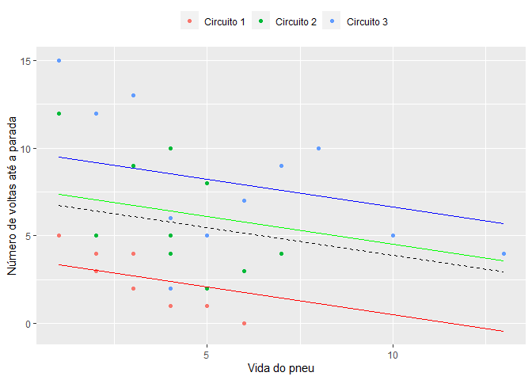
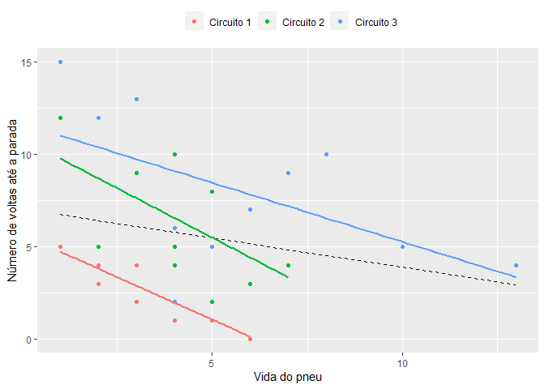

## Time until driver stop for tyre change - example


```r
library(ggplot2)
```

Example data


```r
x1 <- c(1,2,3,4,5,6,1,2,3,4,5)
y1 <- c(5,4,2,2,1,0,5,3,4,1,2)
x2 <- c(1,3,5,7,2,4,5,5,6,4,4)
y2 <- c(12,9,8,4,5,10,8,2,3,4,5)
x3 <- c(1,2,3,7,8,10,13,5,6,4,4)
y3 <- c(15,12,13,9,10,5,4,5,7,2,6)
y <- c(y1,y2,y3)
x <- c(x1,x2,x3)
groups = c(rep("Circuito 1",11),rep("Circuito 2",11),rep("Circuito 3",11))

df = cbind(x,y,groups)
df = data.frame(df)
df$x <- as.integer(as.character(df$x))
df$y <- as.integer(as.character(df$y))
```

Setting regression lines for each group based on a fixed slope.


```r
reg = lm(y~x)

reg_c1 = reg
reg_c1$coefficients[1] = mean(y1 - reg$coefficients[2] * x1)

reg_c2 = reg
reg_c2$coefficients[1] = mean(y2 - reg$coefficients[2] * x2)

reg_c3 = reg
reg_c3$coefficients[1] = mean(y3 - reg$coefficients[2] * x3) 
```

Plot example with random effects on the intercept.


```r
ggplot(df, aes(x = x, y = y , color = groups)) + 
  geom_point()+ 
  #geom_smooth(method = "lm", se = FALSE, linetype = 'dotted') +
  scale_colour_manual(values = c("red", "blue", "green")) +
  scale_color_discrete(name=NULL) +
  xlab("Vida do pneu") + ylab("Número de voltas até a parada") + 
  geom_line(data = fortify(lm(y~x)), aes(x = x, y = .fitted),color = 'black',linetype = "dashed") +
  geom_line(data = fortify(reg_c1), aes(x = x, y = .fitted),color = 'red',linetype = "solid") +
  geom_line(data = fortify(reg_c2), aes(x = x, y = .fitted),color = 'green',linetype = "solid") +
  geom_line(data = fortify(reg_c3), aes(x = x, y = .fitted),color = 'blue',linetype = "solid") +
  theme(legend.position="top", legend.box = "horizontal") 
```


Plot example with random effects on both intercept and slope.


```r
ggplot(df, aes(x = x, y = y , color = groups)) + 
  geom_point()+ 
  geom_line(data = fortify(lm(y~x)), aes(x = x, y = .fitted),color = 'black',linetype = "dashed") +
  geom_smooth(method = "lm", se = FALSE) +
  scale_color_manual(values = c("red", "blue", "green")) +
  scale_color_discrete(name=NULL) +
  xlab("Vida do pneu") + ylab("Número de voltas até a parada")+
  theme(legend.position="top", legend.box = "horizontal") +
  guides(color = guide_legend(override.aes = list(linetype = c(0,0,0))))
```



